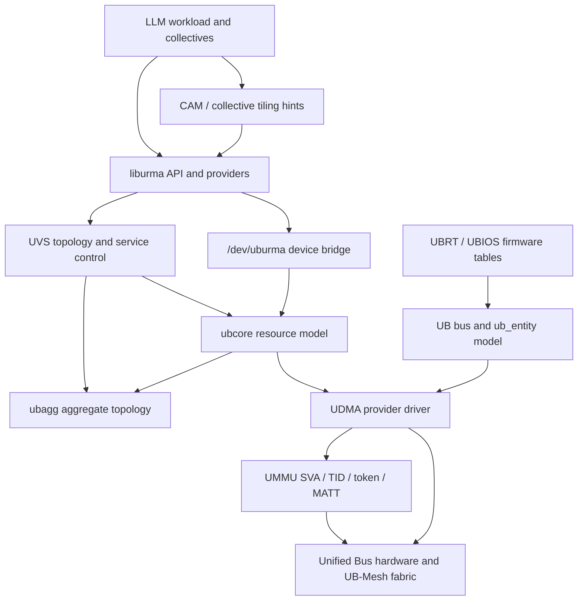
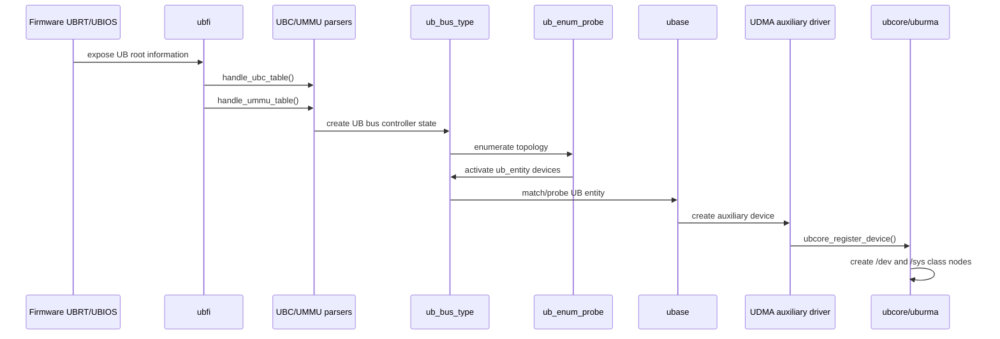
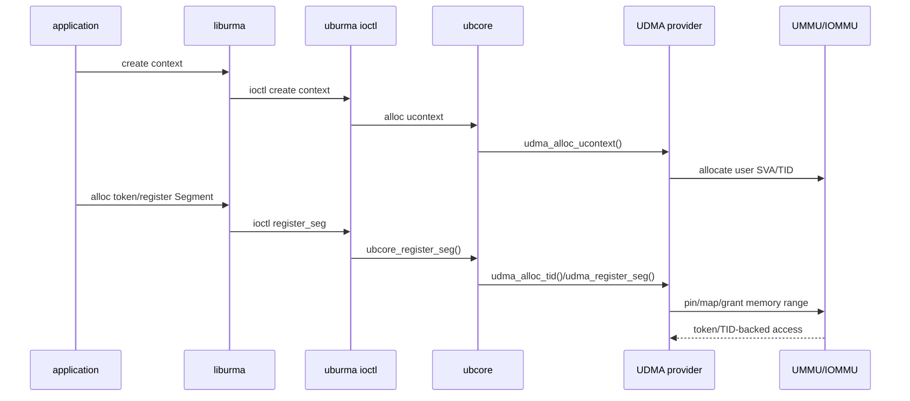
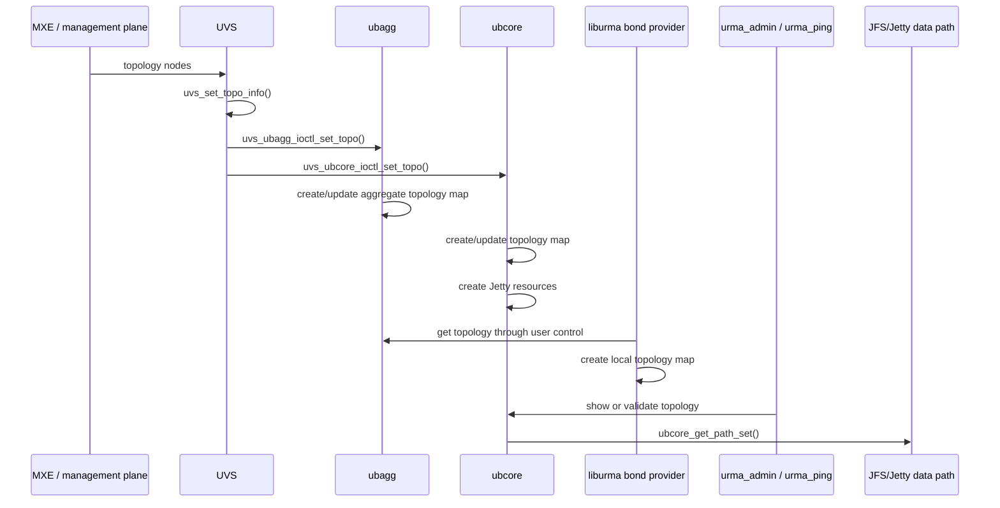
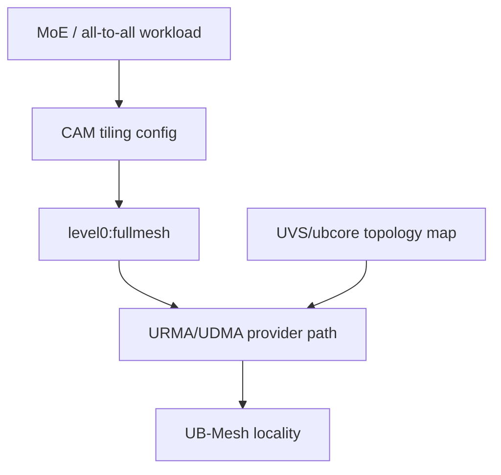

# Architecture Diagrams and Workflows

Last updated: 2026-04-25

This document collects source-anchored diagrams and workflow chapters for the
UMDK/URMA/UDMA stack. It extends the existing end-to-end workflow notes with
UB-Mesh topology and source-evidence references.

## Layer Diagram



## Boot and Enumeration



Source anchors:

- `ubfi_init`: `/Users/ray/Documents/Repo/kernel/drivers/ub/ubfi/ub_fi.c:100`
- `handle_ubc_table`: `/Users/ray/Documents/Repo/kernel/drivers/ub/ubfi/ubc.c:587`
- `handle_ummu_table`: `/Users/ray/Documents/Repo/kernel/drivers/ub/ubfi/ummu.c:420`
- `ub_bus_type`: `/Users/ray/Documents/Repo/kernel/drivers/ub/ubus/ub-driver.c:176`
- `ub_enum_probe`: `/Users/ray/Documents/Repo/kernel/drivers/ub/ubus/enum.c:1447`
- `ubase_ubus_probe`: `/Users/ray/Documents/Repo/kernel/drivers/ub/ubase/ubase_ubus.c:194`
- `ubcore_register_device`: `/Users/ray/Documents/Repo/kernel/drivers/ub/urma/ubcore/ubcore_device.c:1223`

## udev and Device Nodes

```mermaid
flowchart LR
    ub_entity[ub_entity device]
    uevent[ub_uevent()]
    modalias[MODALIAS=ub:*]
    udev[udev/module logic]
    ubcore_node[ubcore/dev_name]
    uburma_node[uburma/dev_name]
    user[liburma / admin tools]

    ub_entity --> uevent
    uevent --> modalias
    modalias --> udev
    ubcore_node --> user
    uburma_node --> user
```

Source anchors:

- UB uevent fields: `/Users/ray/Documents/Repo/kernel/drivers/ub/ubus/ubus_driver.c:379`
- UB modalias: `/Users/ray/Documents/Repo/kernel/drivers/ub/ubus/ubus_driver.c:411`
- ubcore devnode: `/Users/ray/Documents/Repo/kernel/drivers/ub/urma/ubcore/ubcore_device.c:171`
- uburma devnode: `/Users/ray/Documents/Repo/kernel/drivers/ub/urma/uburma/uburma_main.c:51`

## UMMU Memory Workflow



Source anchors:

- `udma_alloc_dev_tid`: `/Users/ray/Documents/Repo/kernel/drivers/ub/urma/hw/udma/udma_main.c:905`
- `udma_alloc_ucontext`: `/Users/ray/Documents/Repo/kernel/drivers/ub/urma/hw/udma/udma_ctx.c:92`
- `udma_alloc_tid`: `/Users/ray/Documents/Repo/kernel/drivers/ub/urma/hw/udma/udma_tid.c:82`
- `udma_register_seg`: `/Users/ray/Documents/Repo/kernel/drivers/ub/urma/hw/udma/udma_segment.c:212`

## UB-Mesh Topology Workflow



Source anchors:

- UVS topology API: `/Users/ray/Documents/Repo/ub-stack/umdk/src/urma/lib/uvs/core/include/uvs_api.h:152`
- UVS propagation: `/Users/ray/Documents/Repo/ub-stack/umdk/src/urma/lib/uvs/core/tpsa_api.c:87`
- ubagg ioctl: `/Users/ray/Documents/Repo/ub-stack/umdk/src/urma/lib/uvs/core/uvs_ubagg_ioctl.c:125`
- ubcore ioctl: `/Users/ray/Documents/Repo/ub-stack/umdk/src/urma/lib/uvs/core/uvs_ubagg_ioctl.c:181`
- ubcore map update: `/Users/ray/Documents/Repo/kernel/drivers/ub/urma/ubcore/ubcore_uvs_cmd.c:256`
- ubagg map update: `/Users/ray/Documents/Repo/kernel/drivers/ub/urma/ubagg/ubagg_ioctl.c:1469`
- bond provider topology load: `/Users/ray/Documents/Repo/ub-stack/umdk/src/urma/lib/urma/bond/bondp_provider_ops.c:179`
- admin topology display: `/Users/ray/Documents/Repo/ub-stack/umdk/src/urma/tools/urma_admin/admin_cmd_show.c:1246`
- path-set selection: `/Users/ray/Documents/Repo/kernel/drivers/ub/urma/ubcore/ubcore_topo_info.c:1157`

## CAM and Fullmesh Collective Hints



Source anchors:

- AllToAll fullmesh hint: `/Users/ray/Documents/Repo/ub-stack/umdk/src/cam/comm_operator/ascend_kernels/moe_dispatch_normal/op_host/moe_dispatch_normal_tiling.cpp:514`
- BatchWrite fullmesh hint: `/Users/ray/Documents/Repo/ub-stack/umdk/src/cam/comm_operator/ascend_kernels/notify_dispatch_a2/op_host/notify_dispatch_tiling_a2.cpp:189`
- MultiPut fullmesh hint: `/Users/ray/Documents/Repo/ub-stack/umdk/src/cam/comm_operator/ascend_kernels/moe_combine_normal_a2/op_host/moe_distribute_combine_a2_tiling.cpp:292`

## Workflow 1: Boot to UB Device Visible in User Space

Trigger: kernel boot or module load on a system with UB firmware tables.

1. Firmware exposes UB root information through ACPI UBRT or DTS UBIOS paths.
2. `ubfi_init()` fetches the root table and dispatches table handlers.
3. UBC tables create bus-controller state; UMMU tables create memory-management
   platform state.
4. The UB bus is registered as `bus_type` named `ub`.
5. Topology enumeration scans controllers, creates/activates `ub_entity`
   devices, and calculates routes.
6. UB uevents expose identity and `MODALIAS=ub:*` fields.
7. ubase probes matching UB entities and builds ubase devices.
8. UDMA probes auxiliary devices and registers `ubcore_device` instances.
9. ubcore and uburma create `/sys/class/*` and `/dev/*` nodes.
10. liburma and tools discover devices through those nodes.

## Workflow 2: Topology Set to Provider Path Selection

Trigger: management plane or MXE supplies topology data.

1. Management provides an array of `struct urma_topo_node`.
2. `uvs_set_topo_info()` verifies the node size and node count.
3. UVS sends the same topology to ubagg and ubcore.
4. ubagg creates or updates its aggregate topology map.
5. ubcore creates or updates its topology map and creates Jetty resources.
6. The bond provider fetches topology from kernel and builds its own map.
7. ubcore can resolve aggregate source/destination EIDs into path sets.
8. Provider data-path setup can use the topology-derived aggregate or physical
   path information.
9. `urma_admin show topo` and `urma_ping` provide operator/test visibility.

## Workflow 3: Context, Segment, Jetty, Work Request

Trigger: application uses liburma.

1. Application opens a URMA device.
2. liburma issues uburma commands for context creation.
3. ubcore dispatches provider operations to UDMA.
4. UDMA allocates user context state and obtains SVA/TID state from UMMU.
5. Application allocates a token or registers a Segment.
6. ubcore validates segment flags, token usage, and access semantics.
7. UDMA pins/maps/grants memory through UMMU.
8. Application creates JFC/JFS/JFR/Jetty resources.
9. Work requests are posted to JFS/Jetty provider queues.
10. Hardware executes work and completions are observed through JFC polling.

## Workflow 4: Teardown

Trigger: application closes resources, process exits, or device is removed.

1. Application destroys Jetty, JFS, JFR, and JFC objects.
2. Segments are unregistered.
3. UDMA unmaps MATT/IOMMU state or ungrants SVA ranges.
4. Pinned pages are released.
5. Token/TID state is released.
6. Contexts are destroyed and SVA bindings are removed.
7. Device unregister removes ubcore/uburma visibility.
8. UB bus remove/shutdown callbacks handle entity teardown.

## Workflow 5: Failure and Observability

Trigger: link, device, topology, or memory registration failure.

1. UB enumeration failures should show in `dmesg` near `ubfi`, `ub_enum`, or
   `ubus`.
2. Device-node failures should be checked through `/sys/class/ubcore`,
   `/sys/class/uburma`, `/dev/ubcore`, and `/dev/uburma`.
3. Topology failures should be checked with `urma_admin show topo` and UVS logs.
4. Segment failures should be checked at ubcore validation, UDMA mapping, and
   UMMU grant/map points.
5. Fullmesh collective issues should be checked from CAM tiling hints down to
   provider topology availability.
