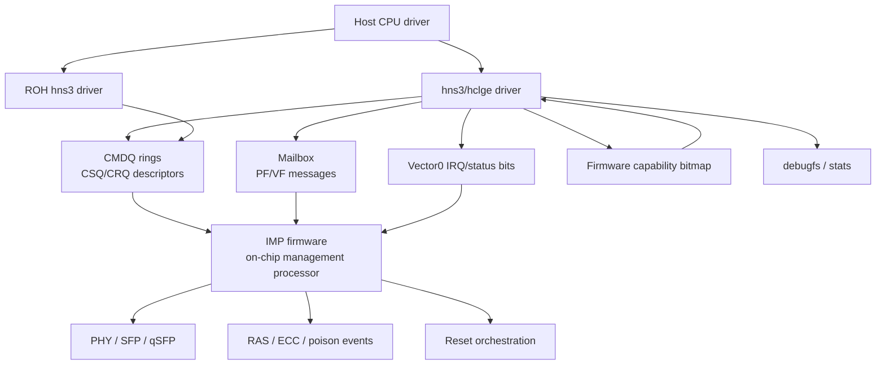
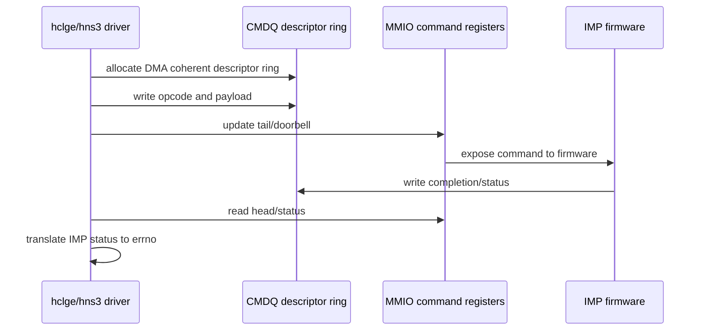
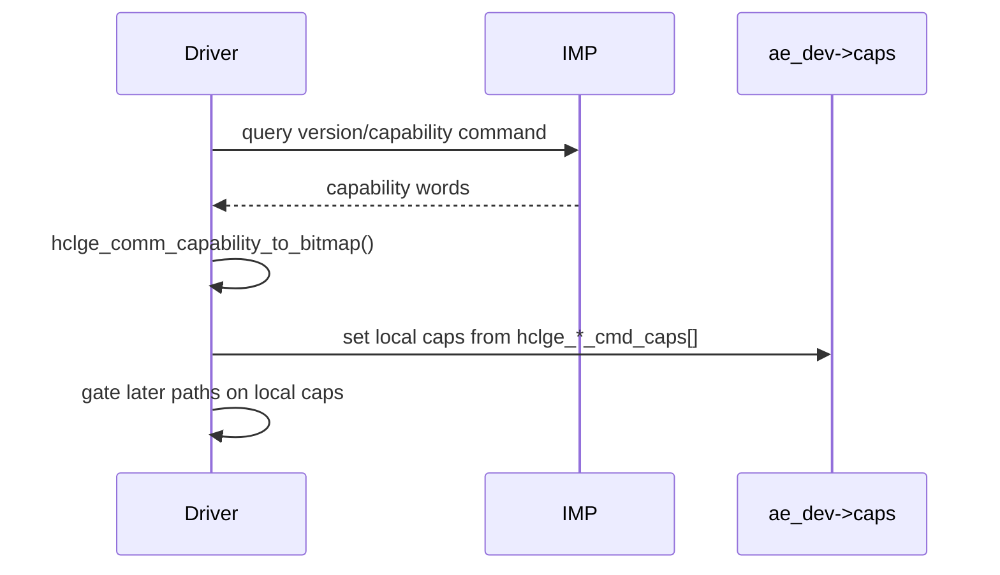
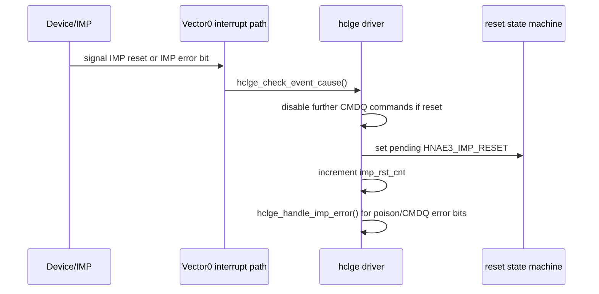

# HiSilicon IMP Interface

Last updated: 2026-04-27

This note captures IMP-related information from the local kernel source trees,
without using or modifying the older `UMDK/imp_interface.md` note.

Primary source trees:

```text
/Users/ray/Documents/Repo/ub-stack/kernel-ub
/Users/ray/Documents/Repo/kernel
```

IMP is a HiSilicon device-firmware concept rather than a UMDK or UMQ API. In
the HNS3 NIC and ROH driver code, IMP is the on-chip management firmware engine
that handles parts of device control, PHY/SFP access, reset orchestration, RAS,
mailbox routing, and firmware capability advertisement.

## Executive Summary

The IMP interface is the host-driver control path to HiSilicon management
firmware. In the HNS3 code it appears as:

- a command queue, or CMDQ, with DMA descriptors and MMIO registers
- a PF/VF mailbox path where IMP can stamp the source VF id
- Vector0 interrupt bits for IMP reset and IMP error events
- firmware capability bits that decide whether the driver uses IMP-mediated
  behavior or fallback/direct paths
- debugfs and stats hooks for IMP state and reset counts

It is not the UMQ datapath. It sits below or beside networking/ROH data paths as
firmware control plumbing.

## Module Graph



## Interface Pieces

| Piece | What it does | Source evidence |
| --- | --- | --- |
| CMDQ | Host allocates command descriptors, writes opcodes/payload, rings device registers, and waits for completion. | `hns3_common/hclge_comm_cmd.{c,h}`, `hns3pf/hclge_cmd.h`, `drivers/roh/hw/hns3/hns3_cmdq.{c,h}` |
| Firmware compatibility command | Host sends `HCLGE_OPC_IMP_COMPAT_CFG` and enables compatibility bits, including PHY-through-IMP when supported. | `hclge_comm_cmd.c`, `hclge_comm_firmware_compat_config` |
| Capability bitmap | Firmware capability bits map to local driver caps such as `HNAE3_DEV_SUPPORT_PHY_IMP_B` and `HNAE3_DEV_SUPPORT_RAS_IMP_B`. | `hclge_comm_cmd.c`, `hclge_pf_cmd_caps`, `hclge_comm_parse_capability` |
| Mailbox source stamping | VF-to-PF mailbox command contains `mbx_src_vfid`, documented as auto-filled by IMP. | `hclge_mbx.h`, `hns3_cmdq.h` |
| Vector0 reset/error bits | IMP reset, CMDQ error, read poison, and host-triggered IMP reset have dedicated bits. | `hns3pf/hclge_main.h` |
| Reset handling | Driver recognizes IMP reset interrupts, disables further commands, records pending reset, and counts IMP resets. | `hns3pf/hclge_main.c` |
| Host-triggered IMP reset | For `HNAE3_IMP_RESET`, driver sets `HCLGE_TRIGGER_IMP_RESET_B`. | `hns3pf/hclge_main.c` |
| PHY/SFP indirection | When PHY IMP support is present, link/SFP information is queried through firmware commands. | `hns3pf/hclge_main.c` |
| RAS/read poison | IMP read poison is reported as a hardware error class and is enabled/masked by RAS registers. | `hns3pf/hclge_err.{c,h}`, `hns3_enet.c` |
| Debugfs | `imp_info` and reset statistics expose IMP state to operators. | `hns3_debugfs.c`, `hns3pf/hclge_debugfs.c` |

## CMDQ Path

The common HNS3 command code defines command flags, command queue register
addresses, queue state, return status, and descriptor allocation. The relevant
register group is in the `0x27000` range for CSQ/CRQ base, depth, head, tail,
and interrupt status/source registers.



Two details are important:

- `hclge_comm_cmd_csq_clean` disables further commands when the command head is
  invalid and logs that a firmware watchdog reset is expected.
- `hclge_comm_errcode` stores the mapping from IMP firmware return codes to
  common Linux errors.

## Capability Negotiation

Firmware reports a capability bitmap. The driver maps IMP capability bits to
local `ae_dev->caps` bits through `hclge_pf_cmd_caps` and
`hclge_vf_cmd_caps`.



IMP-specific capability markers found in source:

- `HCLGE_COMM_CAP_PHY_IMP_B`
- `HCLGE_COMM_CAP_RAS_IMP_B`
- `HNAE3_DEV_SUPPORT_PHY_IMP_B`
- `HNAE3_DEV_SUPPORT_RAS_IMP_B`
- `hclge_comm_dev_phy_imp_supported(ae_dev)`
- `hnae3_dev_phy_imp_supported(hdev)`
- `hnae3_dev_ras_imp_supported(hdev)`

The compatibility command uses `HCLGE_COMM_PHY_IMP_EN_B` only when
`hclge_comm_dev_phy_imp_supported(ae_dev)` is true.

## Mailbox Path

The HNS3 mailbox structure includes:

```text
mbx_src_vfid  /* Auto filled by IMP */
```

That field is visible in both NIC and ROH-oriented source paths:

- `drivers/net/ethernet/hisilicon/hns3/hclge_mbx.h`
- `drivers/roh/hw/hns3/hns3_cmdq.h`

The implication is that mailbox traffic involving VFs is not only a direct
host-software convention. IMP participates in routing or annotation, and the PF
driver can rely on firmware-provided VF source identity.

## Reset And Error Interrupts

The PF driver defines IMP-related bits in the Vector0 and reset register path:

| Symbol | Meaning from usage |
| --- | --- |
| `HCLGE_IMP_RESET_BIT` | IMP reset bit in the global reset register model |
| `HCLGE_VECTOR0_IMP_RESET_INT_B` | Vector0 IMP reset interrupt source |
| `HCLGE_VECTOR0_IMP_CMDQ_ERR_B` | Vector0 IMP command-queue error source |
| `HCLGE_VECTOR0_IMP_RD_POISON_B` | Vector0 IMP read-poison source |
| `HCLGE_TRIGGER_IMP_RESET_B` | Host-set bit requesting an IMP reset |

Runtime handling:



`hclge_do_reset` also supports the opposite direction. When the selected reset
type is `HNAE3_IMP_RESET`, the host sets `HCLGE_TRIGGER_IMP_RESET_B` in the PF
other interrupt register to request IMP reset.

## PHY And SFP Indirection

The driver has paths where PHY or SFP behavior is mediated through IMP:

- `hclge_get_sfp_speed` sends `HCLGE_OPC_GET_SFP_INFO`.
- `hclge_get_sfp_info` sends the same opcode with query type data.
- `hclge_update_tp_port_info` and `hclge_tp_port_init` return early unless
  `hnae3_dev_phy_imp_supported(hdev)` is true.
- `hclge_update_port_info` skips SFP/qSFP queries when `support_sfp_query` is
  false.

The driver logs explicit firmware-not-supported cases such as:

```text
IMP do not support get SFP speed
IMP does not support get SFP info
```

This is the clearest operational example of the interface: the host asks IMP
firmware for information that older or different silicon might expose through a
direct hardware path.

## RAS And Poison Handling

IMP appears in RAS/error handling in two ways:

- capability gating through `HNAE3_DEV_SUPPORT_RAS_IMP_B`
- error sources such as `HCLGE_VECTOR0_IMP_RD_POISON_B`,
  `HCLGE_IMP_RD_POISON_ERR_INT_EN`, and `HNAE3_IMP_RD_POISON_ERROR`

`hclge_handle_imp_error` checks the PF other interrupt register. If the IMP read
poison bit is set, it reports `HNAE3_IMP_RD_POISON_ERROR` and clears the bit. If
the IMP CMDQ error bit is set, it reports a command queue ECC error and clears
that bit.

## Debug And Observability

Operator/debug paths expose IMP state:

- common debugfs has an `imp_info` command entry mapped to
  `HNAE3_DBG_CMD_IMP_INFO`
- PF debugfs prints `IMP reset count`
- reset stats include `imp_rst_cnt`
- error strings include `IMP RD poison`

These hooks make IMP visible as a management-firmware component rather than
just a hidden implementation detail.

## Relationship To UMDK And UnifiedBus

IMP is not part of the UMDK UMQ API. It is a firmware management interface
visible in HiSilicon NIC and ROH kernel drivers.

The reason it matters to UMDK/UnifiedBus notes is architectural context:

- UMDK/URMA/UMQ operate above kernel drivers and device firmware.
- HNS3/ROH device code shows how HiSilicon hardware often separates data path
  queues from firmware-controlled management paths.
- For UB-oriented systems, a management entity such as MUE fills a similar
  architectural slot: management, control, reset, RAS, and service functions
  beside the data path.

## Source Evidence Map

| Source | Evidence |
| --- | --- |
| `kernel-ub/drivers/net/ethernet/hisilicon/hns3/hns3_common/hclge_comm_cmd.h` | CMDQ flags, command registers, `HCLGE_COMM_PHY_IMP_EN_B`, capability enums, IMP return-code field |
| `kernel-ub/drivers/net/ethernet/hisilicon/hns3/hns3_common/hclge_comm_cmd.c` | firmware compatibility command, capability mapping, command disable/watchdog messages |
| `kernel-ub/drivers/net/ethernet/hisilicon/hns3/hnae3.h` | local capability bits and reset/error enum values |
| `kernel-ub/drivers/net/ethernet/hisilicon/hns3/hclge_mbx.h` | mailbox source VF id auto-filled by IMP |
| `kernel-ub/drivers/net/ethernet/hisilicon/hns3/hns3pf/hclge_main.h` | Vector0 IMP reset/error bits and trigger bit |
| `kernel-ub/drivers/net/ethernet/hisilicon/hns3/hns3pf/hclge_main.c` | IMP reset interrupt handling, host-triggered IMP reset, SFP/PHY command paths |
| `kernel-ub/drivers/net/ethernet/hisilicon/hns3/hns3pf/hclge_err.h` | IMP read-poison interrupt enable/mask |
| `kernel-ub/drivers/net/ethernet/hisilicon/hns3/hns3pf/hclge_err.c` | read-poison RAS register setup and IMP-related error paths |
| `kernel-ub/drivers/net/ethernet/hisilicon/hns3/hns3_enet.c` | user-visible hardware error strings including IMP read poison |
| `kernel-ub/drivers/net/ethernet/hisilicon/hns3/hns3_debugfs.c` | `imp_info` debugfs command |
| `kernel-ub/drivers/net/ethernet/hisilicon/hns3/hns3pf/hclge_debugfs.c` | IMP reset count and IMP info dump helpers |
| `kernel-ub/drivers/roh/hw/hns3/hns3_cmdq.{c,h}` | ROH-side command queue and mailbox structures with IMP return/status markers |
| `kernel/drivers/net/ethernet/hisilicon/hns3` | newer openEuler kernel cross-check with same IMP concepts and nearby symbol names |
