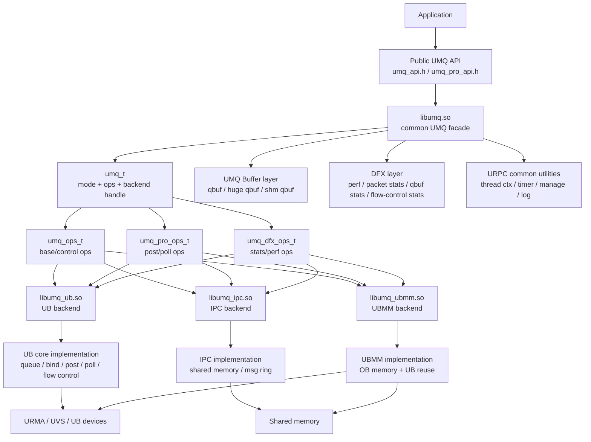
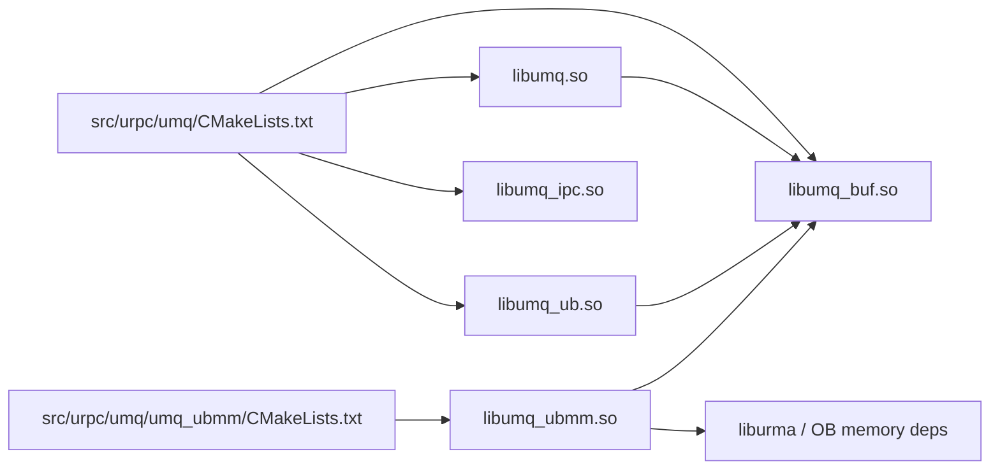
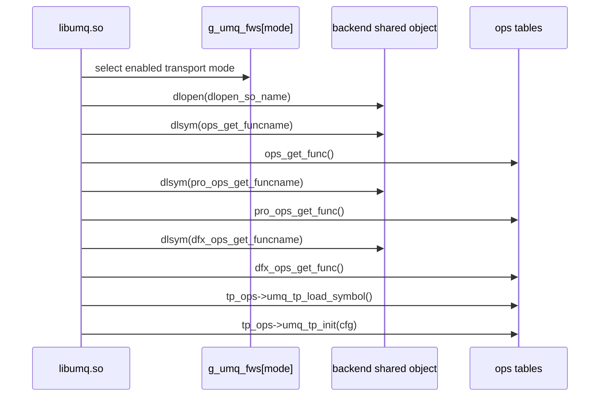
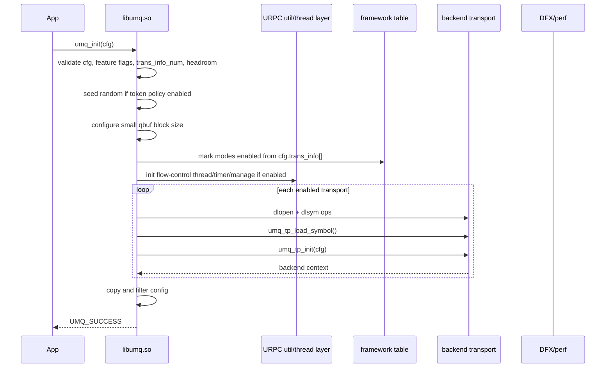
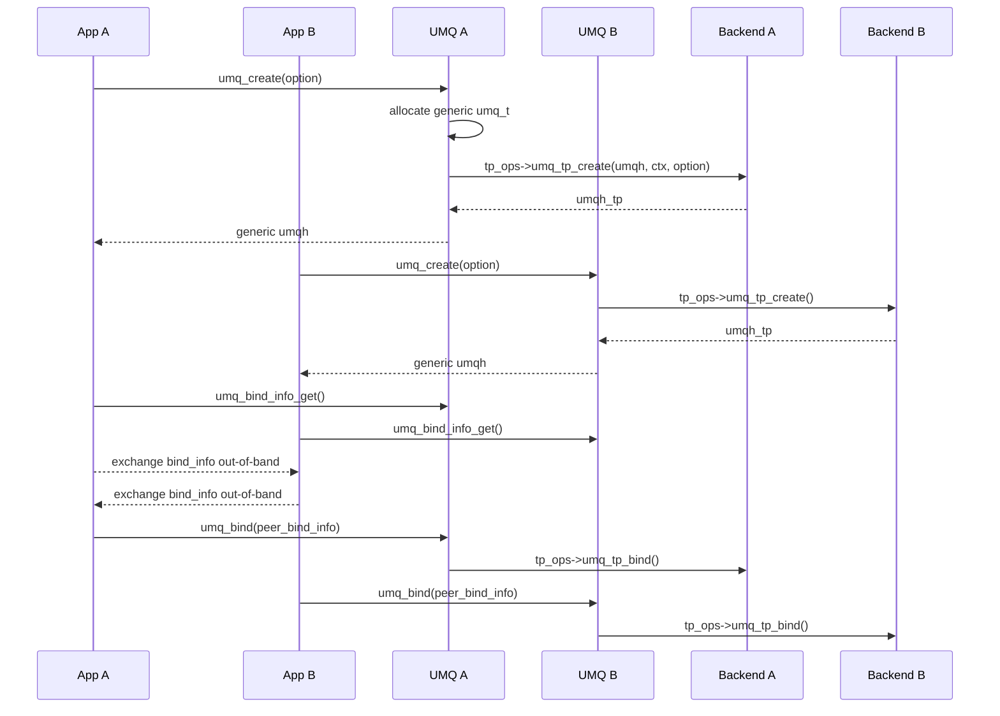
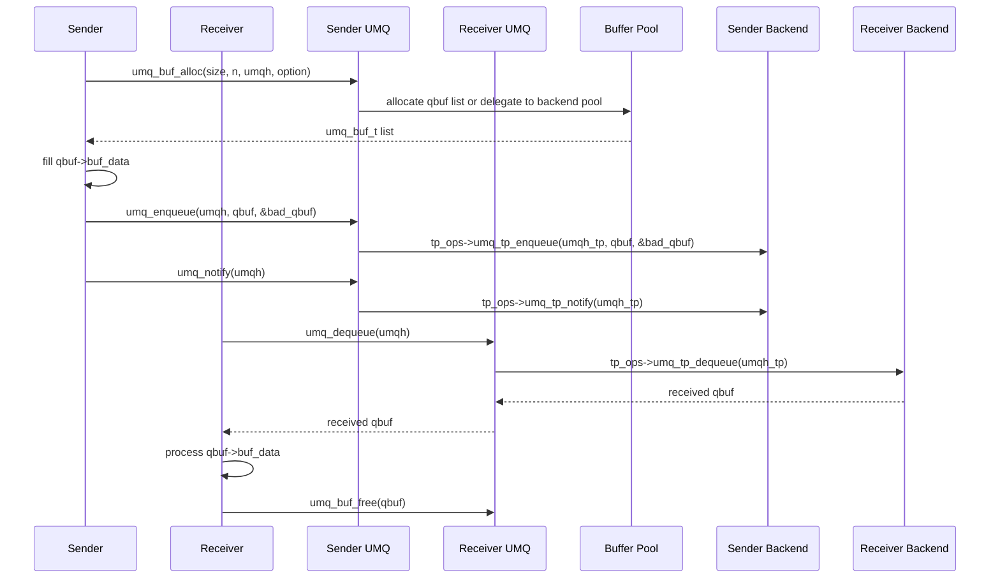
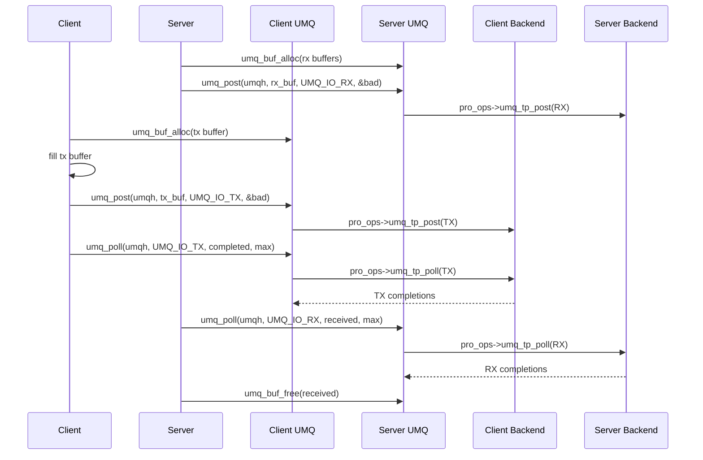
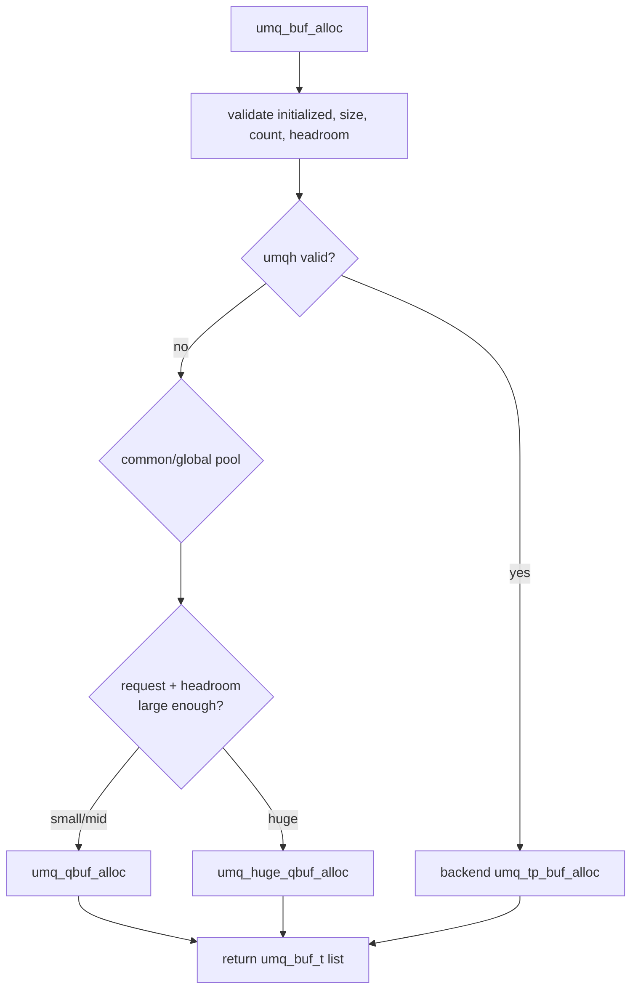
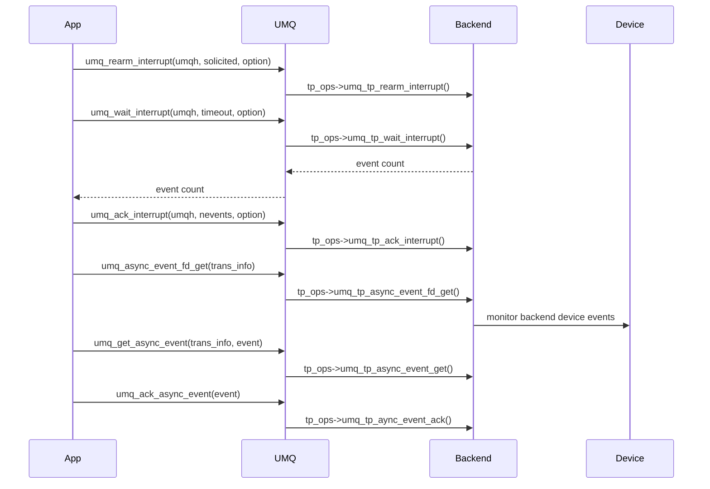
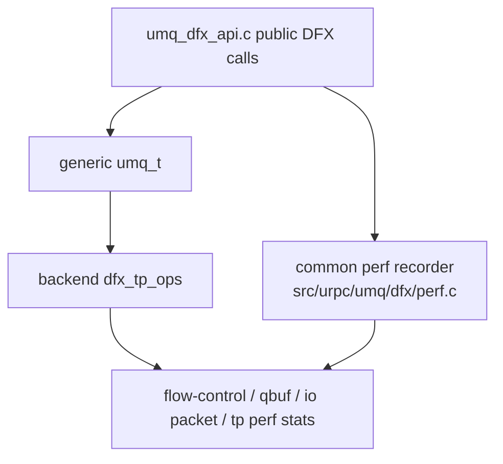

# UMQ Architecture and Workflows

Last updated: 2026-04-27

This note summarizes the Unified Message Queue (UMQ) implementation in the
local UMDK checkout:

```text
/Users/ray/Documents/Repo/ub-stack/umdk
```

UMQ lives under `src/urpc`. It is a message-queue and asynchronous I/O layer
that exposes a common C API, then dispatches operations to transport-specific
backends such as UB, IPC, and UBMM.

## Source Layout

| Area | Path | Role |
| --- | --- | --- |
| Public API | `src/urpc/include/umq` | User-facing UMQ headers, types, errors, DFX APIs, transport ABI headers |
| Common facade | `src/urpc/umq/umq_api.c` | `umq_init`, `umq_create`, bind, base enqueue/dequeue, buffer allocation, control, logging |
| Pro I/O facade | `src/urpc/umq/umq_pro_api.c` | `umq_post`, `umq_poll`, CQ event and interrupt fd wrappers |
| Internal common state | `src/urpc/umq/umq_inner.h` | Internal `umq_t` handle and shared helpers |
| Buffer pools | `src/urpc/umq/qbuf` | qbuf, huge qbuf, shared-memory qbuf pool management |
| UB backend | `src/urpc/umq/umq_ub` | UB transport backend using URMA/UVS symbols and UB device resources |
| IPC backend | `src/urpc/umq/umq_ipc` | Local IPC backend using shared memory/message-ring mechanisms |
| UBMM backend | `src/urpc/umq/umq_ubmm` | UB memory-mode backend, sharing UB implementation pieces and OB memory support |
| DFX/perf | `src/urpc/umq/dfx` and `src/urpc/umq/umq_dfx_api.c` | Latency, packet, qbuf, flow-control, and transport perf statistics |
| Examples | `src/urpc/examples/umq` | UMQ example clients/tools |
| Unit tests | `test/urpc/umq` | UMQ unit tests |
| Integration tests | `test/intergration_test/test_suites/UMQ` | End-to-end UMQ demo tests |
| Docs | `doc/en/urpc/UMQ *.md` | UMQ initialize, I/O, buffer, flow-control, and abnormal-event guides |

## High-Level Module Graph



The important design point is that `libumq.so` is mostly a facade and dispatch
layer. It validates inputs, manages common state, records perf hooks, and
routes calls through backend operation tables. The actual transport behavior is
owned by transport libraries.

## Build-Time Library Graph



Source anchors:

- `src/urpc/umq/CMakeLists.txt`: builds `umq`, adds `qbuf`, `umq_ub`, and `umq_ipc`.
- `src/urpc/umq/qbuf/CMakeLists.txt`: builds `umq_buf`.
- `src/urpc/umq/umq_ub/CMakeLists.txt`: builds `umq_ub`.
- `src/urpc/umq/umq_ipc/CMakeLists.txt`: builds `umq_ipc`.
- `src/urpc/umq/umq_ubmm/CMakeLists.txt`: builds `umq_ubmm`.

## Runtime Transport Loading

UMQ has a static framework table in `src/urpc/umq/umq_api.c`. Each transport
mode maps to:

- a shared object name, such as `libumq_ub.so`, `libumq_ipc.so`, or `libumq_ubmm.so`
- a base ops getter, such as `umq_ub_ops_get`
- a pro ops getter, such as `umq_pro_ub_ops_get`
- a DFX ops getter, such as `umq_ub_dfx_ops_get`



The loading path is implemented in `umq_framework_init`. Backend libraries
publish their operation tables through symbols such as:

- `umq_ub_ops_get` in `src/urpc/umq/umq_ub/umq_ub_api.c`
- `umq_pro_ub_ops_get` in `src/urpc/umq/umq_ub/umq_pro_ub_api.c`
- `umq_ipc_ops_get` in `src/urpc/umq/umq_ipc/umq_ipc.c`

## Public API Groups

| API group | Main functions | Common implementation |
| --- | --- | --- |
| Lifecycle | `umq_init`, `umq_uninit` | `src/urpc/umq/umq_api.c` |
| Queue handle | `umq_create`, `umq_destroy` | `src/urpc/umq/umq_api.c` |
| Bind/connect | `umq_bind_info_get`, `umq_bind`, `umq_unbind` | `src/urpc/umq/umq_api.c` |
| Buffer | `umq_buf_alloc`, `umq_buf_free`, `umq_buf_reset`, `umq_buf_split` | `src/urpc/umq/umq_api.c`, `src/urpc/umq/qbuf` |
| Base queue | `umq_enqueue`, `umq_dequeue`, `umq_notify` | `src/urpc/umq/umq_api.c` |
| Interrupts | `umq_rearm_interrupt`, `umq_wait_interrupt`, `umq_ack_interrupt` | `src/urpc/umq/umq_api.c` |
| Pro I/O | `umq_post`, `umq_poll`, `umq_interrupt_fd_get`, `umq_get_cq_event` | `src/urpc/umq/umq_pro_api.c` |
| Async events | `umq_async_event_fd_get`, `umq_get_async_event`, `umq_ack_async_event` | `src/urpc/umq/umq_api.c`, backend ops |
| Devices/routes | `umq_dev_add`, `umq_get_route_list`, `umq_dev_info_get` | `src/urpc/umq/umq_api.c`, backend ops |
| DFX | `umq_stats_*`, `umq_info_get`, `umq_io_perf_callback_register` | `src/urpc/umq/umq_dfx_api.c` |

## Core Data Structures

### `umq_t`

Defined in `src/urpc/umq/umq_inner.h`.

```text
umq_t
  mode        -> selected umq_trans_mode_t
  tp_ops      -> base/control/data operation table
  pro_tp_ops  -> post/poll operation table
  dfx_tp_ops  -> stats/perf operation table
  umqh_tp     -> transport-specific backend handle
```

The public `uint64_t umqh` returned by `umq_create` is a cast pointer to this
generic `umq_t`. Backend calls receive `umq->umqh_tp`.

### `umq_buf_t`

Defined in `src/urpc/include/umq/umq_types.h`.

```text
umq_buf_t
  qbuf_next        -> chain next fragment/request
  umqh             -> owner handle, or invalid for global/common pool
  total_data_size  -> total request payload size on first fragment
  buf_size         -> current buffer size
  data_size        -> valid payload size in this fragment
  headroom_size    -> user header space before data
  token fields     -> internal token/reference tracking
  mempool_id       -> owner memory pool id
  status           -> data-plane status visible to user
  io_direction     -> TX/RX marker
  buf_data         -> payload pointer
  qbuf_ext         -> extension area, commonly `umq_buf_pro_t`
  data[]           -> inline payload in combine mode
```

UMQ supports two buffer modes:

- `UMQ_BUF_SPLIT`: metadata and payload are separate.
- `UMQ_BUF_COMBINE`: metadata and payload are contiguous.

## Initialization Workflow



Notes:

- Flow-control support initializes URPC thread context, timing wheel, and
  manage/listen infrastructure only when `UMQ_FEATURE_ENABLE_FLOW_CONTROL` is set.
- UB backend initialization loads URMA/UVS symbols, creates UB context, and
  registers the common UMQ I/O buffer memory.
- IPC mode does not need dynamic symbol loading inside its backend.

## Create And Bind Workflow



The bind-info exchange is intentionally outside UMQ. Applications must carry
the peer's bind data over some separate control channel. With token policy
enabled in UB mode, the bind info contains token material and should be
exchanged over a secure channel.

## Base Queue Data Workflow

This is the simple message-queue model: enqueue on one side and dequeue on the
other side.



Common dispatch points:

- `umq_enqueue` validates `umqh`, `qbuf`, and backend ops, then calls
  `umq_tp_enqueue`.
- `umq_dequeue` calls `umq_tp_dequeue` and records perf timing when enabled.
- `umq_notify` is backend-specific. UB currently provides a no-op notify wrapper,
  while IPC maps notify to IPC implementation logic.

## Pro Post/Poll Data Workflow

This model exposes explicit asynchronous TX/RX posting and completion polling.



`umq_post` and `umq_poll` live in `src/urpc/umq/umq_pro_api.c`. They validate
the generic `umq_t` and dispatch to `umq->pro_tp_ops`. UB maps these calls to
`umq_ub_post_impl` and `umq_ub_poll_impl`; IPC maps them to IPC implementation
functions.

## Buffer Allocation Workflow



Common buffer pools are used when `umqh == UMQ_INVALID_HANDLE`. If a real UMQ
handle is provided, allocation is delegated to the backend. This matters for
transport modes with queue-local or shared-memory-backed buffer ownership.

## Interrupt And Event Workflow

UMQ exposes two related event paths:

- Queue interrupts: `umq_rearm_interrupt`, `umq_wait_interrupt`,
  `umq_ack_interrupt`, plus pro helpers `umq_interrupt_fd_get` and
  `umq_get_cq_event`.
- Device asynchronous events: `umq_async_event_fd_get`,
  `umq_get_async_event`, and `umq_ack_async_event`.



The UB backend implements async-event hooks. IPC has queue interrupt support,
but no device-level async-event operations in its `umq_ops_t` table.

## DFX And Perf Workflow



DFX includes:

- flow-control statistics
- qbuf pool statistics
- UMQ info dump
- I/O packet counters
- global latency/perf records
- transport-layer perf start/stop/info calls

Features are controlled through `umq_init_cfg_t.feature`, including
`UMQ_FEATURE_ENABLE_STATS`, `UMQ_FEATURE_ENABLE_PERF`, and
`UMQ_FEATURE_ENABLE_FLOW_CONTROL`.

## Backend Responsibilities

### UB Backend

Primary files:

- `src/urpc/umq/umq_ub/umq_ub_api.c`
- `src/urpc/umq/umq_ub/umq_pro_ub_api.c`
- `src/urpc/umq/umq_ub/umq_ub_dfx_api.c`
- `src/urpc/umq/umq_ub/core/umq_ub_impl.c`
- `src/urpc/umq/umq_ub/core/private/umq_ub.c`
- `src/urpc/umq/umq_ub/core/private/umq_pro_ub.c`
- `src/urpc/umq/umq_ub/core/flow_control/umq_ub_flow_control.c`

Responsibilities:

- Load URMA/UVS dynamic symbols.
- Initialize UB device context from `trans_info`.
- Register common UMQ I/O memory for UB access.
- Create UB queues and queue resources.
- Serialize/deserialize bind information.
- Bind local and remote queue state.
- Implement base enqueue/dequeue.
- Implement pro `post`/`poll` for TX/RX.
- Support flow control, interrupts, async device events, DFX stats, route lookup,
  and device information queries.

### IPC Backend

Primary files:

- `src/urpc/umq/umq_ipc/umq_ipc.c`
- `src/urpc/umq/umq_ipc/umq_pro_ipc.c`
- `src/urpc/umq/umq_ipc/umq_ipc_impl.c`
- `src/urpc/umq/msg_ring.c`

Responsibilities:

- Initialize local IPC context.
- Create shared-memory-backed queue resources.
- Exchange bind information between local peers.
- Implement enqueue/dequeue and notify with IPC semantics.
- Implement pro post/poll wrappers.
- Support queue interrupt operations.

### UBMM Backend

Primary files:

- `src/urpc/umq/umq_ubmm/umq_ubmm.c`
- `src/urpc/umq/umq_ubmm/umq_pro_ubmm.c`
- `src/urpc/umq/umq_ubmm/umq_ubmm_impl.c`
- `src/urpc/umq/umq_ubmm/obmem_common.c`

Responsibilities:

- Provide UB shared-memory style transport modes.
- Use OB memory support and reuse UB implementation pieces.
- Implement base and pro ops for `UMQ_TRANS_MODE_UBMM` and
  `UMQ_TRANS_MODE_UBMM_PLUS`.

## Transport Modes

Defined in `src/urpc/include/umq/umq_types.h`.

| Mode | Meaning in code comments |
| --- | --- |
| `UMQ_TRANS_MODE_UB` | UB, max I/O size 64K |
| `UMQ_TRANS_MODE_IB` | IB, max I/O size 64K |
| `UMQ_TRANS_MODE_UCP` | UB offload, max I/O size 64K |
| `UMQ_TRANS_MODE_IPC` | Local IPC, max I/O size 10M |
| `UMQ_TRANS_MODE_UBMM` | UB shared memory, max I/O size 8K |
| `UMQ_TRANS_MODE_UB_PLUS` | UB, max I/O size 10M |
| `UMQ_TRANS_MODE_IB_PLUS` | IB, max I/O size 10M |
| `UMQ_TRANS_MODE_UBMM_PLUS` | UB shared memory, max I/O size 10M |

The current local build files include UB, IPC, and UBMM backend sources. The
framework table also names IB and UCP shared-object entries, but matching local
backend source directories were not found in this checkout.

## Configuration Model

`umq_init_cfg_t` controls global UMQ behavior:

- `buf_mode`: split or combine buffer layout.
- `feature`: API and feature flags.
- `headroom_size`: user header size before payload.
- `io_lock_free`: allows callers to take thread-safety responsibility.
- `trans_info_num` and `trans_info[]`: enabled devices/transport modes.
- `flow_control`: flow-control parameters.
- `block_cfg`: small qbuf block size.
- `cna` and `ubmm_eid`: UBMM-specific information.
- `buf_pool_cfg`: buffer pool sizing.

`umq_create_option_t` controls per-queue creation:

- required `trans_mode`, `dev_info`, and `name`
- optional RX/TX buffer sizes and depths
- queue mode: polling or interrupt
- TP mode/type
- shared receive-queue flags
- used ports and priority

## End-To-End Workflow Summary

```text
Application
  -> umq_init(cfg)
      -> enable transport modes from cfg.trans_info[]
      -> initialize flow-control utilities if requested
      -> dlopen backend .so and fetch ops tables
      -> initialize backend contexts and DFX
  -> umq_create(option)
      -> allocate generic umq_t
      -> backend creates transport queue/context and returns umqh_tp
  -> umq_bind_info_get()
      -> backend serializes local endpoint/bind data
  -> exchange bind_info through app control channel
  -> umq_bind(peer_bind_info)
      -> backend connects local and remote endpoint state
  -> data path
      -> base model: umq_buf_alloc -> umq_enqueue -> umq_dequeue -> umq_buf_free
      -> pro model:  umq_buf_alloc -> umq_post(TX/RX) -> umq_poll(TX/RX) -> umq_buf_free
  -> optional DFX, interrupts, async events, route/device queries
  -> umq_unbind()
  -> umq_destroy()
  -> umq_uninit()
      -> backend uninit, dlclose, perf uninit, thread/timer cleanup
```

## Source Evidence Map

| Topic | Source anchor |
| --- | --- |
| UMQ framework table and backend SO names | `src/urpc/umq/umq_api.c` |
| Framework loading with `dlopen`/`dlsym` | `src/urpc/umq/umq_api.c`, `umq_framework_init` |
| Generic `umq_t` handle | `src/urpc/umq/umq_inner.h` |
| Transport base ops ABI | `src/urpc/include/umq/transport_layer/umq_tp_api.h` |
| Transport pro ops ABI | `src/urpc/include/umq/transport_layer/umq_pro_tp_api.h` |
| Transport DFX ops ABI | `src/urpc/include/umq/transport_layer/umq_tp_dfx_api.h` |
| UMQ init/create/bind/base API | `src/urpc/umq/umq_api.c` |
| UMQ post/poll API | `src/urpc/umq/umq_pro_api.c` |
| UMQ buffer structure | `src/urpc/include/umq/umq_types.h` |
| qbuf pool implementation | `src/urpc/umq/qbuf/umq_qbuf_pool.c` |
| huge qbuf implementation | `src/urpc/umq/qbuf/umq_huge_qbuf_pool.c` |
| shared-memory qbuf implementation | `src/urpc/umq/qbuf/umq_shm_qbuf_pool.c` |
| UB ops table | `src/urpc/umq/umq_ub/umq_ub_api.c` |
| UB pro ops table | `src/urpc/umq/umq_ub/umq_pro_ub_api.c` |
| UB implementation | `src/urpc/umq/umq_ub/core/umq_ub_impl.c` and `core/private` |
| UB flow control | `src/urpc/umq/umq_ub/core/flow_control` |
| IPC ops table | `src/urpc/umq/umq_ipc/umq_ipc.c` |
| IPC implementation | `src/urpc/umq/umq_ipc/umq_ipc_impl.c` |
| UBMM implementation | `src/urpc/umq/umq_ubmm` |
| Perf implementation | `src/urpc/umq/dfx/perf.c` |
| User docs | `doc/en/urpc/UMQ Initialize.en.md`, `UMQ IO.md`, `UMQ Buffer.md`, `UMQ Flowcontrol.md`, `UMQ Abnormal Event.md` |
