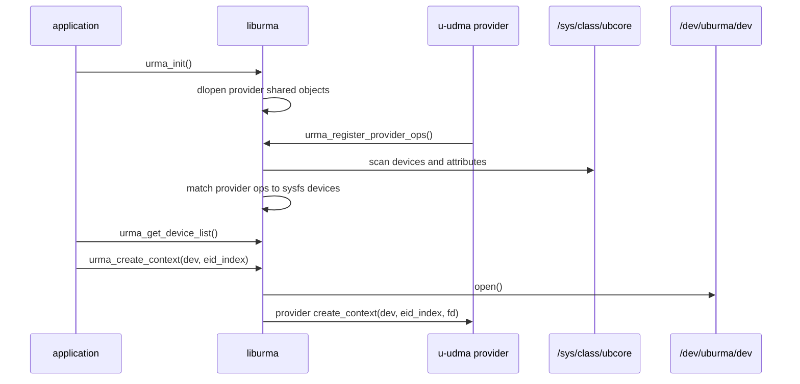

# URMA/UDMA User-Kernel Boundary

Last updated: 2026-04-25

This note consolidates the relationship between the user-space URMA stack,
the UDMA user provider, the `uburma` user-kernel bridge, `ubcore`, and the
kernel UDMA provider. The short version is:

```text
application
  -> liburma public API
  -> UDMA user provider, usually called u-udma in these notes
  -> /dev/uburma/<device> for setup/control ioctl and mmap
  -> uburma kernel bridge
  -> ubcore common kernel resource layer
  -> UDMA kernel provider, usually called k-udma in these notes
  -> UMMU, UBASE, and hardware
```

After setup, the normal user-space data path is designed to avoid a syscall
per work request:

```text
application
  -> liburma dataplane wrapper
  -> u-udma provider ops
  -> user-mapped WQE/CQE buffers
  -> user-mapped doorbell or MMIO page
  -> UDMA hardware
```

That means URMA is not only a user-space API and not only a kernel subsystem.
It is a split stack. `liburma` and provider plugins define the user-facing
ABI; `uburma` protects the user-kernel crossing; `ubcore` owns common URMA
kernel objects; and the UDMA kernel provider realizes those objects on UB
hardware, UMMU, queues, contexts, and doorbells.

## Boundary Summary

| Layer | Space | Main role | Boundary artifact |
| --- | --- | --- | --- |
| Application | User | Calls URMA APIs and owns application buffers. | `urma_*` public APIs. |
| `liburma` core | User | Discovers devices, loads providers, validates generic API inputs, dispatches provider ops, wraps ioctls. | `/sys/class/ubcore`, fallback `/sys/class/uburma`, `/dev/uburma/<device>`. |
| UDMA user provider | User | Implements provider-specific URMA ops, builds provider-private command payloads, allocates user queue buffers, formats WQEs/CQEs, maps doorbells, polls completions. | `urma_provider_ops_t`, UDMA private ABI structures, `mmap()` offsets. |
| `uburma` | Kernel | Character device and ioctl/mmap bridge. Copies command headers and TLV args, owns user-object handles, enforces context/object lifetime, forwards to `ubcore`. | `UBURMA_CMD`, `UBURMA_CMD_*`, `/dev/uburma/<device>`. |
| `ubcore` | Kernel | Common URMA resource model and device registry. Owns `ubcore_device`, user context, Segment, token/TID, Jetty/JFS/JFR/JFC common semantics and client callbacks. | `ubcore_*` resource APIs and `ubcore_ops`. |
| UDMA kernel provider | Kernel | Hardware-specific implementation of `ubcore_ops`: context, UMMU/TID, Segment, JFS/JFR/JFC/Jetty, mmap, user control, and hardware queue programming. | `g_dev_ops` in the UDMA driver. |
| UMMU/UBASE/hardware | Kernel/firmware/hardware | UB memory translation/protection, device TID, SVA/KSVA, DMA resources, hardware queues, and doorbells. | UMMU APIs, UBASE auxiliary devices, hardware registers. |

## Source Anchors

The most important source anchors for this boundary are:

| Claim | Source anchor |
| --- | --- |
| `liburma` discovers the current sysfs path and falls back from `/sys/class/ubcore` to `/sys/class/uburma` for older kernels. | `/Users/ray/Documents/Repo/ub-stack/umdk/src/urma/lib/urma/core/urma_device.c:27`, `:28`, `:355` |
| `liburma` expects character devices under `/dev/uburma`. | `/Users/ray/Documents/Repo/ub-stack/umdk/src/urma/lib/urma/core/urma_device.c:33` |
| `liburma` loads provider shared objects with `dlopen()`. | `/Users/ray/Documents/Repo/ub-stack/umdk/src/urma/lib/urma/core/urma_main.c:64`, `:89`, `:159` |
| The UDMA user provider registers provider ops from a constructor. | `/Users/ray/Documents/Repo/ub-stack/umdk/src/urma/hw/udma/udma_u_main.c:12`, `:16` |
| Provider ops include `create_context`, dataplane post functions, and `poll_jfc`. | `/Users/ray/Documents/Repo/ub-stack/umdk/src/urma/lib/urma/core/include/urma_provider.h:197`, `:205`, `:163` |
| `urma_create_context()` opens the `/dev/uburma/<device>` path and calls the selected provider. | `/Users/ray/Documents/Repo/ub-stack/umdk/src/urma/lib/urma/core/urma_main.c:503`, `:521`, `:530` |
| The common user ioctl wrapper sends `URMA_CMD` with a command header. | `/Users/ray/Documents/Repo/ub-stack/umdk/src/urma/lib/urma/core/urma_cmd_tlv.c:45`, `:52` |
| UDMA user context creation sends `URMA_CMD_CREATE_CTX`. | `/Users/ray/Documents/Repo/ub-stack/umdk/src/urma/lib/urma/core/urma_cmd_tlv.c:62`, `:71`; `/Users/ray/Documents/Repo/ub-stack/umdk/src/urma/hw/udma/udma_u_ops.c:214`, `:246` |
| `uburma` installs file operations for `open`, `mmap`, `ioctl`, and `release`. | `/Users/ray/Documents/Repo/kernel/drivers/ub/urma/uburma/uburma_main.c:65` |
| `uburma` dispatches `UBURMA_CMD_*` to command handlers. | `/Users/ray/Documents/Repo/kernel/drivers/ub/urma/uburma/uburma_cmd.c:4845`, `:4933`, `:4949` |
| `UBURMA_CMD_CREATE_CTX`, Segment, queue, Jetty, event, and TP commands are enumerated in the kernel bridge ABI. | `/Users/ray/Documents/Repo/kernel/drivers/ub/urma/uburma/uburma_cmd.h:35`, `:39` |
| `ubcore` registers provider devices and allocates user contexts. | `/Users/ray/Documents/Repo/kernel/drivers/ub/urma/ubcore/ubcore_device.c:1223`, `:1812` |
| UDMA installs `ubcore_ops` and registers itself with `ubcore`. | `/Users/ray/Documents/Repo/kernel/drivers/ub/urma/hw/udma/udma_main.c:262`, `:501`, `:513` |
| UDMA kernel context allocation and mmap are provider ops. | `/Users/ray/Documents/Repo/kernel/drivers/ub/urma/hw/udma/udma_ctx.c:92`, `:326` |
| UDMA kernel allocates device TID and user/token TID through UMMU-related paths. | `/Users/ray/Documents/Repo/kernel/drivers/ub/urma/hw/udma/udma_main.c:905`; `/Users/ray/Documents/Repo/kernel/drivers/ub/urma/hw/udma/udma_tid.c:82` |
| UDMA kernel Segment registration maps URMA Segment intent to UDMA/UMMU work. | `/Users/ray/Documents/Repo/kernel/drivers/ub/urma/hw/udma/udma_segment.c:212` |
| User provider maps doorbell pages with `mmap()`. | `/Users/ray/Documents/Repo/ub-stack/umdk/src/urma/hw/udma/udma_u_db.c:205`, `:212` |
| UDMA mmap command types include JFC pages, Jetty DSQE pages, reserved SQ, kernel buffers, and huge pages. | `/Users/ray/Documents/Repo/ub-stack/umdk/src/urma/hw/udma/kernel_headers/udma_abi.h:125`; `/Users/ray/Documents/Repo/kernel/drivers/ub/urma/hw/udma/udma_ctx.c:341` |
| User dataplane calls dispatch to provider ops without `uburma` per WR. | `/Users/ray/Documents/Repo/ub-stack/umdk/src/urma/lib/urma/core/urma_dp_api.c:210`, `:220`, `:274` |
| The UDMA user provider implements post and poll ops. | `/Users/ray/Documents/Repo/ub-stack/umdk/src/urma/hw/udma/udma_u_ops.c:101`, `:105`; `/Users/ray/Documents/Repo/ub-stack/umdk/src/urma/hw/udma/udma_u_jfs.c:948`; `/Users/ray/Documents/Repo/ub-stack/umdk/src/urma/hw/udma/udma_u_jfc.c:743` |
| Kernel clients can also post/poll through `ubcore`, but that is a kernel-client path, not the normal `liburma` fast path. | `/Users/ray/Documents/Repo/kernel/drivers/ub/urma/ubcore/ubcore_dp.c:64`, `:89` |

## Discovery and Open

The user-space side starts before an application creates a context:

1. The `liburma` constructor calls `urma_discover_sysfs_path()` so the library
   can use `/sys/class/ubcore` on current kernels and `/sys/class/uburma` on
   older kernels.
2. `urma_init()` loads provider shared objects. The provider shared object's
   constructor registers its `urma_provider_ops_t`.
3. `liburma` scans sysfs devices and matches them with registered provider
   match tables.
4. The resulting `urma_device_t` carries both sysfs-derived device attributes
   and the `/dev/uburma/<device>` path.
5. `urma_create_context()` opens the character device and passes the fd to the
   selected provider's `create_context` operation.

The important design point is that the application does not call UDMA kernel
APIs directly. It sees a generic URMA device. Provider selection turns that
generic device into a UDMA-specific user provider when the sysfs/device match
requires UDMA.



## Control Plane

The control plane is every operation where user space needs the kernel to
create, destroy, authorize, map, query, or connect a resource. It crosses the
boundary through `ioctl()` on `/dev/uburma/<device>`.

The generic pattern is:

```text
liburma API
  -> provider operation, often UDMA-specific
  -> urma_cmd_* or urma_ioctl_* wrapper
  -> ioctl(fd, URMA_CMD, hdr)
  -> uburma_ioctl()
  -> uburma_cmd_parse()
  -> uburma_cmd_<operation>()
  -> ubcore_<operation>()
  -> ubcore_device->ops-><operation>()
  -> UDMA kernel implementation
```

For context creation:

```text
urma_create_context()
  -> open("/dev/uburma/<device>")
  -> u-udma udma_u_create_context()
  -> urma_cmd_create_context()
  -> ioctl(fd, URMA_CMD_CREATE_CTX)
  -> uburma_cmd_create_ctx()
  -> ubcore_alloc_ucontext()
  -> udma_alloc_ucontext()
  -> UMMU/SVA/TID and provider-private response data
  -> user provider maps doorbell/reserved SQ resources
```

For Segment registration:

```text
urma_register_seg()
  -> provider formats Segment/token/private data
  -> URMA_CMD_REGISTER_SEG
  -> uburma_cmd_register_seg()
  -> ubcore_register_seg()
  -> udma_register_seg()
  -> page pin/map, token/TID handling, UMMU mapping
```

For JFC/JFS/JFR/Jetty creation:

```text
urma_create_jfc()/jfs/jfr/jetty
  -> provider prepares queue buffer addresses and private ABI data
  -> URMA_CMD_CREATE_JFC/JFS/JFR/JETTY
  -> uburma command handler creates a user-object handle
  -> ubcore_create_jfc()/jfs/jfr/jetty
  -> UDMA kernel provider allocates hardware object and returns IDs/handles
  -> user provider records queue metadata for dataplane use
```

The kernel object handle returned by `uburma` is not just a pointer. It is a
user-object ID tracked by `uburma` for lifetime and permission checks. The user
provider stores those handles and passes them back for later modify, destroy,
wait, event, or private user-control operations.

## `uburma` Role

`uburma` is the narrow security and lifetime boundary. It does not implement
UDMA hardware behavior itself. It exists to make user requests safe enough to
enter `ubcore` and the provider driver.

Its main responsibilities are:

- create one character device per `ubcore_device` under `/dev/uburma`;
- accept `open()`, `release()`, `ioctl()`, and `mmap()` from user space;
- copy command headers and TLV payloads from/to user space;
- reject invalid command IDs, missing context, oversized payloads, or stale
  object handles;
- allocate and track user objects for context, Segment, token, JFC, JFS, JFR,
  Jetty, notifier, and related resources;
- dispatch valid commands to `ubcore`;
- call provider mmap through `ubcore_device->ops->mmap`.

`uburma` therefore resembles the Linux RDMA `uverbs` boundary more than it
resembles a device driver for the actual hardware. The actual UDMA behavior is
behind `ubcore_ops`.

## `ubcore` Role

`ubcore` is the common kernel URMA layer. It is the place where UDMA becomes a
URMA device visible to the rest of the UB software stack.

Its main responsibilities are:

- own the `ubcore_device` registry;
- publish sysfs attributes consumed by `liburma`;
- register and unregister provider devices;
- expose common resource functions such as `ubcore_alloc_ucontext()`,
  `ubcore_register_seg()`, `ubcore_create_jfc()`, `ubcore_create_jfs()`,
  `ubcore_create_jfr()`, and `ubcore_create_jetty()`;
- manage common object state and reference counts;
- call `dev->ops` to delegate hardware-specific work to UDMA or another
  provider;
- support kernel clients that use URMA resources without going through
  `liburma`, such as in-kernel UB management or ULP paths.

This is the main difference between the user-space fast path and the kernel
client path. User-space post/poll normally goes through `u-udma` and mapped
queues. Kernel clients use `ubcore_post_jfs_wr()` and `ubcore_poll_jfc()`,
which call the provider's kernel `ubcore_ops`.

## UDMA Provider Split

UDMA appears twice because it has two cooperating halves:

| Half | Location | Purpose |
| --- | --- | --- |
| `u-udma` | `ub-stack/umdk/src/urma/hw/udma` | User-space provider loaded by `liburma`; owns provider ops, queue buffer layout, WQE/CQE parsing, doorbell mapping, and provider-private command payloads. |
| `k-udma` | `kernel/drivers/ub/urma/hw/udma` | Kernel provider registered into `ubcore`; owns hardware context, UMMU/TID, memory mapping, hardware queues, mailbox or command programming, and provider-private mmap/user-control handling. |

The split lets URMA keep a generic API while UDMA keeps hardware-specific
details out of the common library. The common boundary is not a single C
structure. It is the combination of:

- `urma_provider_ops_t` in user space;
- UDMA provider-private ABI headers and structures;
- `UBURMA_CMD_*` command IDs and TLV/payload rules;
- `ubcore_ops` in kernel space;
- mmap offset encoding for provider-specific pages;
- returned object IDs, queue IDs, doorbell IDs, token IDs, TIDs, and provider
  response data.

## mmap and Doorbells

`mmap()` is the second major user-kernel crossing, separate from control
ioctls. It is how the provider maps pages needed for the fast path.

The user provider computes an mmap offset using a command/type field and an
index. Kernel UDMA decodes that offset in `udma_mmap()` and maps the requested
resource.

Relevant mmap command types visible in the user provider's kernel header copy
and kernel UDMA mmap switch include:

| mmap type | Purpose |
| --- | --- |
| `UDMA_MMAP_JFC_PAGE` | JFC/CQ doorbell or completion-related page mapping. |
| `UDMA_MMAP_JETTY_DSQE` | Direct-send queue entry or send doorbell page for JFS/Jetty. |
| `UDMA_MMAP_RESERVED_SQ` | Reserved send queue area shared by contexts. |
| `UDMA_MMAP_KERNEL_BUF` | Kernel buffer mapping helper used by provider code. |
| `UDMA_MMAP_HUGEPAGE` | Huge-page mapping path for provider-managed buffers. |

The boundary looks like:

```text
u-udma computes offset with get_mmap_offset(index, page_size, mmap_type)
  -> mmap(NULL, size, PROT_READ | PROT_WRITE, MAP_SHARED, dev_fd, offset)
  -> uburma_mmap()
  -> ubcore_device->ops->mmap(file->ucontext, vma)
  -> udma_mmap()
  -> map DB, DSQE, reserved SQ, hugepage, or kernel buffer
```

This is why post/poll can be fast after setup. User space already has the
queue memory and doorbell mapping it needs to produce WQEs and observe CQEs.

## Data Path

For a normal user-space URMA application, the steady-state send/receive path
does not call `uburma` for every WQE.

Send path:

```text
application calls urma_post_jfs_wr()
  -> liburma validates and finds provider ops
  -> u-udma udma_u_post_jfs_wr()
  -> user provider formats WQE in mapped SQ memory
  -> user provider updates producer index
  -> user provider rings mapped doorbell
  -> hardware fetches/executes WQE
```

Completion path:

```text
application calls urma_poll_jfc()
  -> liburma validates and finds provider ops
  -> u-udma udma_u_poll_jfc()
  -> user provider reads mapped CQE/JFC memory
  -> user provider translates CQE to urma_cr_t
  -> application receives completion result
```

Operations that still cross into the kernel include:

- context creation and deletion;
- JFC/JFS/JFR/Jetty create, modify, active/deactive, query, and delete;
- Segment register/unregister and import/unimport;
- token/TID allocation and free;
- event fd/notifier creation;
- blocking event waits when the provider uses kernel event support;
- provider private `user_ctl` operations;
- mmap setup for queue, doorbell, reserved SQ, hugepage, and kernel buffers.

## Kernel Client Path

The kernel also has URMA users. Those paths do not call `liburma`. They call
`ubcore_*` directly.

```text
kernel client
  -> ubcore_create_jfc()/ubcore_create_jfs()/ubcore_register_seg()
  -> ubcore_post_jfs_wr()/ubcore_poll_jfc()
  -> ubcore_device->ops
  -> k-udma implementation
```

This is important when reading source:

- `ubcore_post_jfs_wr()` and `ubcore_poll_jfc()` are real dataplane helpers,
  but they are for kernel clients.
- `urma_post_jfs_wr()` and `urma_poll_jfc()` are user-space APIs and normally
  dispatch into `u-udma`.
- Both paths converge at the provider concept, but one uses `urma_provider_ops_t`
  in user space and the other uses `ubcore_ops` in kernel space.

## Object Ownership

| Object | User-space view | Kernel common owner | UDMA kernel owner | Fast-path owner |
| --- | --- | --- | --- | --- |
| Device | `urma_device_t` from liburma scan. | `ubcore_device`. | UDMA registers the `ubcore_device` and installs `g_dev_ops`. | N/A |
| Context | `urma_context_t` with device fd and provider private context. | `ubcore_ucontext`. | `udma_context`, UMMU/SVA/TID state, mmap state. | User provider uses context for queues and DB mappings. |
| Token/TID | Token ID/handle returned to user. | `ubcore_token_id`. | `udma_tid` and UMMU allocation. | Used by Segment and remote access metadata. |
| Segment | `urma_seg_t` or imported target Segment. | `ubcore_target_seg` or target/import model. | UDMA page pin/map, MAPT/MATT, SVA separated-mode handling. | Used in WQE SGE metadata. |
| JFC | `urma_jfc_t`, CQ/completion queue abstraction. | `ubcore_jfc`. | UDMA CQ/JFC object and completion resources. | User provider polls mapped CQE memory when possible. |
| JFS | `urma_jfs_t`, send queue abstraction. | `ubcore_jfs`. | UDMA send queue object and hardware ID. | User provider writes WQEs and rings doorbell. |
| JFR | `urma_jfr_t`, receive queue abstraction. | `ubcore_jfr`. | UDMA receive queue object and hardware ID. | User provider posts receive WQEs. |
| Jetty | `urma_jetty_t`, QP-like endpoint. | `ubcore_jetty`. | UDMA Jetty/SQ/RQ/TP-related hardware state. | User provider posts Jetty send/recv WQEs. |
| JFCE/JFAE/notifier | Event-related user object. | uburma user object and ubcore callback/event model. | Provider event/completion integration. | Blocking wait may cross kernel; polling can be user space. |

## Teardown

Teardown must unwind both user mappings and kernel objects:

1. The application calls the corresponding delete/unregister/destroy API.
2. `liburma` dispatches to provider ops.
3. The provider tears down local fast-path state and sends a command if kernel
   state exists.
4. `uburma` validates the handle and object type, then marks or removes the
   user object.
5. `ubcore` releases common references and calls the provider destroy/free op.
6. UDMA kernel frees hardware resources, UMMU mappings, token/TID references,
   pinned pages, CQ/SQ state, and provider-specific buffers.
7. The user provider unmaps doorbells and buffers.
8. Closing the device fd releases any per-file context left behind by `uburma`.

Hot-remove or provider unload is the inverse of registration:

```text
UDMA unregisters ubcore_device
  -> ubcore removes sysfs/client state
  -> uburma removes /dev/uburma/<device>
  -> open file contexts must drain or reject further commands
  -> user-space discovery no longer returns the device
```

## Comparison With Linux RDMA Verbs Boundary

The closest Linux RDMA analogy is:

| UB/URMA/UDMA | RDMA verbs analogy | Difference |
| --- | --- | --- |
| `liburma` | `libibverbs` plus provider library | URMA models UB-specific objects such as Jetty, JFS/JFR/JFC, Segment, token/TID, and EID. |
| UDMA user provider | verbs user provider | UDMA provider understands UB/UMMU-specific mmap offsets, queue layouts, and private ABI. |
| `uburma` | `uverbs` character-device boundary | Command names and object model are UB/URMA-specific. |
| `ubcore` | `ib_core` | `ubcore` owns UB transport, EID/topology/resource semantics rather than IB/RoCE port/QP/MR semantics. |
| UDMA kernel provider | RDMA hardware driver | Provider implements `ubcore_ops`, UMMU/TID/Segment behavior, and UB transport hardware operations. |
| Segment/token/TID | MR/lkey/rkey nearby concept | Not an exact match: UMMU TID/token behavior has UB-specific address-space and grant/map semantics. |
| Jetty/JFS/JFR/JFC | QP/SQ/RQ/CQ nearby concept | Similar enough for orientation, but Jetty and queue split reflect URMA's model. |

The design goal is similar to RDMA: do expensive or privileged setup in the
kernel, then let user space post and poll through mapped queues. The difference
is that UB/URMA builds this around UnifiedBus memory semantics, UMMU, EIDs,
Jetty/JFS/JFR/JFC, and UDMA provider-specific queue formats rather than around
IB verbs objects directly.

## Debug Checklist

When the user-kernel relationship is broken, locate the failure by boundary:

| Symptom | Boundary to check | Useful checks |
| --- | --- | --- |
| No URMA device appears in user space. | UDMA -> `ubcore` -> sysfs. | `ls /sys/class/ubcore`, dmesg for `ubcore_register_device`, UDMA probe errors. |
| Device appears in sysfs but cannot open. | `uburma` devnode. | `ls -l /dev/uburma`, check `uburma_devnode`, udev/devtmpfs, permissions. |
| `urma_create_context()` fails. | `open()` or `UBURMA_CMD_CREATE_CTX`. | Check `/dev/uburma/<device>`, `uburma_ioctl`, `uburma_cmd_create_ctx`, `ubcore_alloc_ucontext`, `udma_alloc_ucontext`. |
| Context succeeds but mmap fails. | `uburma_mmap` -> `udma_mmap`. | Check mmap type/index encoding, `UDMA_MMAP_*` switch case, page size, `dev_fd`. |
| Segment registration fails. | `UBURMA_CMD_REGISTER_SEG` -> UMMU. | Check token/TID allocation, page pinning, SVA mode, `udma_register_seg`. |
| Queue creation fails. | JFC/JFS/JFR/Jetty create command. | Check provider-private payload length, buffer addresses, uobject handle validity, UDMA hardware resource limits. |
| Post succeeds but no completion. | Fast path and hardware. | Check mapped SQ/CQ, doorbell address/type, queue IDs, CQ polling, hardware error counters. |
| Blocking wait fails but polling works. | Event path. | Check JFCE/notifier creation and event fd command path. |
| Kernel client works but user app fails. | `liburma`/`u-udma`/`uburma` boundary. | Compare `ubcore_*` kernel path with `/dev/uburma` permissions, provider load, mmap, and user ABI. |
| User app works but kernel ULP fails. | `ubcore` kernel-client path. | Check `ubcore_post_jfs_wr`, `ubcore_poll_jfc`, kernel client resource lifetime. |

## What This Document Adds

Earlier notes already covered the pieces:

- `umdk-component-architecture.md` covers components and the stack diagram.
- `urma-udma-working-flows.md` covers major API workflows.
- `end-to-end-platform-workflow.md` covers boot-to-application lifecycle.
- `ummu-memory-management-deep-dive.md` covers UMMU/TID/token/Segment details.

This document adds one focused boundary view:

- which pieces run in user space vs kernel space;
- which operations cross `ioctl`;
- which operations cross `mmap`;
- why steady-state user dataplane operations normally avoid per-WR syscalls;
- how `u-udma` and `k-udma` cooperate;
- how kernel URMA clients differ from `liburma` user applications;
- where to debug failures by boundary.

## Remaining Gaps

The relationship is now covered at the architecture and source-anchor level.
The remaining gaps are runtime validation, not structural documentation:

- capture real `/sys/class/ubcore`, `/sys/class/uburma`, and `/dev/uburma`
  output on UB hardware;
- capture a successful `urma_create_context()` trace with kernel logs;
- confirm exact mmap resource names and permissions on a live system;
- compare `src/urma/hw/udma/kernel_headers/udma_abi.h` with the installed
  kernel UDMA ABI for the exact deployed branch;
- capture post/poll counters or traces showing user-space fast-path activity
  after setup.
