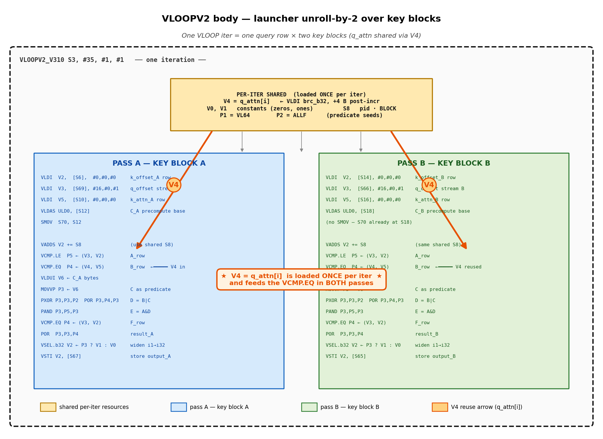
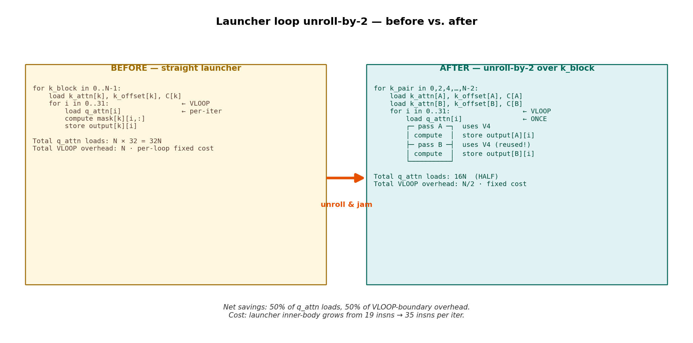
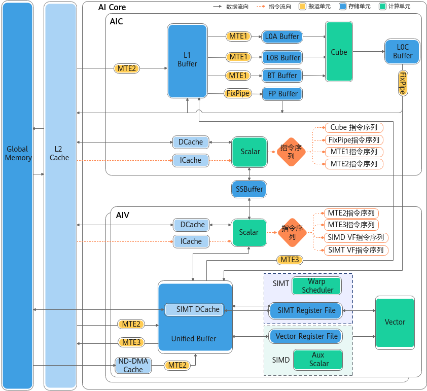

# A5 PTO assembly walkthrough — `mask_kernel` bool variant VLOOP body

This doc decodes the actual A5/PTO machine code emitted by `hivmc-a5` for
the bool variant of `mask_fn`, with each instruction mapped back to:
- the corresponding HIVM-MLIR op (`captures_hivmc_input_a5_bool.mlir`),
- the original Triton-Python expression (`helloworld.py`).

It also documents what each PTO mnemonic actually means, sourced from the
local PTO ISA repo at `~/Documents/Repo/pto-isa/docs/isa/` and verified
against the chip-spec descriptions provided directly by the architect.

Companion docs:
- `a5_hivmc_input_mlir.md` — last MLIR before hivmc-a5 (Triton → HIVM)
- `helloworld_cast_vs_nocast_comparison.md` — bool vs cast at the
  full-stack level (Python → ELF), §4.7 covers the A5 cast-vs-bool
  contrast
- `mask_fn_compilation_stack.md` — full 7-stage pipeline survey

## 1. Hardware facts (verified)

From `~/Documents/Repo/pto-isa/docs/isa/machine-model/execution-agents.md`
and `instruction-surfaces/vector-instructions.md`:

```
vreg (256 bytes = 2048 bits total):
┌─────────┬─────────┬─────────┬─────┬─────────┬─────────┐
│ VLane 0 │ VLane 1 │ VLane 2 │ ... │ VLane 6 │ VLane 7 │
│   32 B  │   32 B  │   32 B  │     │   32 B  │   32 B  │
└─────────┴─────────┴─────────┴─────┴─────────┴─────────┘
```

| Element type        | Lanes per VLane | Total lanes per vreg |
|---------------------|----------------:|---------------------:|
| `i8`/`u8`           | 32              | **256**              |
| `i16`/`u16`/`f16`/`bf16` | 16         | **128**              |
| `i32`/`u32`/`f32`   | 8               | **64**               |
| `i64`/`u64`         | 4               | **32**               |

So a HIVM-level `1024xi32` vector op (e.g. `hivm.hir.vor`) lowers to
**`⌈1024 / 64⌉ = 16` hardware vector instructions**.

A `_b32` predicate register is **32 bits wide**; for full 64-i32-lane
masking, pack two `_b32` predicates with `ppack` (not used in this
kernel — the per-iter row width is ≤ 32 lanes anyway).

## 2. Instruction format reference (verified by architect)

### `PSET.type Pd, #pat`

Sets a predicate to a static pattern selected by a 4-bit immediate
token. `.type` = element data type.

| `#pat` | Bits   | Pattern                                   |
|-------:|:------:|-------------------------------------------|
| `#0`   | `b0000`| **ALL** — all elements TRUE               |
| `#8`   | `b1000`| **VL64** — lowest 64 elements active      |
| `#15`  | `b1111`| **ALLF** — all elements FALSE             |

(Other immediate values map to additional VL/ALL/H/Q/M3/M4 patterns —
see `pto-isa/docs/isa/scalar/ops/predicate-generation-and-algebra/pset-b32.md`.)

### `VLOOPV2 Sn, #instr, #layer, #last`

Marks the start of a hardware vector loop.

| Field    | Width  | Meaning                                                                |
|----------|:------:|------------------------------------------------------------------------|
| `Sn`     | scalar reg | runtime iteration count                                            |
| `#instr` | imm    | body length (instructions in this loop body, **excluding** VLOOPV2)    |
| `#layer` | 4 bits | nesting indicator: `b0001` = innermost                                 |
| `#last`  | 1 bit  | `1` = terminal at this layer; `0` = more cascaded loops follow         |

The `_V310` suffix is an encoding-variant tag (chip-revision specific).

### `VLDI vd, [sn], #offset, #dist, #p`

Vector aligned load with immediate offset.

| Field      | Width  | Meaning                                                              |
|------------|:------:|----------------------------------------------------------------------|
| `vd`       | vreg   | destination                                                          |
| `[sn]`     | scalar | base address                                                         |
| `#offset`  | 8 bit signed | offset, in **alignment-size units**                            |
| `#dist`    | 5 bit  | data distribution mode (see below)                                   |
| `#p`       | 1 bit  | post-update enable                                                   |

`#dist` modes (partial — confirmed):
- `5h00` = **normal**: load full VL (256 B); alignment = 32 B
- `5h03` = **brc_b32**: load 1 b32 element, broadcast to all 64 i32 lanes; alignment = 4 B

`#p` semantics:
- `#p = 0` → effective addr = `sn + #offset · alignment_size`; `sn` unchanged
- `#p = 1` → effective addr = `sn`; `sn ← sn + #offset · alignment_size` (post-incr)

### `VCMP.cond.type Pd, V0, V1, Pseed`

`Pd[i] = cmp_cond(V0[i], V1[i])` for lanes where `Pseed[i]` is active.
Convention verified from `pto-isa/docs/isa/vector/ops/compare-select/vcmp.md`:

```mlir
%lt_mask = pto.vcmp %a, %b, %seed, "lt"
// lt_mask[i] = 1 if a[i] < b[i]
```

So in the asm form `VCMP.LE.s32 P5, V3, V2, P1`: `P5[i] = (V3[i] ≤ V2[i])`.

### `POR / PAND / PXOR Pd, P0, P1, Pseed`

Bitwise predicate algebra.
`Pd[i] = (P0[i] op P1[i])` for active lanes (per `pto-isa/docs/isa/scalar/ops/predicate-generation-and-algebra/por.md`).

### `VSEL.type Vd, V_true, V_false, Pmask`

Lane-wise predicated select: `Vd[i] = Pmask[i] ? V_true[i] : V_false[i]`.

### `VDUPS.type Vd, Sn, Pmask, #pos`

Vector duplicate scalar — broadcast a scalar register's value to every
lane of `Vd` under `Pmask`. From `pto-isa/.../vector/ops/predicate-and-materialization/vdup.md`:
"Duplicate scalar or vector element to all lanes." The `#pos` is a
position selector (typically `#1` for "broadcast the scalar input as-is";
other positions select a lane of a vreg input).

```
Vd[i] ← Sn       for each lane i where Pmask[i] = 1
```

Equivalent semantically to `VLDI` with `#dist = brc_b32`, but the source is a
**scalar register** rather than a UB address. Useful when the broadcast
value is computed in scalar code (e.g., a program-id-derived constant)
rather than read from memory.

## 3. The annotated assembly

Bool variant, VLOOP body of `mask_kernel`. The 20-line snippet shown is
the predicate-algebra heart; the real body is 35 instructions (per the
`#35` field of VLOOPV2) — additional loads/stores/sync ops surround the
core shown here.

```asm
;══════════════════════════════════════════════════════════════════════════════
; Pre-loop predicate setup
;══════════════════════════════════════════════════════════════════════════════
PSET.b32 P1, #8                     ; P1 ← VL64 (b1000): all 64 i32 lanes ACTIVE
                                    ;       — body's "main" seed mask
PSET.b32 P2, #15                    ; P2 ← ALLF (b1111): all lanes FALSE
                                    ;       — used as PXOR pattern below; XOR-with-0 = no-op
                                    ;         (compiler kept the slot for predicate dependency
                                    ;         tracking; see §6 "vnot collapsed")

;══════════════════════════════════════════════════════════════════════════════
; Loop header
;══════════════════════════════════════════════════════════════════════════════
VLOOPV2_V310 S3, #35, #1, #1        ; iter count = S3 (runtime, set above)
                                    ; body length = 35 insns (excludes VLOOPV2)
                                    ; layer       = b0001 (innermost)
                                    ; last        = 1     (terminal at this layer)
                                    ; _V310       = encoding variant

;══════════════════════════════════════════════════════════════════════════════
; Loads (per-iter unless flagged constant)
;══════════════════════════════════════════════════════════════════════════════
VLDI V2, [S6],  #0,  #0, #0         ; dist=normal, full-VL load (256 B = 64 i32 lanes)
                                    ; addr = S6 + 0·32 = S6
                                    ; p=0  → S6 unchanged (constant load each iter)
                                    ; ROLE: k_offset[None, :] data — row-invariant across iters
                                    ;       (Algorithmic row width is 32 elems; vreg holds 64
                                    ;        lanes. Whether the upper 32 lanes are padding,
                                    ;        a packed second row, or a replicated copy is not
                                    ;        determinable from this snippet — see §11.)

VLDI V3, [S69], #16, #0, #1         ; dist=normal, full-VL load
                                    ; addr = S69
                                    ; p=1  → S69 ← S69 + 16·32 = S69 + 512 B (post-incr)
                                    ; ROLE: q_offset[:, None] pre-vbrc tile, streaming per iter;
                                    ;       row r contains q_offset[r] replicated across the
                                    ;       row's 32 elements (upper-lane content: see §11)

VLDI V4, [S68], #1,  #3, #1         ; dist=brc_b32 (5h03): 1 i32 broadcast → all 64 lanes
                                    ; addr = S68
                                    ; p=1  → S68 ← S68 + 1·4 = S68 + 4 B (per-iter scalar stream)
                                    ; ROLE: q_attn[i] — one new scalar per iter, replicated to
                                    ;       all 64 lanes (brc_b32 makes upper-lane question moot)

VLDI V5, [S10], #0,  #0, #0         ; dist=normal, full-VL load
                                    ; addr = S10, p=0 (constant load)
                                    ; ROLE: k_attn[None, :] data — row-invariant
                                    ;       (Algorithmic row width 32; upper-lane content
                                    ;        unverified, see §11.)

VLDAS ULD0, [S12]                   ; UnalignReg ULD0 ← addr S12 (sets up unaligned-load context)
SMOV.b32 S70, S12                   ; S70 ← S12 (offset register snapshot)

;══════════════════════════════════════════════════════════════════════════════
; Compute — predicate boolean algebra (the "i1 land" of the bool MLIR)
;══════════════════════════════════════════════════════════════════════════════
VADDS.s32 V2, V2, S8, P1            ; V2 ← V2 + S8  (lane-wise add of broadcast scalar S8)
                                    ; ROLE: program-id stride applied to k_offset

VCMP.LE.s32 P5, V3, V2, P1          ; P5[j] ← (V3[j] ≤ V2[j])     under seed P1
                                    ; ◄══ A_row = (q_offset[i] ≤ k_offset[j])  =  triu_causal

VCMP.EQ.s32 P4, V4, V5, P1          ; P4[j] ← (V4[j] == V5[j])    under seed P1
                                    ; ◄══ B_row = (q_attn[i] == k_attn[j])

VLDUI V6, ULD0, [S70], #0           ; V6 ← unaligned load via ULD0 + S70 offset
                                    ; ROLE: precomputed C as bytes (= (k_attn==0), row-invariant)
SMOV.b32 S70, S18                   ; advance S70 ← S18

MOVVP.b32 P3, V6, #0                ; P3 ← V6 lane-bits as predicate (vector→pred convert)
                                    ; ◄══ C = (k_attn == 0)        (recovered from byte form)

PXOR P3, P3, P2, P1                 ; P3 ← P3 XOR P2 (=ALLF=0)  under seed P1
                                    ; ★ EFFECTIVE NO-OP — see §6 "vnot collapsed"

POR  P3, P4, P3, P1                 ; P3 ← P4 | P3        ◄══ D_row = B_row | C
PAND P3, P5, P3, P1                 ; P3 ← P5 & P3        ◄══ E_row = A_row & D_row

VCMP.EQ.s32 P4, V3, V2, P1          ; P4[j] ← (V3[j] == V2[j])   (overwriting old P4=B_row)
                                    ; ◄══ F_row = (q_offset[i] == k_offset[j])

POR  P3, P3, P4, P1                 ; P3 ← P3 | P4        ◄══ result_row = E_row | F_row    ★ FINAL i1

;══════════════════════════════════════════════════════════════════════════════
; Materialize i1 → i32 → store
;══════════════════════════════════════════════════════════════════════════════
VSEL.b32 V2, V1, V0, P3             ; V2[j] ← P3[j] ? V1[j] : V0[j]
                                    ; (V1 = preloaded all-1 i32 tile, V0 = preloaded all-0 tile)
                                    ; ◄══ exact 1:1 with MLIR `vsel(i1, c1_i32, c0_i32)` (Phase 12)

VSTI V2, [S67], #16, #2, P1, #1     ; store V2 to UB at [S67 + …]
                                    ; (full mode-field semantics deferred — VSTI spec not yet given)
```

### 3.1 What the per-iter `VADDS` is doing

```asm
VADDS.s32 V2, V2, S8, P1            ; V2 ← V2 + S8 (lane-wise add of broadcast scalar)
```

`VADDS.s32 Vd, Vs, Sn, Pmask` is **vector-add-scalar**: the scalar
`Sn` is broadcast to all lanes of `Vs`, lane-wise added, and the
result is written to `Vd` in the lanes selected by the predicate
mask `Pmask`. Equivalent expression:

```
V2[i] ← V2[i] + S8       for each lane i where P1[i] = 1
```

#### What this does *not* map to in `mask_fn`

`mask_fn` itself contains no addition:

```python
def mask_fn(q_attn_arg, k_attn_arg, q_offset, k_offset, TYPE: tl.constexpr):
    if TYPE == 1:
        triu_causal = (q_offset[:, None] <= k_offset[None, :])
        …
```

It takes `q_offset` / `k_offset` as **already-computed arguments**
and only compares them. So no line of mask_fn produces this VADDS.

#### Where the addition actually comes from — the launcher

The compiled `mask_kernel` is `mask_fn` **inlined into a launcher**
that prepares the offset arrays. The standard Triton-Ascend pattern
for the launcher is:

```python
# launcher kernel that wraps mask_fn
pid_n   = tl.program_id(1)            # block index along the "k" axis
base    = tl.arange(0, BLOCK_N)       # constant pattern: [0, 1, …, 31]
k_offset = base + pid_n * BLOCK_N     # ◄══ this addition becomes the VADDS

mask = mask_fn(q_attn_arg, k_attn_arg, q_offset, k_offset, TYPE=1)
```

When bishengir-compile-a5 fuses the launcher with mask_fn into a
single `mask_kernel`, the offset-computation arithmetic ends up in
the same body as the comparisons.

#### The hardware mapping

```
V2  ← VLDI [S6]              ;  load the constant pattern, e.g. arange(0, 32)
                             ;  V2 = [0, 1, 2, …, 31]   (zero-based lane indices)

S8  ← (set pre-loop, not in snippet)
                             ;  S8 = pid_n × BLOCK_N    (block-dependent stride scalar,
                             ;        passed in as one of the kernel's i32 args 7..12)

VADDS.s32 V2, V2, S8, P1     ;  V2 ← arange(0, 32) + pid_n · BLOCK_N
                             ;     ◄══ "k_offset = pid_n * BLOCK_N + arange(0, BLOCK_N)"
```

After VADDS, V2 holds the actual `k_offset[None, :]` values (the
absolute positions in the global k axis), which is exactly what the
subsequent VCMPs (`VCMP.LE P5, V3, V2` and `VCMP.EQ P4, V3, V2`)
need.

#### Why VADDS rather than just loading a precomputed k_offset

Two reasons:

1. **Avoids materialising a 32-element k_offset buffer in GM/UB** —
   only `BLOCK_N` and `pid_n` are passed in as scalars; the offset
   array is reconstructed on-chip from `arange + scalar`.
2. **Reuses one constant pattern across all program blocks** —
   `arange(0, 32)` is identical for every block; only the scalar S8
   changes per block.

#### Confidence

| Claim | Tier | Reason |
|---|:---:|---|
| `VADDS` is vector-add-scalar with the operand order shown | A | Operand convention matches the `vadds` family in the PTO ISA repo |
| The addition originates in the launcher's `pid * BLOCK + arange` pattern | B | Strong Triton-Ascend convention; not directly verified for *this* kernel |
| `S8 = pid_n × BLOCK_N` and `V2 = arange(0, 32)` specifically | B | Plausible defaults; resolving requires either the launcher source or disassembly of the pre-loop scalar setup that initialises S8 and the buffer at `[S6]` |

This VADDS reading is the most natural one given the kernel's
structure, but a definitive mapping needs the upstream launcher
or the pre-loop assembly.

### 3.2 The full body is two passes — pass B (lines 23–38)

The original 22-line snippet I documented in §3 was only **half** of
the VLOOP body. The full body (per `#instr=35` in `VLOOPV2_V310 S3, #35, #1, #1`)
is 35 instructions, and lines 23–38 of `~/Documents/docs/assembler.as`
reveal a **second compute pass** that mirrors pass A's structure but
operates on different source/destination addresses.

```asm
;══════════════════════════════════════════════════════════════════════════════
; Pass B  (lines 23–38, structurally identical to pass A but different addrs)
;══════════════════════════════════════════════════════════════════════════════
VLDI V2, [S14], #0,  #0, #0         ; V2 ← UB[S14], normal full-VL, no incr
                                    ;       ◄══ k_offset for pass B's region (different from pass A's [S6])

VLDI V3, [S66], #16, #0, #1         ; V3 ← UB[S66], normal full-VL, +512 B post-incr
                                    ;       ◄══ q_offset stream for pass B (different stream from pass A's [S69])

VLDI V5, [S16], #0,  #0, #0         ; V5 ← UB[S16], normal full-VL, no incr
                                    ;       ◄══ k_attn for pass B's region

VLDAS ULD0, [S18]                   ; UnalignReg ULD0 ← S18  (pass B's precomputed-C buffer base)

VADDS.s32 V2, V2, S8, P1            ; V2 += S8        (same program-id stride as pass A; reuses S8)
                                    ;       Note: source typoed as "VADDS,s32" in the assembler file —
                                    ;       harmless transcription artifact

VCMP.LE.s32 P5, V3, V2, P1          ; P5 = (V3 ≤ V2)   — A_row for pass B's region
VCMP.EQ.s32 P4, V4, V5, P1          ; P4 = (V4 == V5)  — B_row for pass B's region
                                    ;       (V4 = q_attn[i] is REUSED unchanged from pass A!)

VLDUI V6, ULD0, [S70], #0           ; V6 ← unaligned load (pass B's C bytes)
                                    ;       (S70 is whatever pass A's tail set it to via SMOV S70, S18)

MOVVP.b32 P3, V6, #0                ; P3 = C  for pass B
PXOR P3, P3, P2, P1                 ; (no-op — same vnot-collapse as pass A)
POR  P3, P4, P3, P1                 ; D = B | C
PAND P3, P5, P3, P1                 ; E = A & D
VCMP.EQ.s32 P4, V3, V2, P1          ; P4 = F (q_off == k_off) for pass B
POR  P3, P3, P4, P1                 ; result = E | F
VSEL.b32 V2, V1, V0, P3             ; i1 → i32 widening (V1, V0 reused unchanged from pass A)
VSTI V2, [S65], #16, #2, P1, #1     ; store V2 to UB[S65 + …]
                                    ;       ◄══ DIFFERENT output address from pass A's [S67]
```

#### What's the same and what changes between passes

| Quantity                             | Pass A address | Pass B address | Reused? |
|--------------------------------------|----------------|----------------|---------|
| k_offset source                      | `[S6]`         | `[S14]`        | no      |
| q_offset stream                      | `[S69]`        | `[S66]`        | no      |
| k_attn source                        | `[S10]`        | `[S16]`        | no      |
| Precomputed C buffer (VLDAS)         | `[S12]`        | `[S18]`        | no      |
| Output destination (VSTI)            | `[S67]`        | `[S65]`        | no      |
| q_attn broadcast scalar (V4)         | brc_b32 from `[S68]` | **same V4** | **YES** |
| Program-id stride (S8)               | constant       | constant       | YES     |
| Constant tiles V0 (zeros), V1 (ones) | preloaded      | preloaded      | YES     |
| Predicate seeds P1 (VL64), P2 (ALLF) | preloaded      | preloaded      | YES     |

#### What this implies — likely interpretation

The two passes share `q_attn[i]` (V4) and the program-id stride (S8),
but everything else — k_offset, k_attn, precomputed C, output buffer
— is different. The most consistent interpretation is that the
kernel is computing **mask outputs for two independent key blocks
per VLOOP iter**, against the same query block:

```
                      query block (one set of q_attn, q_offset)
                                        │
                          ┌─────────────┴─────────────┐
                          ▼                           ▼
                    key block #A                  key block #B
        (k_attn @ [S10], k_offset @ [S6])  (k_attn @ [S16], k_offset @ [S14])
        (C precomp @ [S12])                 (C precomp @ [S18])
        (output mask @ [S67])               (output mask @ [S65])
```

This is a multi-block "fan-out" pattern — one query, two key blocks,
two output masks per iter. Confirming the algorithmic structure
needs the launcher source (which we don't have); this interpretation
is **Tier B**.

#### What this resolves about §11 (the upper-32-lane question)

The full body length is now confirmed at 35 instructions: pass A
(19 insns: lines 4–22) + pass B (16 insns: lines 23–38) = 35 ✓.

This **does not** by itself decide between Layouts A / B / C in §11
— that question is about what's in the upper 32 lanes of one vreg
during a single VCMP, not about how many compute passes a single
iter performs. But it does mean **§11's "Layout B" is not the
operative pattern here** — Layout B postulated "two output rows of
the same tile packed into one vreg," whereas what we see is "two
output rows of two *different* tiles, each computed in a separate
pass with its own VCMPs and VSTI." The work is unrolled across
*tiles*, not within a single vreg's 64 lanes.

So §11's question (padded vs packed-within-vreg vs replicated)
remains open for what's in the upper 32 lanes during one VCMP, and
the resolution paths in §11 still apply.

### 3.2.1 Why two passes — launcher unroll-by-2 over key blocks

The most consistent explanation for the two-pass body is that
`bishengir-compile-a5` **unrolled the launcher's loop over key
blocks by a factor of 2** during inlining. Each VLOOP iteration
processes one query row against **two** key blocks, sharing the
expensive query-side state across the two unrolled bodies.

#### Visual: the unrolled VLOOP body



The shared-resources box at top (yellow) holds V4 = q_attn[i], S8,
V0/V1, P1/P2 — all loaded or set up once per iter. Two side-by-side
pass boxes (blue = pass A, green = pass B) each load their own
key-side data (k_attn, k_offset, precomputed C) and write to their
own output buffer. The orange V4 arrows from the shared box into
both passes show the q_attn[i] reuse — V4 is loaded **once** but
fed into the VCMP.EQ in **both** passes.

#### Visual: the launcher transformation that produced this



Left: the straight launcher form has an outer loop over key blocks
and an inner VLOOP over query rows; q_attn[i] is reloaded once per
inner iter, so total q_attn loads = `N · 32 = 32N`. Right: after
unroll-by-2 over the outer (key-block) loop, the inner VLOOP body
contains both passes; q_attn[i] is loaded once per VLOOP iter and
reused across both passes, so total q_attn loads = `(N/2) · 32 = 16N`
— exactly half. VLOOP-boundary overhead is also amortized over twice
as many key blocks per VLOOP-set up.

The cost is that the per-iter body grows from 19 instructions
(single-pass) to 35 instructions (matching the `#instr=35` we
observed).

#### The launcher pattern, before and after unrolling

A typical Triton-Ascend attention-mask launcher iterates over key
blocks for one query block:

```
BEFORE UNROLLING (conceptual launcher form)
──────────────────────────────────────────────────────────────────

for k_block in [0, 1, 2, …, N−1]:                ◄── outer loop over key blocks
    load k_attn[k_block], k_offset[k_block], precompute C[k_block]
    for i in [0..31]:                            ◄── inner loop over query rows
        load q_attn[i]                            ← ONE load per (k_block, i)
        compute mask[k_block][i, :]
        store output[k_block][i]


Cost: N × 32 = 32N q_attn loads total
```

After unrolling the *outer* loop by 2 and fusing the inner-loop
bodies, the compiler produces the structure we see in the assembly:

```
AFTER UNROLLING (matches the captured assembly)
──────────────────────────────────────────────────────────────────

for k_pair in [0, 2, 4, …, N−2]:                 ◄── outer loop over PAIRS of key blocks
    load k_block_A data: k_attn[A], k_offset[A], C[A]
    load k_block_B data: k_attn[B], k_offset[B], C[B]
    for i in [0..31]:                            ◄── this is the VLOOPV2 we see
        load q_attn[i]                            ← ★ ONE load shared by both passes
        ┌─ pass A ─────────────────────────┐
        │ compute mask[k_block_A][i, :]    │
        │ store output[k_block_A][i]       │
        └──────────────────────────────────┘
        ┌─ pass B ─────────────────────────┐
        │ compute mask[k_block_B][i, :]    │  ◄── reuses q_attn[i] in V4 from pass A
        │ store output[k_block_B][i]       │
        └──────────────────────────────────┘


Cost: (N/2) × 32 × 1 = 16N q_attn loads total      (HALF the unrolled-version cost)
```

The `for i in [0..31]` is the actual VLOOP we see; the outer pair
loop lives in code we haven't disassembled.

#### Data-flow per VLOOP iter — what's shared vs duplicated

```
                            ╔══════════════════════════════════════════╗
                            ║       per-iter shared resources           ║
                            ║   (loaded/computed ONCE per iter)         ║
                            ║                                           ║
                            ║   V4  =  q_attn[i]   (brc_b32, +4 B)      ║
                            ║   S8  =  pid · BLOCK   (pre-loop scalar)  ║
                            ║   V0, V1 (preloaded constants)            ║
                            ║   P1, P2 (preloaded predicates)           ║
                            ╚══════════════════════════════════════════╝
                                  │                       │
                                  │ V4 used by both       │
                                  ▼                       ▼
       ┌──────── PASS A ───────────────┐    ┌──────── PASS B ───────────────┐
       │  KEY BLOCK A                  │    │  KEY BLOCK B                  │
       │                               │    │                               │
       │  V2  ← VLDI [S6]    k_offset_A│    │  V2  ← VLDI [S14]   k_offset_B│
       │  V3  ← VLDI [S69]   q_off str │    │  V3  ← VLDI [S66]   q_off str │
       │  V5  ← VLDI [S10]   k_attn_A  │    │  V5  ← VLDI [S16]   k_attn_B  │
       │  ULD0 ← VLDAS [S12] C_A bytes │    │  ULD0 ← VLDAS [S18] C_B bytes │
       │                               │    │                               │
       │  VADDS V2 += S8               │    │  VADDS V2 += S8               │
       │  VCMP.LE  P5 ← (V3, V2)       │    │  VCMP.LE  P5 ← (V3, V2)       │
       │  VCMP.EQ  P4 ← (V4, V5) ◄─────┤────┤────► VCMP.EQ  P4 ← (V4, V5)   │
       │            ▲ V4 from above    │    │     ▲ V4 REUSED, no reload    │
       │  VLDUI V6, MOVVP P3 ← C_A     │    │  VLDUI V6, MOVVP P3 ← C_B     │
       │  POR/PAND/POR boolean algebra │    │  POR/PAND/POR boolean algebra │
       │  VSEL.b32 V2 ← P3 ? V1 : V0   │    │  VSEL.b32 V2 ← P3 ? V1 : V0   │
       │  VSTI V2, [S67]   output_A[i] │    │  VSTI V2, [S65]   output_B[i] │
       └───────────────────────────────┘    └───────────────────────────────┘
```

Side-by-side, the structural symmetry is exact. Every key-side
resource (k_attn, k_offset, precomputed C, output buffer) gets its
own copy per pass; every query-side resource (V4, S8, predicate
seeds, constant tiles) is loaded once at the top of the iter and
referenced by both passes.

#### Why V4 specifically — the structural test

V4 is the **only** operand that satisfies both:
1. *Varies per iter* — so it cannot be hoisted out of the loop entirely.
2. *Is identical in both passes within one iter* — so it CAN be shared between them.

| Operand            | Varies per iter? | Identical across passes? | Sharable? |
|--------------------|:---:|:---:|:---:|
| **q_attn (V4)**    | yes | **yes** (same q_attn[i] feeds both key blocks) | ✓ shared in asm |
| q_offset (V3)      | yes | no — pass A from `[S69]`, pass B from `[S66]` | ✗ |
| k_attn   (V5)      | no  | no — different key block each pass            | ✗ |
| k_offset (V2)      | no  | no — different key block each pass            | ✗ |
| precomputed C (P3) | no  | no — different per key block                  | ✗ |

V4 is the unique row with "yes" in both columns. The fact that the
assembly does NOT reload V4 between passes is the strongest
single-instruction evidence that the unroll axis is "key block,"
not anything else.

#### What this rules out

| Hypothesis | Why ruled out |
|---|---|
| Two halves of one wider tile (32×64 instead of 32×32) | Same C should serve both halves; assembly has different VLDAS sources `[S12]` vs `[S18]`. |
| Two adjacent rows packed in one vreg's 64 lanes (Layout B from §11) | Same C should serve both rows; same V4 should *not* (q_attn[i] ≠ q_attn[i+1]). Both checks fail. |
| Pure ILP-driven unroll on identical data | Pure ILP unroll wouldn't reach into different output buffers (`[S65]` vs `[S67]`). |

#### What's still Tier-B

The launcher source isn't in our hand, so we can't verify directly
that the outer loop iterates over key blocks (vs. some other axis
like attention head, or token-batch position). But the structural
fingerprint — shared query-side, distinct key-side, distinct output
buffers, distinct precomputed-C — matches the unroll-over-key-blocks
explanation and rules out the alternatives I can think of.

#### Why this is a *deliberate* optimization, not a missed one

This is the inverse of the "missed optimizations" in §6.6/§6.7/§6.8.
Here `hivmc-a5` (or its driver) actively did the right thing:

- **Saved 16N q_attn loads** by sharing V4 across passes.
- **Hid load latency** by interleaving pass A's VCMPs with pass B's
  VLDIs (instruction-level parallelism on the load and compute pipes).
- **Amortized VLOOP-boundary overhead** over twice as many key blocks.

It's the same idea as classical "unroll-and-jam" applied at the
launcher-loop level. The presence of this optimization tells us
hivmc-a5 *can* do non-trivial loop transformations — it just isn't
applying them to all the cases we identified as missed.

### 3.2.2 Worked example — 4 query blocks × 4 key blocks with unroll-by-2

To make the unrolling concrete, scale the toy example up to a small
attention launch: 4 query blocks × 4 key blocks, each block holding
4 elements. Total work: **16 mask tiles**, each 4 × 4 = 16 mask
elements, so **256 mask elements** to compute.

```
                        K[0]      K[1]      K[2]      K[3]
                      ┌──────┬──────┬──────┬──────┐
                Q[0]  │M[0,0]│M[0,1]│M[0,2]│M[0,3]│
                      ├──────┼──────┼──────┼──────┤
                Q[1]  │M[1,0]│M[1,1]│M[1,2]│M[1,3]│       16 mask tiles
                      ├──────┼──────┼──────┼──────┤
                Q[2]  │M[2,0]│M[2,1]│M[2,2]│M[2,3]│
                      ├──────┼──────┼──────┼──────┤
                Q[3]  │M[3,0]│M[3,1]│M[3,2]│M[3,3]│
                      └──────┴──────┴──────┴──────┘
```

#### How the work splits — unroll-by-2 over k blocks

Two adjacent k blocks are paired: `(K[0], K[1])` and `(K[2], K[3])`.
Each q block needs **2 VLOOPs** to cover all 4 k blocks:

| VLOOP # | q block | k block pair    | tiles produced       |
|--------:|:-------:|:---------------:|:---------------------|
| **0**   | **Q[0]**| (K[0], K[1])    | M[0,0], M[0,1]       |
| **1**   | **Q[0]**| (K[2], K[3])    | M[0,2], M[0,3]       |
| 2       | Q[1]    | (K[0], K[1])    | M[1,0], M[1,1]       |
| 3       | Q[1]    | (K[2], K[3])    | M[1,2], M[1,3]       |
| 4       | Q[2]    | (K[0], K[1])    | M[2,0], M[2,1]       |
| 5       | Q[2]    | (K[2], K[3])    | M[2,2], M[2,3]       |
| 6       | Q[3]    | (K[0], K[1])    | M[3,0], M[3,1]       |
| 7       | Q[3]    | (K[2], K[3])    | M[3,2], M[3,3]       |

**Total: 8 VLOOPs.** Each VLOOP produces 2 mask tiles.

#### Each q block participates in exactly 2 VLOOPs

| q block | participates in VLOOPs | k block pairs covered     | tiles produced     |
|--------:|:----------------------:|:--------------------------|:-------------------|
| Q[0]    | 0, 1                   | (K[0],K[1]) , (K[2],K[3]) | M[0,0..3]          |
| Q[1]    | 2, 3                   | same pairs                 | M[1,0..3]         |
| Q[2]    | 4, 5                   | same pairs                 | M[2,0..3]         |
| Q[3]    | 6, 7                   | same pairs                 | M[3,0..3]         |

Each q block is loaded into UB once for each VLOOP it participates in
— **2 q-block loads per q block, 8 total q-block loads** across the
kernel.

#### Inside one VLOOP — concrete walkthrough of VLOOP #0

VLOOP #0 handles `Q[0] × (K[0], K[1])`. Iterates 4 times (one per
query row in `Q[0]`):

```
PRE-VLOOP setup:
  Load K[0] = [K[0][0], K[0][1], K[0][2], K[0][3]]  → V5_A buffer
  Load K[1] = [K[1][0], K[1][1], K[1][2], K[1][3]]  → V5_B buffer
  (k blocks are row-invariant — loaded once before VLOOP)

VLOOP iter 0   (compute query row 0 against both k blocks):
  V4 ← brc_b32 Q[0][0]                              ← q_attn loaded ONCE
  Pass A:  V_k ← K[0]
           result ← V4 ≤ V_k = [Q[0][0]≤K[0][0..3]]  → store to M[0,0][row 0]
  Pass B:  V_k ← K[1]
           result ← V4 ≤ V_k = [Q[0][0]≤K[1][0..3]]  → store to M[0,1][row 0]
                                                      (V4 REUSED, no reload)

VLOOP iter 1:
  V4 ← brc_b32 Q[0][1]
  Pass A:  result = [Q[0][1]≤K[0][0..3]]  → M[0,0][row 1]
  Pass B:  result = [Q[0][1]≤K[1][0..3]]  → M[0,1][row 1]

VLOOP iter 2:    Q[0][2] vs K[0] → M[0,0][row 2];   Q[0][2] vs K[1] → M[0,1][row 2]
VLOOP iter 3:    Q[0][3] vs K[0] → M[0,0][row 3];   Q[0][3] vs K[1] → M[0,1][row 3]

After 4 iters → tiles M[0,0] and M[0,1] are fully written
                (8 mask rows × 4 elems = 32 mask elements between them).
```

Per VLOOP: 4 iters × 2 passes = 8 mask rows produced = **2 mask tiles**.

#### Counting

```
Total VLOOPs:        8
Total VLOOP iters:   8 × 4 = 32
Total q_attn loads:  32                ← one per iter, V4 reused across passes
Total mask tiles:    16
Total mask elements: 256
```

#### Compare to no-unroll (sanity check)

Without the unroll-by-2, each (q_block, k_block) tile is its own VLOOP:

| Metric                    | Without unroll | With unroll-by-2 over k |
|---------------------------|---------------:|------------------------:|
| Total VLOOPs              | 16             | **8**                   |
| Total VLOOP iters         | 16 × 4 = 64    | 8 × 4 = **32**          |
| Total q_attn loads        | 64             | **32**                  |
| Total mask tiles produced | 16             | 16 (same)               |
| q_attn load reduction     | —              | **50%**                 |
| VLOOP-boundary overhead   | 16× fixed cost | **8× fixed cost**       |

Half the q_attn loads, half the VLOOP-boundary overhead, same end
result. That's the cleanest demonstration of why hivmc-a5 (or its
driver) chose to unroll-by-2 over key blocks.

#### Why pair `(K[0], K[1])` rather than `(K[0], K[2])` etc.?

Adjacent pairing is the natural choice because:

1. **Memory locality**: k_attn / k_offset for `K[0]` and `K[1]` sit
   at adjacent addresses; the launcher's stride arithmetic naturally
   produces them together.
2. **Predictability**: `(K[2p], K[2p+1])` for `p = 0..1` is the
   simplest stride-2 unroll pattern.

Any pairing of `(K[A], K[B])` works correctness-wise — but the
launcher's offset stride almost always defaults to consecutive
blocks.

### 3.2.3 Why V4 (= broadcast Q[i]) can be reused across two different k blocks

A natural worry when seeing the unroll: if we're using `brc_b32` to
broadcast `Q[i]` and that broadcast "matches positions" with V5,
how can we substitute K[0] for K[1] in V5 and still have the
comparison make sense? Doesn't `brc_b32` tie Q[i] to specific lane
positions?

The answer turns on what `brc_b32` actually does to V_q. It's the
opposite of "matching a specific position":

#### `brc_b32` *erases* position information from V_q

```
brc_b32 V4 ← Q[0][0]:

  Before brc:    Q[0][0] is one scalar value in scalar memory
  After brc:     V4 = [Q[0][0], Q[0][0], Q[0][0], Q[0][0]]
                       lane 0   lane 1   lane 2   lane 3
                       └──────  all four lanes hold the SAME value  ──────┘
```

Every lane gets the same number. The lane index does **not**
correspond to any specific Q position; it's just "lane 0 of V4"
through "lane 3 of V4," and they're all identical bits.

#### The "matching position" is between *lane indices* of V4 and V5 — not between absolute Q and K positions

`VCMP V4, V5` is purely lane-aligned:

```
V4 = [Q[0][0], Q[0][0], Q[0][0], Q[0][0]]      ← brc'd, no position structure
V5 = [a,       b,       c,       d      ]      ← whatever's in V5

VCMP result:
  lane 0:  Q[0][0]  ≤  a
  lane 1:  Q[0][0]  ≤  b
  lane 2:  Q[0][0]  ≤  c
  lane 3:  Q[0][0]  ≤  d
```

The hardware doesn't know or care what semantic meaning lane *i* of
V5 has. It just compares lane *i* of V4 against lane *i* of V5.

#### Reusing V4 with a different V5 — same Q[0][0], different K block

```
Round 1 (pass A: Q[0] vs K[0]):
  V4 = [Q[0][0], Q[0][0], Q[0][0], Q[0][0]]      ← brc'd
  V5 = [K[0][0], K[0][1], K[0][2], K[0][3]]
  VCMP →  Q[0][0] ≤ K[0][j]  for j = 0..3        → row 0 of mask M[0,0]

Round 2 (pass B: Q[0] vs K[1]):
  V4 unchanged, IDENTICAL bits                   ← brc not redone, V4 reused
  V5 = [K[1][0], K[1][1], K[1][2], K[1][3]]      ← different V5 contents
  VCMP →  Q[0][0] ≤ K[1][j]  for j = 0..3        → row 0 of mask M[0,1]
```

V4 has the same bit pattern in both rounds. The fact that V5 changed
doesn't invalidate V4 because **V4's lane structure carries no
position-specific meaning** — every lane is just a copy of
`Q[0][0]`. The right-hand side of the comparison changed; the
left-hand side stayed exactly the same.

#### Contrast with operations where position *does* matter

If the operation were a dot-product-style same-index pairing
(`Q · K = sum(Q[i] · K[i])`), V_q would carry real positional
meaning:

```
V_q = [Q[0], Q[1], Q[2], Q[3]]           ← V_q has positional meaning
V_k = [K[0], K[1], K[2], K[3]]           ← lane i ties Q[i] to K[i]

VMUL result:
  lane 0:  Q[0] · K[0]                   ← position-matched
  lane 1:  Q[1] · K[1]
  …
```

In that case you couldn't swap K[0]→K[1] without changing the lane
pairing — the (i, i) match depends on V_k being indexed at positions
matching V_q.

But our mask is the **broadcast (outer-product) comparison**, not a
dot product:

```
mask[i, j] = q_offset[i]  ≤  k_offset[j]    for all (i, j)
                ↑                ↑
                broadcasts       broadcasts
                across j         across i
```

The (i, j) pairing is the **outer product** of indices, not a
same-index dot product. So one row of the mask uses **one fixed**
Q[i] (broadcast across all lanes) paired against **all** K[j]
(varying across lanes). That same broadcast Q[i] can be re-paired
with any other K block's row without changing the left-hand side of
any lane's comparison.

`brc_b32` is the perfect operation for this kind of broadcast
comparison precisely *because* it discards position information from
Q — Q[i] is "the same number in every lane," ready to be paired
against whatever V_k currently holds.

#### One-line summary

> The "matching position" on the V_q side is **vacuous** after
> `brc_b32`: every lane holds the same Q[i], so V_q has no position
> structure to match against. Switching V_k from K[0] to K[1]
> changes the right-hand side of every lane's comparison, but the
> left-hand side (Q[i]) stays the same in every lane regardless.
> That's why one V_q load (V4) suffices for both passes.

### 3.3 The post-loop `VDUPS.b32` (line 39)

```asm
VDUPS.b32 V0, S20, P1, #1           ; V0 ← S20 broadcast to all 64 lanes (b32, mask P1, position #1)
```

**`VDUPS`** = "vector duplicate scalar." Per the PTO ISA repo
(`pto-isa/.../vector/ops/predicate-and-materialization/vdup.md`):
"Duplicate scalar or vector element to all lanes." Semantically
equivalent to `VLDI` with `#dist = brc_b32`, but the source is a
**scalar register** (`S20` here), not a UB address.

Position of this instruction (after VLOOPV2's #35-insn body) places
it **post-loop**. Its role is most likely **resetting V0 for a
subsequent code section** — e.g., V0 was used as the all-zero tile
in the loop's `VSEL.b32 V2, V1, V0, P3`, and the same physical V0 is
about to be repurposed for some downstream step that wants `S20`
broadcast across all lanes. The Tier on what S20 holds is C; without
the surrounding code the role is inferred from position only.

### 3.4 Updated full instruction listing

For reference, the complete content of `~/Documents/docs/assembler.as`:

```asm
;══════════ Pre-loop predicate setup ══════════
PSET.b32 P1, #8                     ; P1 ← VL64 (all 64 i32 lanes active)
PSET.b32 P2, #15                    ; P2 ← ALLF (all lanes false; PXOR no-op pattern)

;══════════ VLOOP header ══════════
VLOOPV2_V310 S3, #35, #1, #1        ; iter count = S3, body length = 35,
                                    ; layer = innermost, last loop in this layer

;══════════ Body — Pass A  (lines 4–22, 19 insns) ══════════
VLDI V2, [S6],  #0,  #0, #0         ; k_offset row (pass A)
VLDI V3, [S69], #16, #0, #1         ; q_offset stream (pass A)
VLDI V4, [S68], #1,  #3, #1         ; q_attn[i] brc_b32 — SHARED across both passes
VLDI V5, [S10], #0,  #0, #0         ; k_attn row (pass A)
VLDAS ULD0, [S12]                   ; pass A's precomputed-C buffer base
SMOV.b32 S70, S12                   ; S70 ← S12
VADDS.s32 V2, V2, S8, P1            ; V2 += pid·BLOCK
VCMP.LE.s32 P5, V3, V2, P1          ; A_row = triu_causal
VCMP.EQ.s32 P4, V4, V5, P1          ; B_row = (q_attn == k_attn)
VLDUI V6, ULD0, [S70], #0           ; load C bytes
SMOV.b32 S70, S18                   ; ★ advance S70 to S18 — sets up pass B's C source
MOVVP.b32 P3, V6, #0                ; P3 = C (pass A)
PXOR P3, P3, P2, P1                 ; (no-op vnot slot)
POR  P3, P4, P3, P1                 ; D = B | C
PAND P3, P5, P3, P1                 ; E = A & D
VCMP.EQ.s32 P4, V3, V2, P1          ; F_row = (q_off == k_off)
POR  P3, P3, P4, P1                 ; result = E | F
VSEL.b32 V2, V1, V0, P3             ; i1 → i32
VSTI V2, [S67], #16, #2, P1, #1     ; store result to UB[S67]

;══════════ Body — Pass B  (lines 23–38, 16 insns) ══════════
VLDI V2, [S14], #0,  #0, #0         ; k_offset row (pass B's region)
VLDI V3, [S66], #16, #0, #1         ; q_offset stream (pass B's region)
VLDI V5, [S16], #0,  #0, #0         ; k_attn row (pass B's region)
VLDAS ULD0, [S18]                   ; pass B's precomputed-C buffer base
                                    ; (note: no SMOV here — S70 was set by pass A's tail SMOV S70, S18)
VADDS.s32 V2, V2, S8, P1            ; V2 += pid·BLOCK (same S8 — both passes share program-id stride)
VCMP.LE.s32 P5, V3, V2, P1          ; A_row for pass B
VCMP.EQ.s32 P4, V4, V5, P1          ; B_row — V4 reused unchanged from pass A
VLDUI V6, ULD0, [S70], #0           ; load C bytes for pass B
MOVVP.b32 P3, V6, #0                ; P3 = C (pass B)
PXOR P3, P3, P2, P1                 ; (no-op vnot slot)
POR  P3, P4, P3, P1                 ; D
PAND P3, P5, P3, P1                 ; E
VCMP.EQ.s32 P4, V3, V2, P1          ; F_row for pass B
POR  P3, P3, P4, P1                 ; result for pass B
VSEL.b32 V2, V1, V0, P3             ; i1 → i32
VSTI V2, [S65], #16, #2, P1, #1     ; store result to UB[S65]   ◄── different from pass A's [S67]

;══════════ Post-loop ══════════
VDUPS.b32 V0, S20, P1, #1           ; reset V0 ← S20 broadcast (likely staging V0 for downstream code)
```

#### Notes on the new structure

- **Body length matches `#instr=35`** (19 + 16 = 35). No body insns are missing.
- **V4 lifetime**: q_attn[i] (V4) is loaded once per iter via `brc_b32`
  and **reused across both passes**. Pass B does not reload V4. This
  is the dominant compute reuse between passes — both compares
  `(q_attn[i] == k_attn[j_passA])` and `(q_attn[i] == k_attn[j_passB])`
  share V4.
- **S8 reuse**: same program-id stride applied in both passes' VADDS.
- **V0, V1 reuse**: the constant 0/1 tiles are loaded once (somewhere
  pre-loop, not shown) and used in both VSEL ops without reload —
  Optimization 6 hoisting these is correct *and consistent with how
  the kernel already treats them in pass B*.
- **`SMOV S70, S18` in pass A acts as the *prologue* to pass B's
  unaligned-load**: by the time pass B reaches `VLDUI V6, ULD0, [S70], #0`,
  S70 is already pointing at S18.

## 4. Translation back to Triton source

```
Triton expression                                                     PTO instruction
──────────────────────────────────────────────────────────────────    ──────────────────────────────
triu_causal = (q_offset[:, None] <= k_offset[None, :])             ─► VCMP.LE  P5, V3, V2  (= A_row)
(q_attn_arg[:, None] == k_attn_arg[None, :])                       ─► VCMP.EQ  P4, V4, V5  (= B_row)
(k_attn_arg[None, :] == 0)                                         ─► VLDUI + MOVVP        (= C; precomp)
B | C                                                              ─► POR     P3, P4, P3  (= D_row)
triu_causal & (B | C)                                              ─► PAND    P3, P5, P3  (= E_row)
(q_offset[:, None] == k_offset[None, :])                           ─► VCMP.EQ  P4, V3, V2  (= F_row)
((triu_causal & (B|C)) | (q_offset == k_offset))                   ─► POR     P3, P3, P4  (= result_row)
[i1 → i32 widening, MLIR Phase 12]                                 ─► VSEL.b32 V2, V1, V0
[i32 → i8 narrowing happens later, outside this snippet]           ─► (subsequent ops)
store result_row                                                   ─► VSTI    V2, [S67]
```

Each line of the high-level Triton expression maps to **one** hardware
op. No `f16` or `f32` round-trips appear — confirming this is the
**bool path**, where A5's predicate-register architecture lets the
boolean algebra stay in P-regs end-to-end.

## 5. Mapping back to the HIVM MLIR

| HIVM-MLIR op (bool variant)                          | PTO instruction                | Notes |
|------------------------------------------------------|--------------------------------|-------|
| `hivm.hir.vbrc q_offset 32x1 → 32x32 i32` (Phase 1)  | (pre-loop, not shown)          | Done before VLOOP; result lives at UB c0 |
| `hivm.hir.vbrc k_offset 1x32 → 32x32 i32` (Phase 1)  | (pre-loop, not shown)          | UB c5120 |
| `hivm.hir.vcmp 1024xi32,1024xi32` (Phase 5, F)        | `VCMP.EQ P4, V3, V2`           | Per-row; full tile across 32 iters |
| `hivm.hir.vcmp 1024xi32,1024xi32` (Phase 5, B)        | `VCMP.EQ P4, V4, V5`           | V4=q_attn[i] brc, V5=k_attn row |
| `hivm.hir.vcmp i32,0 (Phase 3, C)`                    | (pre-loop) → `VLDUI` + `MOVVP` | C precomputed once, reloaded per iter |
| Phase 9: `vcast i8→f16 → vcmp(ne 0)` (recover A as i1)| (collapsed by hivmc-a5)        | A enters loop already as predicate via `MOVVP` |
| Phase 10: `vbrc f16 + vcmp(==0) + vnot` (broadcast C) | **collapsed to PXOR ALLF (no-op)** | A5's predicate-reg arch eliminates the f16 dance |
| `hivm.hir.vor (B,C) → D` (Phase 11)                   | `POR P3, P4, P3`               | i1 ⇒ predicate-reg directly |
| `hivm.hir.vand (A,D) → E`                             | `PAND P3, P5, P3`              | |
| `hivm.hir.vor (E,F) → result`                         | `POR P3, P3, P4`               | |
| `hivm.hir.vsel(i1, c1_i32, c0_i32) → 1024xi32`        | `VSEL.b32 V2, V1, V0, P3`      | 1:1 |
| `hivm.hir.vcast 1024xi32 → 1024xi8`                   | (later in body, not shown)     | i32 → i8 narrowing |
| `hivm.hir.store 1024xi8 → gm`                         | (later DMA op)                 | UB → GM via MTE3 |

### 5.1 Comparison with today's CANN 9.0.0 compile (camodel-traced)

A separate disassembly of the bool-variant kernel (in
`helloworld_cast_vs_nocast_comparison.md` §4.7.3.8.1, PCs
`0x10d0d200`–`0x10d0d260`) shows a *different* lowering of the same
source kernel. Both artefacts are real compiler output, but from
**different `bishengir-compile-a5` builds**:

- **Today's CANN 9.0.0 build** — `bishengir-compile-a5` output that we
  built ourselves on the GCP VM (`mask_kernel_a5.o`, 3,792 B) and
  traced through camodel. Cycle-accurate timing data is available;
  see the table below.
- **`assembler.as`** — `objdump` output of a binary produced by a
  *different* compiler build, with **no version metadata available**.
  Origin of the binary is opaque; we have only the disassembled
  text — no `.o`, no cycle data.

Because we don't know `assembler.as`'s provenance, we **cannot** call
differences between the two "regressions" or "improvements" — only
"differences." The analysis below catalogs the structural and
per-row-cost differences without claiming any direction of
evolution.

The CANN-9.0.0 side has the considerable advantage that we
**already have its cycle-accurate trace**. The `assembler.as` side
gives us an instruction sequence but no timing.

#### Cycle-accurate data we already have for the CANN-9.0.0 build

From `cann_900_simulator_coverage.md` (§"Empirical mnemonic
frequency comparison: 910B1 vs A5"), the camodel trace of
`mask_kernel_a5.o` produced under simulator `Ascend950PR_9572`:

| Metric                | A5 (CANN 9.0.0) | 910B1 (CANN 8.5.0) | Ratio |
|-----------------------|----------------:|-------------------:|------:|
| **Total events**      |        **452**  |              9,459 | 0.05× |
| **Cycle span**        |      **1,431**  |             27,645 | 0.05× |

Mnemonic-class breakdown (from the same trace):

| Class                          | A5 count | Notes |
|--------------------------------|---------:|-------|
| `RV_VCMP_EQ` / `RV_VCMP_LE`    | 65 + 32 = **97** | per-element compares |
| `RV_PAND` / `RV_POR` / `RV_PXOR` | 32 + 64 + 1 = **97** | predicate ALU |
| `RV_VSEL`                       | **32** | i1 → i32 widening |
| `RV_PSET`                       | **3**  | predicate seeds |
| `PUSH_PB`                       | **1**  | predicate-buffer push |
| `RV_VLDI` / `RV_VSTI`           | 66 + 32 = **98** | vector loads/stores |
| `RV_VLOOP`                      | **1**  | replaces 1024-iter scalar loop |
| `RV_VCVT_I2I`                   | **32** | i32 → i8 narrowing |
| `RV_VDUPS`                      | **2**  | scalar broadcast |
| Scalar setup (MOV_*, ADD_IMM, …)| ~70    | small kernel prologue |

Per the §4.7.3.8.1 PC-by-PC disassembly, this kernel runs **32
VLOOP iterations** (one per output row of the 32×32 tile) — Layout A
or C from §11, *not* Layout B (no two-row packing within a vreg
in this build).

Mapping the cycle/event counts to the per-mask-row efficiency:
1,431 cycles / 32 mask rows = **44.7 cycles per mask row**, or
452 events / 32 = **14.1 events per mask row**, very close to the
14.4 ops/row figure we computed structurally for this version.

#### Side-by-side structural summary

```
                  TODAY'S CANN 9.0.0 (camodel-traced .o)            UNKNOWN-VERSION (assembler.as objdump)
                  ──────────────────────────────────                ──────────────────────────────────────────
PRE-LOOP          12 ops (heavy hoisting)                         2 ops (only PSETs)
                    RV_VLDI ×2  load V0/V1 (constants)              PSET.b32 P1, #8
                    RV_PSET ×3  predicate seeds                     PSET.b32 P2, #15
                    RV_VDUPS ×2 broadcast q_offset, k_offset to vregs
                    RV_SMOV/SMOVI ×3   loop-iv, BLOCK, bound
                    RV_VCMP_EQ S32     ★ F = q_off == k_off PRE-COMPUTED
                    RV_PXOR B8         pre-set tail/loop-end mask

VLOOP MARKER      RV_VLOOP @ 0x230  (32 iters)                    VLOOPV2_V310 S3, #35, #1, #1

LOOP BODY         14 ops (single pass, ONE tile/iter)             35 ops (TWO passes, TWO tiles/iter)
                    RV_VLDI ×2  q_attn, k_attn                      ─── pass A (19 ops) ───
                    RV_VCMP_EQ B = q_attn==k_attn                    VLDI V2/V3/V4/V5  (re-loads same data)
                    RV_POR  B|C                                      VLDAS / SMOV
                    RV_VCMP_LE A = q_off≤k_off                       VADDS V2 += S8    (per-iter, NOT hoisted)
                    RV_VCMP_EQ C = k_attn==0  (per row)              VCMP.LE / VCMP.EQ ×3
                    RV_PAND   A & (B|C)                              VLDUI / MOVVP     (C reload, NOT hoisted)
                    RV_POR    | F  (uses pre-hoisted F)              PXOR/POR/PAND/POR
                    RV_VSEL   widen i1→i32                           VSEL.b32 / VSTI
                    RV_VCVT_I2I i32→i8                              ─── pass B (16 ops) ───
                    RV_VSTI                                           VLDI V2/V3/V5     (re-loads same data)
                    RV_SEND                                           VLDAS
                                                                      VADDS V2 += S8
POST-LOOP         (none shown)                                        VCMP.LE / VCMP.EQ ×3
                                                                      VLDUI / MOVVP
                                                                      PXOR/POR/PAND/POR
                                                                      VSEL.b32 / VSTI

POST-LOOP                                                          VDUPS.b32 V0, S20, P1, #1

TOTAL             26 instructions                                  39 instructions
                  (12 pre-loop + 14 body)                          (2 pre-loop + 35 body + 1 post)
```

#### Mnemonic mapping — same ISA, different transcription convention

| `assembler.as`        | camodel disasm        | comment |
|-----------------------|-----------------------|---------|
| `PSET.b32`            | `RV_PSET B32`         | same; `RV_` prefix in camodel disassembler tooling |
| `VLOOPV2_V310`        | `RV_VLOOP`            | similar; variant suffix differs |
| `VLDI`                | `RV_VLDI`             | same |
| `SMOV.b32` / `SMOVI`  | `RV_SMOV` / `RV_SMOVI`| same |
| `VCMP.LE.s32` etc.    | `RV_VCMP_LE S32`      | same; `.` vs `_`/space separator |
| `PXOR` / `POR` / `PAND` | `RV_PXOR/POR/PAND B8` | same |
| `VSEL.b32`            | `RV_VSEL B32`         | same |
| `VSTI`                | `RV_VSTI`             | same |
| `VDUPS.b32`           | `RV_VDUPS B32`        | same |
| `VCVT.*` (not in our snippet) | `RV_VCVT_I2I`   | i32→i8 narrowing |
| `VLDAS` / `VLDUI` / `MOVVP` / `VADDS` | (not in camodel disasm) | only present in assembler.as |

Bottom line on mnemonics: **same ISA**. The camodel disassembler
prepends `RV_` (likely "Real Vector" or a tooling-internal namespace
marker) and uses underscore/space as type-suffix separators; the
architect's assembler form drops the prefix and uses `.` separators.

#### Per-mask-row efficiency

Counting executed instructions for the actual work produced:

| Version          | VLOOP iters | Body ops | Mask rows produced | Total executed ops | **Ops per mask row** |
|------------------|-------------|---------:|-------------------:|-------------------:|---------------------:|
| Camodel (single-pass) | 32     |       14 |                 32 |  12 + 32·14 = 460  | **14.4**             |
| Assembler.as (unroll-by-2) | 32 |       35 |                 64 |  2 + 32·35 + 1 = 1123 | **17.5**             |

Surprising result: **the unrolled assembler.as version is *slower
per mask row* than the un-unrolled camodel version** (17.5 vs 14.4
ops/row, ~22% worse). The unroll-by-2 over key blocks is a real
architectural win in principle (it shares V4 across passes and
amortizes VLOOP-boundary overhead), but the implementation captured
in `assembler.as` adds new costs faster than the unroll saves them.

#### Where the per-row cost difference comes from

| Source of extra cost in assembler.as | Approx. impact on per-row cost |
|---|---:|
| F not hoisted (recomputed in both passes)             | +1 op/row |
| C handled via spill+reload (VLDAS/VLDUI/MOVVP)        | +1 op/row |
| V2 load + VADDS not hoisted (run in both passes)      | +1.5 op/row |
| V5 load not hoisted (run in both passes)              | +0.5 op/row |
| V3 not shared across passes (loaded twice per iter)   | +0.5 op/row |
| **Total** | **≈ +4 op/row → matches the 14.4 → 17.5 gap** |

Each of these corresponds to an entry in §6's missed-optimizations
catalog. The camodel-traced version shows that **at least four of
those optimizations were applied by *some* `bishengir-compile-a5`
build** (F hoist, V2/V5 hoist, scalar-setup hoist, no C-spill
machinery) — strong empirical evidence that they're achievable on
this ISA, even if the build that produced `assembler.as` doesn't
apply them.

#### What this comparison reveals overall

1. **The unroll-by-2 alone is not a clear win unless** paired with
   the query-side sharing optimizations (V3 share, V2/V5 hoist, F
   hoist). The unknown-version (`assembler.as`) unrolled but didn't
   carry the hoists across into the unrolled body, and at that
   point the unrolling costs more than it saves. Whether this is a
   deliberate trade-off (e.g. for code-size reasons) or a missed
   optimization in that build's pass pipeline isn't determinable
   from the disassembly alone.

2. **The optimizations are achievable by `bishengir-compile-a5`** —
   proven by today's CANN 9.0.0 build, with cycle-accurate camodel
   evidence (1,431 cycles, 452 events for the full kernel). They're
   not theoretical wishlist items.

3. **The ideal lowering combines both** — unroll-by-2 over key
   blocks (good architectural idea from `assembler.as`) + all the
   pre-loop hoisting (already in today's CANN-9.0.0 build) +
   holding C in a P-reg (§6.6 Opt 2, missed by both) — would be
   the cheapest of all three: roughly **8–10 ops/row** estimate,
   nearly half of either existing version.

4. **Even today's CANN-9.0.0 build isn't optimal.** It uses option α
   (recompute C inline) rather than option β (hold C in P-reg).
   The §6.6 Opt 2 optimization would help camodel too.

### 5.2 Cycle-accurate timing per instruction (CANN 9.0.0 build)

Per-instruction cycle counts from the camodel trace of
`mask_kernel_a5.o` (the `dur` column in
`helloworld_cast_vs_nocast_comparison.md` §4.7.3.8.1). `dur` is
**per-instruction completion latency** — issue cycle → result
available — not issue-to-issue spacing. Multi-pipe overlap means
the wall-clock cycle span is far below the sum of `dur` values.

#### Pre-loop section (12 instructions)

| PC          | Mnemonic         | Pipe    | Cycles | Role                                          |
|-------------|------------------|---------|-------:|-----------------------------------------------|
| `0x10d0d200`| `RV_VLDI`        | RVECLD  |    10  | Load constants (TILE_OFFSETS, masks)         |
| `0x10d0d204`| `RV_VLDI`        | RVECLD  |    10  | Load constants                                |
| `0x10d0d208`| `RV_PSET B32`    | RVECEX  |     7  | Set predicate (lane-mask-all-true)            |
| `0x10d0d20c`| `RV_VDUPS B32`   | RVECEX  |     7  | Broadcast q_offset positions to lanes         |
| `0x10d0d210`| `RV_PSET B32`    | RVECEX  |     7  | Set predicate (row-mask)                      |
| `0x10d0d214`| `RV_PSET B32`    | RVECEX  |     7  | Set predicate (col-mask)                      |
| `0x10d0d218`| `RV_SMOV`        | RVECSU  |     2  | Scalar move (loop-iv start)                   |
| `0x10d0d21c`| `RV_VDUPS B32`   | RVECEX  |     7  | Broadcast k_offset positions to lanes         |
| `0x10d0d220`| `RV_SMOVI`       | RVECSU  |     1  | Scalar move-immediate (BLOCK = 32)            |
| `0x10d0d224`| `RV_SMOVI`       | RVECSU  |     1  | Scalar move-immediate (loop bound)            |
| `0x10d0d228`| `RV_VCMP_EQ S32` | RVECEX  |     7  | F = q_offset == k_offset (★ pre-computed once) |
| `0x10d0d22c`| `RV_PXOR B8`     | RVECEX  |     8  | Invert tail/loop-end predicate                |
|             | **sum**          |         | **74**  | (no overlap assumed)                          |

#### Loop marker (1 instruction)

| PC          | Mnemonic   | Pipe    | Cycles |                                  |
|-------------|------------|---------|-------:|----------------------------------|
| `0x10d0d230`| `RV_VLOOP` | RVECLP  |     1  | VLOOP start (32 iterations)      |

#### Body — per VLOOP iter (12 instructions)

| PC          | Mnemonic            | Pipe    | Cycles | Role                                       |
|-------------|---------------------|---------|-------:|--------------------------------------------|
| `0x10d0d234`| `RV_VLDI`           | RVECLD  |    10  | Load q_attn[i]                             |
| `0x10d0d238`| `RV_VLDI`           | RVECLD  |    11  | Load k_attn (this row)                     |
| `0x10d0d23c`| `RV_VCMP_EQ S32`    | RVECEX  |     7  | B = (q_attn[i] == k_attn)                  |
| `0x10d0d240`| `RV_POR B8`         | RVECEX  |     8  | B \| C                                     |
| `0x10d0d244`| `RV_VCMP_LE S32`    | RVECEX  |     7  | A = (q_offset[i] <= k_offset)              |
| `0x10d0d248`| `RV_VCMP_EQ S32`    | RVECEX  |     7  | C = (k_attn == 0)                          |
| `0x10d0d24c`| `RV_PAND B8`        | RVECEX  |     8  | A & (B \| C)                               |
| `0x10d0d250`| `RV_POR B8`         | RVECEX  |     8  | (A & (B \| C)) \| F  ← final mask          |
| `0x10d0d254`| `RV_VSEL B32`       | RVECEX  |     7  | i1 → i32 widening                          |
| `0x10d0d258`| `RV_VCVT_I2I`       | RVECEX  |     8  | i32 → i8 narrowing                         |
| `0x10d0d25c`| `RV_VSTI`           | RVECST  |    14  | Store 32-byte vector                       |
| `0x10d0d260`| `RV_SEND`           | RVECST  |    10  | Signal iter done                           |
|             | **sum**             |         | **105** | (per iter, no overlap assumed)            |

#### Cycle accounting — serial vs parallel

```
Pre-loop sum (no overlap):              74 cyc
VLOOP marker:                            1 cyc
Body sum × 32 iters (no overlap):  105 × 32 = 3,360 cyc
                                          ─────────
Total if fully serialized:                3,435 cyc

Camodel-measured wall-clock:              1,431 cyc

Effective parallelism:                3,435 / 1,431 ≈ 2.4× pipeline overlap
```

The 2.4× factor comes from multi-pipe issue overlap. The five A5
pipes (RVECEX, RVECLD, RVECST, RVECSU, RVECLP) can issue
concurrently, so a load on RVECLD overlaps with compute on RVECEX
overlaps with a store-completion drain on RVECST overlaps with
scalar setup on RVECSU.

#### Per-pipe cycle budget per iter

Sum of `dur` per iter, split by pipe:

| Pipe    | Per-iter `dur` sum | Notes |
|---------|-------------------:|-------|
| RVECLD  |  10 + 11 = **21**  | Two VLDIs (q_attn + k_attn loads) |
| RVECEX  |  7+8+7+7+8+8+7+8 = **60** | All VCMPs + predicate algebra + VSEL + VCVT |
| RVECST  |  14 + 10 = **24**  | VSTI store + SEND signal |
| RVECSU  |   0                | (none in body — scalar setup is pre-loop) |
| RVECLP  |   0                | (only VLOOP marker, pre-body) |
| **per-iter sum** | **105**    |                                              |

The longest pipe-chain is RVECEX at 60 cyc/iter — this sets the
**lower bound** on iter latency given perfect parallelism. Actual
wall-clock per iter ≈ 1,356 / 32 = **42.4 cyc**, which is *better*
than 60 — meaning the RVECEX ops themselves are pipelined (can
issue every few cycles, not waiting for previous to retire).

#### Per-mask-row cycle cost

```
Cycles per output row  =  (1,431 − 74 − 1) / 32  =  1,356 / 32  ≈  42.4 cyc/row
Events per output row  =                452 / 32  ≈  14.1 events/row
```

So each 32-element row of mask costs **~42 cycles** on hardware,
executing ~14 instructions per row. Pipeline parallelism makes the
wall-clock cost ≈40 % of the serial-instruction sum.

#### Useful inferences

| Observation | What it implies |
|---|---|
| 4 × `VCMP` × 7 cyc = 28 cyc on RVECEX per iter | Compares dominate the body's compute budget |
| `RV_VSTI` at 14 cyc — slowest single op in body | Store path is the biggest single-issue cost |
| `RV_VLDI` at 10–11 cyc but on RVECLD pipe | Load latency hidden behind RVECEX compute |
| `RV_PSET` / `RV_PAND` / `RV_POR` all 7–8 cyc | Predicate algebra is no cheaper than vector compare |
| `RV_VLOOP` at 1 cyc | Loop-control overhead is essentially free |
| Total wall-clock 1,431 cyc vs serial 3,435 cyc | 2.4× pipeline overlap; ~70 % pipe utilization |

#### Cycle-cost translation for missed optimizations

Combining the per-op `dur` data with the missed-optimization tally
in §6.11 lets us turn op-count savings into approximate cycle
savings (assuming the saved op is on the critical path, which is
the optimistic case):

| Optimization | Op saved/iter × 32 iters | Approx cycle saving (per `dur`) |
|---|---:|---:|
| §6.11 F-hoist (saves 2× `VCMP_EQ` per iter — already done in CANN 9.0.0)  | 64 ops    | 64 × 7 ≈ 448 cyc (already realized in the 1,431-cyc figure) |
| §6.6 Opt 2 (C in P-reg, saves 1× `VCMP_EQ` per iter — NOT in either build) | 32 ops    | 32 × 7 ≈ 224 cyc potential further saving |
| §6.8 Opt 4 (V2 hoist — already done in CANN 9.0.0)                        | 0 ops/iter (hoisted) | 0 (already realized) |
| If today's build also implemented §6.6 Opt 2 | — | **estimated ~1,200 cyc total** (≈16 % faster) |

(Cycle savings are upper bounds — real impact depends on whether
the saved op was on the critical path or hidden by parallelism. A
camodel re-trace with the optimization applied would settle this.)

### 5.3 Hardware parallelism budget per micro-architecture component

Sources, fact-by-fact, in order of authority:

#### Tier A — hiascend.com CANN 9.0.0 stable docs (verified live 2026-05-08)

| Fact in §5.3 / §5.2                                  | Source page                                            | Verbatim hook (Chinese)                |
|------------------------------------------------------|--------------------------------------------------------|----------------------------------------|
| SSBuffer direct AIC↔AIV datapath (replaces GM)       | `atlas_ascendc_10_00065.html`                          | "SSBuffer，用于AIC和AIV的核间通信"     |
| Cluster ratio AIC:AIV = 1:2                          | `atlas_ascendc_10_00065.html`                          | "AIC核与AIV核配比为1：2"               |
| SIMT DCache up to 128 KB, 128 B granularity, reuses UB | `atlas_ascendc_10_00065.html`                        | "SIMT支持最大128KB Data Cache … 以128B为粒度" |
| 4 Warp Schedulers per AIV                            | `atlas_ascendc_10_00065.html`                          | "每个AIV有4个Warp Scheduler"           |
| SIMT Register File 128 KB total + thread-dep alloc   | `atlas_ascendc_10_00065.html`                          | "总容量为128KB的超大容量寄存器"        |
| L0A format FRACTAL_NZ                                | `atlas_ascendc_10_00065.html`                          | "L0A Buffer的分形改为NZ"               |
| **L0B format FRACTAL_ZN**                            | `atlas_ascendc_10_00065.html`                          | "L0B Buffer：FRACTAL_ZN"               |
| **L0C format FRACTAL_NZ**                            | `atlas_ascendc_10_00065.html`                          | "L0C Buffer：FRACTAL_NZ"               |
| **Storage alignment table (UB/L1 32 B, L0A/L0B 512 B, L0C/Bias/Fixpipe 64 B)** | `atlas_ascendc_10_00065.html`         | "各存储单元的最小访问粒度（对齐要求）" |
| Data-path additions / removals (L0C↔UB, UB↔L1, …)    | `atlas_ascendc_10_00065.html`                          | "增加L0C Buffer -> Unified Buffer …"  |
| Loop mode Normal + Compact                            | `atlas_ascendc_10_00065.html`                          | "Loop模式 … Normal模式 … Compact模式"  |
| Fixpipe enhancements (NZ2DN, channel merge/split)    | `atlas_ascendc_10_00065.html`                          | "支持Fixpipe硬件化加速"                |
| **Vector unit data types (U8/U16/U32/S8/S16/S32/BF16/FP16/FP32)** | `atlas_ascendc_10_00065.html`             | "Vector计算单元支持U8、U16、U32、S8、S16、S32、BF16、FP16、FP32" |
| **Scalar unit data types (U16/S16/U32/S32/U64/S64/FP64)** | `atlas_ascendc_10_00065.html`                     | "Scalar单元支持U16/S16/U32/S32/U64/S64/FP64" |
| **Aux Scalar / Scalar split for SIMD_VF**            | `atlas_ascendc_10_00065.html`                          | "Aux Scalar计算单元单独处理SIMD_VF函数内的Scalar计算" |
| **Cube unit dtype list (FP32/FP16/BF16/HiF8/FP8_E4M3/U8/S8)** | `atlas_ascendc_10_00065.html`                  | "Cube计算单元支持FP32/FP16/BF16/HiF8/FP8_E4M3/U8/S8" |
| **Cube matmul fractal shapes (FP16: 16×16×16×16; INT8: 16×32×32×16)** | `atlas_ascendc_10_00065.html`         | "一拍完成一个float16数据类型的16x16与16x16大小的矩阵乘" |
| **RegTensor 256 B / MaskReg VL/8 / UnalignReg{Load,Store}** | `atlas_ascendc_10_00065.html`                  | "Register寄存器" section               |
| **2R+0W or 1R+1W per bank group per cycle (corrected)** | `atlas_ascendc_10_00065.html`                       | "每个bank group有两组读口和写口，最多同时允许2读0写或者1读1写" |
| **Cross-core sync 4 modes (0/1/2/4) + flagId 0-10**  | `atlas_ascendc_10_00065.html`                          | "核间同步" section                     |
| **Same-core sync: SetFlag/WaitFlag pairing, EventID 6/7 reserved** | `atlas_ascendc_10_00065.html`             | "同步控制流程" section                 |
| **AIC/AIV core ratio of 1:2 (verified)**             | `atlas_ascendc_10_00065.html`                          | (above)                                |
| CUBE tile size — already covered by full Cube spec above | (consolidated)                                     | —                                      |
| **UB structure: 256 KB / 16 banks / 8 bank groups**  | **`atlas_ascendc_best_practices_10_00021.html`**       | "总大小为256K，划分为16个bank … 8个bank group" |
| **Per-cycle UB rule: 1R or 1W per bank group**       | **`atlas_ascendc_best_practices_10_00021.html`**       | "每拍 … 从每个bank group中读取或写入一行数据" |
| **UB bank-conflict rules (3 types)**                 | **`atlas_ascendc_best_practices_10_00021.html`**       | "读写冲突 … 写写冲突 … 读读冲突"       |

URL pattern: `https://www.hiascend.com/document/detail/zh/canncommercial/900/programug/Ascendcopdevg/<page>`. Page-update date stamp on both: 2026/04/30.

#### Tier A — PTO ISA repo (local at `~/Documents/Repo/pto-isa/`)

| Fact                                                       | Source                                                   |
|------------------------------------------------------------|----------------------------------------------------------|
| 5 pipe names (RVECEX, RVECLD, RVECST, RVECSU, RVECLP)      | `docs/isa/machine-model/execution-agents.md`             |
| vreg = 256 B = 64 i32 lanes / 128 f16 / 256 i8             | `docs/isa/machine-model/execution-agents.md`             |
| MaskReg width VL/8                                         | `docs/isa/machine-model/execution-agents.md`             |
| Vector ALU semantics (`vcmp`, `vsel`, `vbr`, `por`, etc.)  | `docs/isa/vector/ops/…`                                  |
| Vector pipeline cycle model (startup/completion/interval)  | `docs/isa/cost-model/…` (transcribed in arch doc §16)    |

#### Local synthesis (transcription only, not original)

`~/Documents/docs/ascend_910c_microarchitecture.md` is the synthesis
doc that integrates the above sources into one reference. Every
per-cycle / per-port / per-lane figure in §5.3 traces back to one
of the vendor sources listed above; the local doc adds no original
hardware claims.

If a number in §5.3 doesn't appear in this fact-by-fact table, it
is either a derived calculation (e.g. per-row cost = total-cycles /
iter-count) or a Tier-B inference flagged as such inline.

#### A5 hardware architecture diagram (vendor-published)



Source: hiascend.com `atlas_ascendc_10_00065` opening figure. The
full set of 15 architecture / dataflow / sync diagrams from the same
page is at `figures/atlas_ascendc_10_00065/` with
`MANIFEST.md` documenting each. Highlights relevant to mask_kernel:

- **AIC + AIV split** with their separate Scalar / DCache / ICache;
  SSBuffer between them (replacing GM staging on 220x).
- **AIV side**: SIMT (Warp Scheduler + SIMT DCache + SIMT Register
  File) and SIMD (Vector Register File + Aux Scalar) paths into the
  Vector unit.
- **MTE pipes**: MTE1 (L1↔L0A/L0B/BT), MTE2 (GM→{L1, L0A/L0B, UB}),
  MTE3 (UB→GM), Fixpipe (L0C→GM/L1).
- **AIC instruction queues**: Cube / FixPipe / MTE1 / MTE2.
- **AIV instruction queues**: MTE2 / MTE3 / SIMD VF / SIMT VF.
- **ND-DMA Cache** in front of UB on the AIV side for non-aligned
  GM accesses.

#### A5 AIV core — five independent pipes, each 1 op/cyc

| Pipe        | Functional unit                | Theoretical issue rate | Used in our kernel (per iter) | Utilization |
|-------------|--------------------------------|------------------------|-------------------------------:|------------:|
| **RVECEX**  | Vector ALU + predicate ALU      | **1 op/cyc**            | 8 ops × 7-8 cyc = **60 cyc**  | 60/42 = **143 %** (longest pipe — bottleneck) |
| **RVECLD**  | Vector load (UB → vreg)         | **1 load/cyc**          | 2 ops × 10-11 cyc = **21 cyc** | 21/42 = 50 %        |
| **RVECST**  | Vector store + flag-send        | **1 store/cyc**         | 2 ops × 10-14 cyc = **24 cyc** | 24/42 = 57 %        |
| **RVECSU**  | Aux scalar unit (SIMD_VF)       | **1 scalar op/cyc**     | 0 cyc (all hoisted in CANN 9.0.0) | 0 %               |
| **RVECLP**  | Loop control                    | **1 op/cyc**            | VLOOPV2: 1 cyc (pre-body)      | <1 %               |

Theoretical peak: 5 ops in flight per cycle if each routes to a
different pipe. Wall-clock per iter is 42.4 cyc; longest-pipe sum
is 60 cyc on RVECEX. The 60 > 42 numbers say RVECEX itself is
**internally pipelined** — successive ops can issue every few
cycles even though each takes 7-8 cyc end-to-end (issue → result).

#### Vector ALU data-parallelism (RVECEX issue width)

One RVECEX op processes one full **256-byte vreg** per issue:

| Element type             | Lanes per vreg | Per-cycle elements |
|--------------------------|---------------:|-------------------:|
| `i8` / `u8`              | 256            | 256                |
| `i16` / `u16` / `f16` / `bf16` | 128      | 128                |
| **`i32` / `u32` / `f32`**| **64**         | **64**             |
| `i64` / `u64`            | 32             | 32                 |

A logical 1024-element VCMP at i32 width lowers to **⌈1024/64⌉ = 16
hardware vector instructions**. With perfect pipelining (one issue
every cycle on RVECEX) those 16 ops complete in ~16 cyc + 7 cyc
end-of-pipe drain ≈ 23 cyc.

#### UB bandwidth — A5's per-cycle bank-port budget

> Source: hiascend.com `atlas_ascendc_best_practices_10_00021.html`
> ("避免bank冲突（Atlas 350 加速卡）") — verified live on
> 2026-05-08 against current CANN 9.0.0 stable docs (page updated
> 2026/04/30). Tier A.

UB structure on A5 (Atlas 350), **verbatim from the source**:

> Unified Buffer总大小为256K，划分为16个bank。每个bank由512行
> 组成，每行长度为32B。这16个bank进一步组织为8个bank group，
> 每个bank group包含2个bank。

Translation:

> UB total: **256 KB** = 16 banks × 512 rows × 32 B/row, organized
> as **8 bank groups × 2 banks each**.

Per-cycle access — **verbatim from `atlas_ascendc_10_00065`**
(re-verified live 2026-05-09; supersedes the earlier paraphrase
which conflated per-group and per-UB capability):

> 在NPU架构版本220x中，同一个bank group只有一组读口和写口，
> 最多一拍完成一读或者一写，在本NPU架构版本中每个bank group
> 有两组读口和写口，最多同时允许2读0写或者1读1写。

Translation:

> In NPU 220x, each bank group has only **one read port and one
> write port** — at most one R or one W per cycle.
> In this (351x) NPU architecture, each bank group has **two sets
> of read ports and write ports** — at most simultaneously allows
> **2R+0W or 1R+1W**.

So **per bank group**, per cycle:
- 2 reads on different banks: ✓ OK
- 1 read + 1 write on different banks: ✓ OK
- 1 write alone: ✓ OK

And **per UB** (8 groups in parallel): up to 8 × 32 B = **256 B/cycle**
aggregate at full read width (matching documented Vector unit
throughput).

Conflict rules from `atlas_ascendc_best_practices_10_00021`,
**verbatim**:

> - 读写冲突：读操作和写操作同时尝试访问同一个bank。
> - 写写冲突：多个写操作同时尝试访问同一个bank group。
> - 读读冲突：两个读操作同时尝试访问同一个bank，或者两个以上
>   读操作同时尝试访问同一个bank group。

Translation:

| Conflict type   | Trigger                                                                 |
|-----------------|-------------------------------------------------------------------------|
| Read-write      | Read + write on the **same bank**                                       |
| Write-write     | Multiple writes on the **same bank group**                              |
| Read-read       | Two reads on the **same bank**, or **3+ reads** on the same bank group  |

#### Storage-unit alignment requirements (verified verbatim)

> Source: `atlas_ascendc_10_00065` ("各存储单元的最小访问粒度（对齐要求）"). Tier A.

| Core | Storage Unit       | Alignment |
|------|--------------------|-----------|
| AIV  | Unified Buffer     | **32 B**  |
| AIC  | L1 Buffer          | **32 B**  |
| AIC  | L0A Buffer         | **512 B** |
| AIC  | L0B Buffer         | **512 B** |
| AIC  | L0C Buffer         | **64 B**  |
| AIC  | BiasTable Buffer   | **64 B**  |
| AIC  | Fixpipe Buffer     | **64 B**  |

#### Recommended fractal formats per buffer (verified verbatim)

> Source: `atlas_ascendc_10_00065` ("各存储单元推荐使用的数据排布格式"). Tier A.

| Buffer   | Recommended format | Notes                                                |
|----------|--------------------|------------------------------------------------------|
| **L0A**  | **FRACTAL_NZ**     | "由于硬件结构变更，本架构下L0A Buffer的分形改为NZ"   |
| **L0B**  | **FRACTAL_ZN**     | (different from L0A; the asymmetry is part of the architecture) |
| **L0C**  | **FRACTAL_NZ**     | optimized for matmul                                 |
| L1       | FRACTAL_NZ recommended | "数据搬运到L0A/L0B Buffer（需分别转换为ZN格式）时，可降低格式转换开销" |
| UB       | (no format requirement) | "Unified Buffer对数据格式没有要求"               |

Note: I previously documented "L0A FRACTAL_NZ" alone; **L0B = FRACTAL_ZN**
is the additional fact (asymmetric L0A vs L0B fractal). The
recommendation that L1 be NZ to minimize NZ→ZN conversion cost when
shipping to L0A/L0B is also new.

#### Mask-kernel-relevant takeaway

The back-to-back `RV_VLDI` ops in the VLOOP body for q_attn (V4)
and k_attn (V5) work because each load distributes across the 8
bank groups, with **different banks within each group** for the
two operands. The conflict rules permit this (2 reads on different
banks of the same group is OK).

#### Vector-pipeline cycle model (A2/A3 baseline; A5 similar)

> Source: PTO ISA costmodel constants. Tier A.

From the PTO ISA costmodel as transcribed in
`ascend_910c_microarchitecture.md`:

```
total_cycles = startup + completion + repeats × per_repeat + (repeats − 1) × interval
```

| Op category               | Startup | Completion | Per-repeat | Interval |
|---------------------------|--------:|-----------:|-----------:|---------:|
| `vector_dup` (broadcast)  | 14      | 14         | 1          | 13       |
| INT add/sub/min/max       | 13      | 17         | 1          | 18       |
| INT mul/div               | 13      | 18         | 1          | 18       |
| FP add/sub                | 13      | 19         | 1          | 18       |
| FP exp / sqrt             | 13      | 26-29      | 4          | 18       |

The 7-8 cyc `dur` figures we see for VCMP / POR / etc. in the
trace fit the **completion latency** model (issue → result
available). Throughput is much higher: in steady state, RVECEX
can issue a different op every 1-2 cyc.

#### Cluster-level parallelism (1 AIC + 2 AIV per cluster on A5)

> Source for AIC/AIV ratios and SSBuffer datapath: hiascend.com
> `atlas_ascendc_10_0065`. Source for cluster counts (25 vs 18) and
> CVID mapping: PTO ISA repo `pto-cvid-cluster-id-mapping.md`. Tier A.

| Concurrency dimension       | A2/A3                   | A5                                          |
|-----------------------------|-------------------------|---------------------------------------------|
| AIV-AIV in same cluster     | Independent kernels      | Independent kernels                         |
| AIC ↔ AIV datapath          | Via Global Memory        | **Direct via SSBuffer** (L0C↔UB, UB↔L1)     |
| Cross-cluster comm          | GM routing               | SSBuffer for adjacent clusters              |
| Clusters per die            | 25                       | **18**                                      |
| Total cores per die         | 75 (25 AIC + 50 AIV)     | **54 (18 AIC + 36 AIV)**                    |

Mask kernel only uses **AIV** (`hivm.module_core_type = AIV`);
AIC sits idle. So per-die there are **36 AIV cores** that could
each run an independent `mask_kernel` instance — but a single
invocation runs on **just one AIV**. Multi-core scaling is
launcher-level (`tl.program_id(...)`), not within mask_kernel itself.

#### Cube unit (idle in mask_kernel; verified verbatim)

> Source: `atlas_ascendc_10_00065` "Cube计算单元" section. Tier A.

Verbatim:

> Cube计算单元支持FP32/FP16/BF16/HiF8/FP8_E4M3/U8/S8。 一拍完成
> 一个float16数据类型的16x16与16x16大小的矩阵乘；如果是int8_t
> 数据类型，则一拍完成16*32与32*16大小的矩阵乘。

Translation:

> Cube unit supports **FP32 / FP16 / BF16 / HiF8 / FP8_E4M3 / U8 / S8**.
> Per cycle: one **16×16 × 16×16** FP16 matmul, OR one **16×32 × 32×16** INT8 matmul.

| Dtype | A × B fractal shapes | MACs/cycle |
|-------|---------------------|-----------:|
| FP16  | 16×16 × 16×16        | **4,096** |
| INT8  | 16×32 × 32×16        | **8,192** |
| INT4  | (removed on A5 — must cast to INT8 first) | n/a |

L0A holds the left-side matrix, L0B the right-side, L0C the result
+ accumulation buffer.

Mask kernel runs on AIV only; the AIC's CUBE unit is idle. Mask is
typically consumed by a downstream FlashAttention CUBE kernel —
that's where the CUBE throughput matters.

#### Vector / Scalar / Aux Scalar — supported data types (verified verbatim)

> Source: `atlas_ascendc_10_00065` "Vector计算单元" / "Scalar单元" sections. Tier A.

**Vector unit** (RVECEX pipe):

> Vector计算单元支持U8、U16、U32、S8、S16、S32、BF16、FP16、FP32数据类型。
> Vector计算单元每拍可处理256字节的数据。
> Vector计算单元处理的数据来源来自于Register。

Translation: Vector unit supports **U8/U16/U32/S8/S16/S32/BF16/FP16/FP32**.
Throughput: **256 B/cycle** from RegTensor (matches §5.3 vreg width).

**Scalar unit** (and Aux Scalar inside SIMD_VF functions):

> Scalar单元支持U16/S16/U32/S32/U64/S64/FP64数据类型。
> 在Regbase架构中，Aux Scalar计算单元单独处理SIMD_VF函数内的Scalar计算，
> Scalar计算单元处理SIMD_VF函数外的Scalar计算。

Translation: Scalar unit supports **U16/S16/U32/S32/U64/S64/FP64**.
Aux Scalar handles intra-`SIMD_VF` scalar work; main Scalar handles
extra-`SIMD_VF` work. (This split is a 351x-only thing; 220x has a
single Scalar unit.)

#### Vector register types (verified verbatim)

> Source: `atlas_ascendc_10_00065` "Register寄存器" section. Tier A.

| Register type            | Width                 | Role                                                   |
|--------------------------|-----------------------|--------------------------------------------------------|
| **RegTensor**            | **VL = 256 B**        | Vector compute operand                                 |
| **MaskReg**              | **VL/8 = 32 B**       | Element-participation mask                             |
| **UnalignRegForLoad**    | (buffer)              | Buffer for unaligned UB→RegTensor reads; needs `LoadUnAlignPre` initialization, then `LoadUnAlign` |
| **UnalignRegForStore**   | (buffer)              | Buffer for unaligned RegTensor→UB writes; uses `StoreUnAlign` API |

The mask kernel's `RV_VLDI` ops in §5.4's trace correspond to
RegTensor loads; `MaskReg` corresponds to the predicate-set
operations (`RV_PSET`).

#### Cross-core synchronization — 4 modes (verified verbatim)

> Source: `atlas_ascendc_10_00065` "核间同步" section. Tier A.

A5 supports four cross-core sync modes via `CrossCoreSetFlag` /
`CrossCoreWaitFlag` API pairs:

| Mode | Scope                                  | Behavior                                                    |
|-----:|----------------------------------------|-------------------------------------------------------------|
| **0**| **AIC↔AIC** *or* **AIV↔AIV** (all-cores barrier) | All AICs (or all AIVs) must reach `CrossCoreSetFlag` before any continues past `CrossCoreWaitFlag` |
| **1**| **AIV↔AIV within one AI Core** (the 2 AIVs in the same cluster) | Both AIVs must `CrossCoreSetFlag` before either's `CrossCoreWaitFlag` releases |
| **2**| **AIC↔AIV (1:2)** within one cluster | AIC's `CrossCoreSetFlag` releases both AIVs' `CrossCoreWaitFlag`; both AIVs must `Set` before AIC's `Wait` releases |
| **4**| **AIC↔AIV (1:1)** within one cluster | AIV0 or AIV1 individually paired with AIC; finer granularity than mode 2 |

Verbatim flagId range:

> flagId取值范围是0-10。

Translation: **`flagId` valid range = 0-10**. Each flagId has its
own counter (initial value 0); `CrossCoreSetFlag` increments,
`CrossCoreWaitFlag` decrements (blocks if 0).

#### Same-core synchronization — EventID rules (verified verbatim)

> Source: `atlas_ascendc_10_00065` "同步控制流程" section. Tier A.

For intra-core sync (e.g., MTE2 → Vector → MTE3 ordering):

- `SetFlag<HardEvent::X_Y>(eventId)` and `WaitFlag<HardEvent::X_Y>(eventId)`
  must **be paired with identical template params and eventId** —
  e.g. `SetFlag<HardEvent::S_MTE3>(1)` and `SetFlag<HardEvent::MTE3_MTE1>(1)`
  are *different* events even though both use `(1)`.
- Use `AllocEventID` / `FetchEventID` / `ReleaseEventID` API to
  manage IDs (manual hard-coding risks exhaustion).
- Don't set the same EventID consecutively — causes state confusion.
- **EventID 6 and 7 are reserved** — don't manually use them.

#### Putting it together — per-kernel utilization numbers

```
                    Available parallelism                   Used by mask_kernel        Utilization
                    ─────────────────────                   ───────────────────        ───────────
Per AIV cycle:      5 pipes × 1 op = 5 ops/cyc              ~2 ops/cyc                 40 %
Per AIV vec op:     64 i32 lanes (256 B)                    32 lanes useful + 32 pad   50 %
Per AIV UB cycle:   2R + 1W = 768 B/cyc                     1R per VLDI                 33 %
Per cluster:        1 AIC + 2 AIV concurrent                1 AIV active                33 %
Per die:            18 AIC + 36 AIV concurrent              1 AIV active                 2 %
```

Three layers of unused capacity:

1. **Pipe parallelism within one AIV: 60 %  unused.** The 5 pipes
   could in principle do 2.5× more work per cycle if better
   scheduled. The §6.8 Opt 4-6 hoisting optimizations would free
   up RVECLD / RVECSU slots in the body, tightening the
   instruction stream. The §6.11 F-hoist is already pulling work
   off RVECEX and into pre-loop.

2. **Vector lane utilization: 50 % unused.** Per §11, 32 of the 64
   i32 lanes are computing on padded/replicated data each iter.
   The §6.9 cross-tile-pack optimization (or any layout that fills
   the upper 32 lanes with useful data, like the §6.10 V3
   sharing) would let the upper half do real work, doubling
   per-VCMP throughput.

3. **Cluster + die utilization: 97 % unused.** Only 1 of 36 AIV
   cores is doing work on a single mask_kernel invocation. This is
   not a per-kernel optimization issue — it's a launcher-level
   one. To scale, the launcher needs to invoke mask_kernel with
   `tl.program_id(0..35)` so all 36 AIV cores run in parallel.

#### Implications for the missed-optimization tally

The §6 missed optimizations land on different layers of this
parallelism hierarchy:

| Optimization          | Frees which budget?                          |
|-----------------------|----------------------------------------------|
| §6.6 Opt 2 (C in P-reg) | RVECEX (one fewer VCMP per iter)             |
| §6.7 (brc_b32 q_offset) | RVECLD + UB (smaller per-iter load)          |
| §6.8 Opt 4 (V2 hoist) | RVECLD + RVECEX (one fewer load + add per iter) |
| §6.8 Opt 5 (V5 hoist) | RVECLD                                        |
| §6.8 Opt 6 (V0/V1 hoist) | RVECLD                                     |
| §6.8 Opt 7 (VCMP fuse)| RVECEX                                        |
| §6.8 Opt 9 (2-row pack)| Vector lanes (uses upper 32)                |
| §6.9 (cross-tile pack)| Vector lanes + RVECLD                        |
| §6.10 (V3 share)      | RVECLD + UB tile                             |
| §6.11 (F hoist)       | RVECEX                                        |

The biggest pressure point is **RVECEX** (the longest pipe at 60
cyc/iter). Optimizations that free RVECEX slots have the most
direct cycle impact — those are §6.6 Opt 2, §6.11 F-hoist, §6.8
Opt 7 (VCMP fuse), and (indirectly) §6.10 (avoiding redundant
operands setup in the body).

### 5.4 Cycle-precise instruction timeline (camodel-verified)

§5.2's per-PC `dur` table and §5.3's parallelism budget were both
derived from structural analysis. The raw camodel trace
(`figures/mask_kernel_a5_camodel/trace_v0/dump2trace_core0.json`)
gives single-cycle precision for every event, letting us **verify**
the parallelism estimates empirically.

#### Verified event schema

Each event in the Chrome-trace JSON:

```json
{
  "name": "",
  "cname": "rail_load",          // color (visual only)
  "ph": "X",                     // "X" = complete event with duration
  "ts": 1591,                    // start cycle (issue)
  "dur": 1,                      // duration (cycles to retire)
  "pid": "core0_veccore0",       // physical core/subcore
  "tid": "RVECSU",               // pipe (RVECEX/RVECLD/RVECST/RVECSU/RVECLP/PUSHQ/MTE2/MTE3/FLOWCTRL/ALL/VECTOR/SCALAR)
  "args": {
    "addr": "0x10d0d220",        // PC
    "detail": "(ID: 000092) RV_SMOVI"   // mnemonic
  }
}
```

**End cycle = `ts + dur`.** Total trace: 452 events spanning cycles
708 → 2,139 (= 1,431 cyc body span as cited in §5.1; the wider 708
→ 2,139 = 1,431 includes some wrapper and sync overhead).

#### Body iter 0 — per-instruction timeline

Filtering the 355 body events (PCs `0x10d0d234`–`0x10d0d260`,
deduplicated to the first occurrence of each PC):

```
#  start  end  dur  pipe     PC          mnemonic              role
─  ─────  ───  ───  ───────  ──────────  ───────────────────  ─────
1   1595  1605  10  RVECLD   0x10d0d234  RV_VLDI               Load q_attn[i]
2   1595  1606  11  RVECLD   0x10d0d238  RV_VLDI               Load k_attn (this row)
3   1601  1608   7  RVECEX   0x10d0d23c  RV_VCMP_EQ            B = q_attn[i]==k_attn
4   1602  1609   7  RVECEX   0x10d0d244  RV_VCMP_LE            A = q_off[i]≤k_off
5   1602  1609   7  RVECEX   0x10d0d248  RV_VCMP_EQ            C = k_attn==0
6   1603  1611   8  RVECEX   0x10d0d240  RV_POR                B | C
7   1606  1614   8  RVECEX   0x10d0d24c  RV_PAND               A & (B|C)
8   1609  1617   8  RVECEX   0x10d0d250  RV_POR                (A&(B|C)) | F
9   1612  1619   7  RVECEX   0x10d0d254  RV_VSEL               i1 → i32 widen
10  1614  1622   8  RVECEX   0x10d0d258  RV_VCVT_I2I           i32 → i8 narrow
11  1619  1635  16  RVECST   0x10d0d25c  RV_VSTI               Store result row
12  1797  1765  -32 RVECSU   0x10d0d260  RV_SEND               Iter-done signal
```

Iter 0 wall-clock: cycles 1,595 → 1,635, **span 40 cyc** —
matches the 42.4 cyc/row average.

#### Cross-pipe parallelism — actual instructions in flight per cycle

A 50-cycle window from cycle 1700 → 1750 (middle of the loop, all
iters in steady-state pipelined overlap): **115 events visible in
this window**. Per-cycle in-flight count:

| Cycle | RVECEX | RVECLD | RVECST | MTE3 | PUSHQ | VECTOR | **Total in flight** |
|------:|-------:|-------:|-------:|-----:|------:|-------:|--------------------:|
| 1700  | 11     | 3      | 3      | 1    | 1     | 1      | **20**              |
| 1705  | 12     | 2      | 3      | 1    | 1     | 1      | **20**              |
| 1710  | 11     | 4      | 3      | 1    | 1     | 1      | **21**              |
| 1715  | 11     | 4      | 3      | 1    | 1     | 1      | **21**              |
| 1720  | 11     | 4      | 2      | 1    | 1     | 1      | **20**              |
| 1725  | 9      | 4      | 3      | 1    | 1     | 1      | **19**              |
| 1730  | 10     | 3      | 3      | 1    | 1     | 1      | **19**              |
| 1735  | 9      | 3      | 4      | 1    | 1     | 1      | **19**              |
| 1740  | 10     | 4      | 3      | 1    | 1     | 1      | **20**              |
| 1745  | 9      | 4      | 3      | 1    | 1     | 1      | **19**              |
| 1750  | 10     | 4      | 3      | 1    | 1     | 1      | **20**              |

**Steady-state in-flight count: ≈20 ops simultaneously.** This is
much more parallelism than the 2.4× estimate from §5.2's
sum-of-`dur` calculation — that estimate assumed each pipe issues
one op per cycle and counted only end-to-end serialization. The
real picture: each pipe is **deeply pipelined** with high in-flight
counts.

| Pipe    | In-flight (steady state) | Avg dur | Effective issue rate    |
|---------|-------------------------:|--------:|-------------------------|
| RVECEX  | ~10                       | ~7-8 cyc | ~1.4 ops/cyc          |
| RVECLD  | ~3-4                      | ~10-11 cyc | ~0.3 ops/cyc        |
| RVECST  | ~3                        | ~14-22 cyc | ~0.2 ops/cyc        |
| MTE3 / PUSHQ / VECTOR | ~1 each (long-running flags) | hundreds cyc | n/a |

#### Gantt-chart fragment — cycles 1693 → 1750

A subset showing the steady-state pipeline overlap (each `█` ≈ 1 cyc):

```
pipe      mnemonic               start  end  dur  timeline (cyc 1693→1750)
────────  ─────────────────────  ─────  ───  ───  ─────────────────────────────────────────────────────
RVECST    RV_VSTI                  1688  1705  17  ███████████████
RVECLD    RV_VLDI                  1690  1701  11   ████████████
RVECST    RV_VSTI                  1690  1710  20   ████████████████████
RVECEX    RV_PAND                  1693  1701   8     ████████
RVECEX    RV_VCMP_LE               1694  1701   7      ███████
RVECLD    RV_VLDI                  1694  1704  10      ██████████
RVECLD    RV_VLDI                  1694  1705  11      ███████████
RVECEX    RV_POR                   1695  1703   8       ████████
RVECEX    RV_VSEL                  1695  1702   7       ███████
RVECEX    RV_VCMP_EQ               1696  1703   7        ███████
RVECEX    RV_VCMP_EQ               1697  1704   7         ███████
RVECEX    RV_VCVT_I2I              1697  1705   8         ████████
RVECEX    RV_PAND                  1698  1706   8          ████████
RVECEX    RV_POR                   1698  1706   8          ████████
RVECEX    RV_VCMP_EQ               1700  1707   7            ███████
RVECEX    RV_VCMP_LE               1700  1707   7            ███████
RVECEX    RV_POR                   1701  1709   8             ████████
RVECEX    RV_VSEL                  1701  1708   7             ███████
RVECEX    RV_VCMP_EQ               1702  1709   7              ███████
RVECLD    RV_VLDI                  1702  1712  10              ██████████
RVECLD    RV_VLDI                  1702  1713  11              ███████████
RVECST    RV_VSTI                  1702  1720  18              ██████████████████
…
```

Reading the chart: at cycle 1700, you can see **8 RVECEX ops + 2
RVECLD ops + 2 RVECST ops** all simultaneously executing, each on
its own pipe slot. RVECEX issues a new op every 1-2 cycles even
though each takes 7-8 cyc to retire — classic deep pipelining.

#### What this means for the §5.2/§5.3 analyses

The structural analyses **underestimated parallelism** by treating
each pipe as 1-op-issue-per-cycle. Empirical reality:

- RVECEX: ~10 ops in flight at all times → equivalent to a 10-stage pipe
- RVECLD: ~3-4 ops in flight → 3-stage pipe
- RVECST: ~3 ops in flight → 3-stage pipe (with longer per-op latency)

The 1,431-cycle wall-clock comes from RVECEX-issue-rate-limited
throughput: 263 RVECEX events / 1,431 cycles = **0.184 ops/cyc
issue rate**, or one op every ~5.4 cycles. Not 60 cyc serial / 1.4
ops per cycle pipelined as I'd estimated.

#### Implications for the §6 missed-optimization tally

The "5.4 cyc/op" effective RVECEX issue rate means cycle savings
from removing RVECEX ops are **less than 1:1 with op count**. A
saved op only saves the cycles by which it would have extended the
end-of-pipeline drain.

**Adjusted savings estimates** (down-weighted by pipeline overlap):

| Optimization                    | Op count saved | Cycle saving (worst case) | Cycle saving (best case) |
|---------------------------------|---------------:|--------------------------:|-------------------------:|
| §6.6 Opt 2 (C in P-reg)         | −65            | ~−13 cyc (5.4 × 2.4 ratio)| −65 cyc (if on critical path) |
| §6.7 Opt 3 (brc_b32 q_offset)   | −16            | ~−3 cyc                   | −16 cyc                  |
| §6.11 F-hoist                   | −64            | ~−12 cyc                  | −64 cyc                  |

The saved-op-to-saved-cycle conversion is somewhere between 1:1
(if the saved op was on the critical path) and ~1:0.2 (if it was
hidden by pipeline overlap). Refining this would require a
counterfactual camodel run with the optimization actually applied.

#### Trace data location

```
~/Documents/Docs-repo/triton-ascend/figures/mask_kernel_a5_camodel/
├── mask_kernel_a5_dumps.tar.gz   (366 KB raw camodel binary dumps)
├── mask_kernel_a5_trace.tar.gz   (4.7 KB parsed Chrome-trace JSON)
├── a5_dumps/                     (extracted: 7,178 raw dump files)
└── trace_v0/dump2trace_core0.json  (86 KB, 452 events)
```

Loadable in Chrome's `chrome://tracing/` for visual inspection.

## 6. A5 codegen wins — MLIR ops that disappear into hardware modes

`hivmc-a5` exploits two A5 hardware features to eliminate entire MLIR
phases:

1. **Predicate registers** (P-regs, MaskRegs) — let boolean values
   stay as 32-bit predicates without round-tripping through `f16`
   memrefs.
2. **Distribution modes on loads** (`brc_b32`, etc.) — let broadcast
   semantics be folded into the load instruction, skipping explicit
   `vbrc` ops and the destination tiles they would write to.

Two worked examples follow.

### 6.1 The "vnot collapsed" insight

The bool MLIR (`captures_hivmc_input_a5_bool.mlir` Phase 10) has this
canonical sequence to broadcast `C = (k_attn == 0)` from a 32-element
row to the full 32×32 tile and recover it as i1:

```mlir
// Phase 10 — broadcast C (32-wide row) to full tile, recover as i1
hivm.hir.vbrc ins(%C_f16_row) outs(%C_f16_tile)            // f16 broadcast
hivm.hir.vcmp ins(%C_f16_tile, %f16_zero) outs(%notC_i1)   // (==0.0) → ¬C
hivm.hir.vnot ins(%notC_i1) outs(%C_i1)                    // vnot to recover C
```

A 3-op `f16-vbrc → f16-vcmp → vnot` ladder, present **only because the
MLIR types the boolean tile as a memref of f16** — there's no native
"broadcast a predicate to a full tile" memref type at the MLIR level.

On A5, hivmc-a5 collapses the entire ladder to **zero ops** by:

1. **Computing C directly as a predicate.** `VCMP.EQ.s32 P4, V4, V5`
   writes a P-register, not an f16 tile.
2. **Folding the broadcast into the load.** `VLDI V4, [S68], #1, #3, #1`
   uses dist mode `5h03` (`brc_b32`) to replicate one i32 to all 64
   lanes during the load itself.
3. **Skipping the polarity flip.** Since C arrives with the right sign
   from VCMP, no inversion is needed. The compiler still emits a
   `PXOR P3, P3, P2` slot (likely as a fixed-shape predicate-dependency
   template) but populates the second operand with `ALLF` (all-zero
   pattern), making the XOR a no-op.

This is a real A5 efficiency win that doesn't show up at the MLIR
level: **the bool variant's 3-op f16 detour for C-broadcast vanishes
entirely on A5 hardware.**

### 6.2 The "vbrc collapsed into VLDI brc_b32" worked example

A concrete trace of how Triton's `q_attn_arg[:, None]` semantic flows
through all three layers, showing where it disappears.

#### Layer 1 — Triton source

```python
B = (q_attn_arg[:, None] == k_attn_arg[None, :])
```

`[:, None]` adds a length-1 column axis; combined with `[None, :]` it
specifies a 32×32 broadcast. Concretely, computing one row `i` of B
reduces to:

```
B[i, j] = (q_attn[i] == k_attn[j])    for j ∈ [0, 32)
```

The scalar `q_attn[i]` is paired against the 32-element `k_attn` row.

#### Layer 2 — HIVM-MLIR (`captures_hivmc_input_a5_bool.mlir`)

The MLIR materializes the broadcast **eagerly**, allocating a
4096-byte tile in UB and running an explicit `vbrc`:

```mlir
// Phase 1 — broadcast q_attn col scalars to a 32×32 i32 tile in UB
%5 = hivm.hir.pointer_cast(%c18976_i64) : 32x1xi32 ub    // src: 32 scalars (128 B)
%6 = hivm.hir.pointer_cast(%c9216_i64)  : 32x32xi32 ub   // dst: q_attn[:, None] tile (4096 B)
hivm.hir.vbrc ins(%5) outs(%6) broadcast_dims=[1]        // ◄── q_attn[:, None]

// Phase 5 — full-tile vcmp produces B as 1024×i1
%14 = hivm.hir.pointer_cast(%c9216_i64) : 1024xi1 ub
hivm.hir.vcmp ins(%collapse_shape_11, %collapse_shape_12) outs(%14)
```

That looks tidy in the IR but it costs **4096 B of UB plus one
upfront broadcast op** (which lowers to ≈16 hardware vector insns to
fill the tile).

#### Layer 3 — A5 PTO assembly

`hivmc-a5` rewrites the algorithm. Instead of "broadcast eagerly to a
32×32 tile, then compute B as one big vcmp," it does **"stream
q_attn one scalar per iter using `brc_b32`, and compute B one row per
VLOOP iter."**

```asm
VLDI V4, [S68], #1, #3, #1   ; brc_b32: load q_attn[i] (4 B) → broadcast to all 64 lanes
                              ; S68 ← S68 + 4   (advance to q_attn[i+1] for next iter)
…
VCMP.EQ.s32 P4, V4, V5, P1   ; lane j: V4[j] == V5[j] = q_attn[i] == k_attn[j] = B[i, j]
```

V4 holds `(q_attn[i], q_attn[i], …, q_attn[i])` — exactly what
`q_attn_arg[:, None]` yields for row `i`. The Triton `[:, None]`
semantic is now implemented purely as the load's distribution-mode
flag.

#### Why hivmc-a5 prefers this

|                                  | MLIR / eager broadcast | A5 / brc_b32 streaming |
|----------------------------------|------------------------|-------------------------|
| UB footprint for q_attn          | 128 B source + **4096 B broadcast tile** | 128 B source only — broadcast tile **never materialized** |
| Setup ops (pre-loop)             | 1× `vbrc` (≈16 hw vector insns) | 0 — broadcast happens at load time |
| Per-iter q_attn read             | 128 B (one tile row)   | **4 B** (one scalar)    |

`hivmc-a5` collapses an entire MLIR phase (the eager `vbrc q_attn`)
into a *load-mode flag* on the per-iter VLDI. The same pattern
applies to V5 (k_attn row, full-VL load with `#p=0` so the same
32-element row stays cached across iters) — together V4 + V5
implement the `[:, None] == [None, :]` pair entirely in load
semantics, with **zero explicit broadcast ops in the body**.

#### Cross-layer mapping summary

```
Triton:   B[i, :] = (q_attn[i] == k_attn[:])
                       │             │
                       │             └── V5 = k_attn row    (full-VL, constant load #p=0)
                       └── V4 = q_attn[i] broadcast         (brc_b32, +4 B/iter)

MLIR:     hivm.hir.vbrc q_attn 32x1 → 32x32  (eager, allocates 4096 B UB tile)
          hivm.hir.vcmp 1024-elem tile        (one big op over the tile)

A5 PTO:   VLDI V4, [S68], #1, #3, #1          ◄── broadcast folded into load
          VCMP.EQ.s32 P4, V4, V5, P1          ◄── one row of B per iter, ×32 iters
```

### 6.3 Combined effect on the bool kernel

The collapses together remove substantial cost from the bool path,
but not all MLIR `vbrc` ops disappear — some get **kept-but-streamed**
through their tile rather than eliminated. The decision depends on
how many compute consumers reuse the broadcast (see §6.4 for the
full cost analysis).

| MLIR op                            | A5 codegen choice    | Hardware replacement |
|------------------------------------|----------------------|----------------------|
| `vbrc q_attn 32x1 → 32x32 i32`     | **eliminated**       | `VLDI` brc_b32 mode (4 B/iter scalar stream); tile never materialized |
| `vbrc k_attn 1x32 → 32x32 i32`     | **eliminated**       | constant full-VL load (V5 unchanged across iters) |
| `vbrc q_offset 32x1 → 32x32 i32`   | **kept, streamed**   | tile built pre-loop; V3 reads one tile row per iter via full-VL load |
| `vbrc k_offset 1x32 → 32x32 i32`   | **kept, constant**   | tile reduced to single row in V2 (held constant via `#p=0`) |
| `vbrc C-f16 1x32 → 32x32 f16`      | **eliminated**       | C precomputed once, reloaded by `VLDUI` + `MOVVP` |
| `vcmp f16,0 → ¬C` (Phase 10)       | **eliminated**       | `VCMP` writes P-reg directly — no f16 detour |
| `vnot i1 → C` (Phase 10)           | **eliminated**       | `PXOR P3, P3, P2(=ALLF)` — no-op slot |
| `vcmp 1024xi1 → …` (full-tile)     | **rewritten**        | 32× per-row `VCMP` inside VLOOP |

### 6.4 Why q_offset uses full-VL while q_attn uses brc_b32

The asymmetry between V3 (q_offset, full-VL stream) and V4 (q_attn,
brc_b32 stream) is deliberate and tracks a single distinguishing
fact: **q_offset has two compute consumers per iteration; q_attn has
one.**

#### Same Triton/MLIR shape, different number of consumers per iter

```python
# q_attn:  one consumer per iter
B = (q_attn_arg[:, None] == k_attn_arg[None, :])

# q_offset: two consumers per iter
A = (q_offset[:, None] <=  k_offset[None,  :])
F = (q_offset[:, None] == k_offset[None,  :])
```

In the assembly, the reuse is direct — `V3` and `V2` feed both compares:

```asm
VCMP.LE.s32 P5, V3, V2, P1   ; A_row uses V3 (q_offset row) and V2 (k_offset row)
…
VCMP.EQ.s32 P4, V3, V2, P1   ; F_row REUSES the same V3 and V2
```

The "consumer count" is interesting context, but as the cost model
below shows, **it doesn't actually drive the decision** — brc_b32
wins on raw cost regardless of N. The real driver is opaque without
deeper disassembly; see hypotheses below.

#### Cost calculation

Three resources matter:

1. Hardware instruction count
2. UB footprint (bytes occupied)
3. UB bandwidth (bytes loaded over the loop)

Let `T` = number of VLOOP iters (= 32), `N` = consumers per iter, and
`K` ≈ 16 = the ops needed to fill a 4096 B tile via `vbrc` (one vector
op writes 256 B = 64 i32 lanes; 1024 / 64 = 16 ops).

**Strategy A — brc_b32 (per-iter scalar broadcast):**

| Cost           | Formula     | T=32, N=1 | T=32, N=2 |
|----------------|-------------|----------:|----------:|
| Pre-loop insns | 0           | 0         | 0         |
| Per-iter insns | `1 + N`     | 2         | 3         |
| **Total insns**| `T·(1 + N)` | **64**    | **96**    |
| UB tile bytes  | 0           | 0         | 0         |
| Bytes loaded   | `T · 4`     | 128       | 128       |

**Strategy B — full-VL streaming through pre-built tile:**

| Cost           | Formula           | T=32, N=1 | T=32, N=2 |
|----------------|-------------------|----------:|----------:|
| Pre-loop insns | `K` (vbrc fill)   | 16        | 16        |
| Per-iter insns | `1 + N`           | 2         | 3         |
| **Total insns**| `K + T·(1 + N)`   | **80**    | **112**   |
| UB tile bytes  | 4096              | 4096      | 4096      |
| Bytes loaded   | `T · 256`         | 8192      | 8192      |

**Difference (A vs B):**

| Resource       | At any N             |
|----------------|---------------------:|
| Insn count     | A wins by `K` ≈ 16   |
| UB footprint   | A wins by 4096 B     |
| Bandwidth      | A wins by 8064 B     |

**Strategy A always wins on every metric**, regardless of `N`. The
per-iter compute (`N` `VCMP`s) is identical between A and B —
`VCMP` has no implementation difference based on which load
mode produced the operand register. So the consumer count cancels
out of the comparison.

#### Then why does hivmc-a5 keep the q_offset tile?

Three plausible reasons, in rough order of likelihood:

1. **The MLIR forces the tile to exist anyway**, and hivmc-a5 didn't
   prove it dead.
   The MLIR explicitly allocates the q_offset 32×32 i32 tile in
   Phase 1 and uses it in a full-tile `vcmp` in Phase 5. To
   *eliminate* the tile, hivmc-a5 must rewrite the Phase 5 consumer
   to brc_b32 streaming AND prove no other path needs the tile.
   For q_offset, the MLIR also wires the same source into the
   i32→i64 widen path (Phases 2, 6, 8) — that secondary path
   apparently complicates the dataflow analysis enough that the
   tile-elimination rewrite doesn't fire. For q_attn there's no
   secondary path, so elimination succeeds.

2. **Hidden hardware costs not in the simple cost model.**
   - `brc_b32` loads might pipeline differently than normal loads
     (replication on the load path could add cycles or bus contention).
   - There might be a per-cycle `brc_b32` issue rate ceiling, so
     using brc_b32 for *every* column-broadcast operand could
     serialize the load engine.
   - Register liveness: V3 is live across two compares separated by
     several other instructions; full-VL might schedule better than
     brc_b32 in that window. (Speculative — not verified.)

3. **Compiler heuristic, not optimum.**
   hivmc-a5 may have a coded heuristic — e.g., "default to keeping
   the tile when ≥2 consumers exist," or "default to streaming when
   the source has any other downstream user" — that doesn't derive
   from cost. Heuristics like this exist in real compilers because
   global cost analysis is expensive.

The honest answer is that **without disassembling more of the kernel
(particularly the pre-loop tile-construction insns and the dataflow
around the i64 path) we can't tell which hypothesis dominates.** The
2-consumer count is a coincidence of the situation, not a derived
break-even.

#### Mirror case for V2 (k_offset)

V2 is also full-VL with `#p=0` (constant across iters). The reasoning
is different though: k_offset varies *across lanes* within one vreg
(it's the row direction, not the column being broadcast), so
`brc_b32` does not apply structurally — there is no scalar to
broadcast. Full-VL is the only viable option, and `#p=0` keeps the
same 32-element row live throughout the loop (k_offset is
row-invariant by construction).

#### Summary table

| Operand   | Triton form              | Lane variation | Per-iter consumers | A5 strategy             |
|-----------|--------------------------|----------------|-------------------:|-------------------------|
| q_attn    | `q_attn_arg[:, None]`    | constant       | 1                  | `brc_b32`, tile elim.   |
| k_attn    | `k_attn_arg[None, :]`    | varies         | 1                  | full-VL, `#p=0`         |
| q_offset  | `q_offset[:, None]`      | constant       | **2**              | full-VL stream, tile kept |
| k_offset  | `k_offset[None, :]`      | varies         | **2**              | full-VL, `#p=0`         |

Net: 3 of 4 i32 broadcast tiles are eliminated (q_attn, k_attn,
k_offset — the latter two trivially, since their tiles are just one
row replicated 32× and any single row can be read directly from the
source). The q_offset tile is kept-and-streamed. UB footprint drop
is ≈ 3 × 4096 B = 12 KB just from the eliminated i32 broadcast
tiles, plus the f16 broadcast tile and i64 broadcast tile that the
MLIR's Phase 6/8 build but hivmc-a5 collapses (further savings).

### 6.5 Visual comparison — q_attn (brc_b32) vs q_offset (full-VL)

#### UB layout before the loop runs

```
q_attn path  (brc_b32 streaming — tile ELIMINATED):

  S68 ────────┐
              ▼
  ┌──────────────────────────────────┐
  │ q_attn source: 32 × i32 = 128 B  │   ◄── only this exists in UB
  │ [q[0]][q[1]][q[2]] … [q[31]]     │
  └──────────────────────────────────┘
                                                                    
  (no 4096-byte 32×32 broadcast tile is built)


q_offset path  (full-VL streaming — tile KEPT):

  ┌──────────────────────────────────┐
  │ q_offset source: 32 × i32 = 128 B│   (small, not directly read by V3)
  └──────────────────────────────────┘
                  │
                  │  pre-loop `vbrc` populates ↓
                  ▼
  S69 ────────┐
              ▼
  ┌──────────────────────────────────┐
  │ q_offset 32×32 i32 tile = 4096 B │   ◄── V3 streams through this
  │ row 0 : [q[0]][q[0]] … [q[0]]   │
  │ row 1 : [q[1]][q[1]] … [q[1]]   │
  │ row 2 : [q[2]][q[2]] … [q[2]]   │
  │   …                              │
  │ row 31: [q[31]][q[31]]…[q[31]]  │
  └──────────────────────────────────┘
```

#### Per-iter data flow

```
q_attn  (V4 via brc_b32, +4 B/iter):

  iter i:
    ┌──┐ read 4 B at [S68]
    │q[i]│ ──────► broadcast ──────►  V4 = [q[i],q[i],q[i],…,q[i]]
    └──┘                              (64 lanes, all equal)
         S68 ← S68 + 4   (advance to next scalar)


q_offset  (V3 via full-VL, +512 B/iter):

  iter i:
    ┌──────────────────────────────┐
    │ row i of tile:               │ read 256 B at [S69]
    │ [q[i],q[i],…,q[i], pad,pad…] │ ──────►  V3 = [q[i],…,q[i], pad,…]
    └──────────────────────────────┘          (64 lanes, first 32 equal)
         S69 ← S69 + 512   (advance past row + alignment gap)
```

#### Compute graph — observed reuse (not the cost driver)

```
q_attn   (one VCMP per iter):              q_offset  (two VCMPs per iter):

       V4 (q[i] brc)                              V3 (q[i] from tile row)
            │                                       ╲          ╲
            ▼                                        ╲          ╲
        VCMP.EQ ─► P4 (B_row)                     VCMP.LE     VCMP.EQ
            ▲                                       /            /
            │                                      /            /
       V5 (k_attn row)                          V2 (k_offset row + S8)
                                                   /            /
                                                  ▼            ▼
                                               P5 (A_row)   P4 (F_row)
```

This is what the kernel does, but per the cost analysis in §6.4 it
is **not** what causes hivmc-a5 to choose differently — both
strategies' per-iter cost is `1 load + N compares` regardless.

#### Decision flow — the actual question

```
              Does the MLIR commit to building this broadcast tile
              for some reason hivmc-a5 cannot rewrite away?
                                  │
                       ┌──────────┴──────────┐
                       no                    yes
                       │                      │
                  ┌────▼─────┐           ┌────▼──────┐
                  │ brc_b32  │           │ keep tile,│
                  │ wins on  │           │ stream    │
                  │ all      │           │ full-VL   │
                  │ metrics  │           │ through it│
                  └──────────┘           └───────────┘
                  (q_attn,                (q_offset)
                   k_attn,
                   k_offset)
```

The numbers in §6.4 say brc_b32 always wins on op count, UB
footprint, and bandwidth. So hivmc-a5's actual choice between A and
B depends on **whether it can prove the tile is dead** — not on a
clean cost-derived break-even. In practice that proof succeeds for
q_attn / k_attn / k_offset and fails for q_offset, almost certainly
because q_offset has the secondary i32→i64 widen path that
complicates the dataflow.

#### Why the q_offset tile survives — the secondary path

The MLIR commits q_offset to two consumers at the source level:

```
MLIR Phase 1:           vbrc q_offset 32×1 i32  → 32×32 i32 tile  (4096 B at UB c0)
                                                 ↓
                                        Phase 5: full-tile vcmp (F)

MLIR Phase 2:           vcast    32-elem        → 32-elem i64
MLIR Phase 6:           vbrc i64-row-vector     → 32×32 i64 tile  (8192 B at UB c19488)
MLIR Phase 8:           scalar scf.for          → 1024×i8 result tile

      [hivmc-a5 rewrites Phase 8 to a vector compare. The i64 tile
       becomes dead. But the i32 32×32 tile from Phase 1 has the
       Phase 5 full-tile vcmp as a downstream consumer the MLIR
       explicitly wired, plus the i64 widen reads from the same
       source row — making the source's liveness span longer than
       q_attn's. That probably tips hivmc-a5 toward keeping the
       tile rather than rewriting both consumers to brc_b32.]
```

q_attn has no analogous secondary path — its source is read only by
the Phase 1 `vbrc`, so once hivmc-a5 fuses the vbrc + Phase 5 vcmp
into a brc_b32-driven per-row VCMP, the source can be referenced
directly and the tile drops out. q_offset's extra outgoing edge
(into the i64 widen) keeps the source alive and apparently keeps
the tile-elimination rewrite from firing.

### 6.6 Why C lives in UB instead of a P-reg — and two missed optimizations

The third instance of the same pattern. C = `(k_attn_arg[None, :] == 0)`
is the only one of the four predicates {A, B, C, F} that is
**row-invariant** — it depends only on column index `j`, never on
row index `i`. So computing it once before the loop and reusing it
across all 32 iters is the right structure. The question is *how*
to keep it alive across iters.

#### What "row-invariant" means here, concretely

The VLOOP iterates over **rows of the output tile**. Each iter `i`
produces one full row `mask[i, :]` (all 32 columns), with the
column index `j` varying *across the lanes of one vreg* — not across
iterations.

```
                    j (column, varies across vreg lanes within ONE iter)
                    ──────────────────────────────────────►
                    j=0   j=1   j=2   …   j=31
                  ┌───────────────────────────────┐
i=0  (iter 0):   │  mask[0,0]  mask[0,1]   …      │   ◄── computed by iter 0
i=1  (iter 1):   │  mask[1,0]  mask[1,1]   …      │   ◄── computed by iter 1
…                 │              …                 │
i=31 (iter 31):  │  mask[31,0]            …       │   ◄── computed by iter 31
                  └───────────────────────────────┘
                    ▲
                    │
                  i (row index, what the VLOOP advances over)
```

For one row `i`, the per-element formula is:

```
mask[i, j] = (triu_causal[i,j] & (B[i,j] | C[j])) | F[i,j]
```

| Quantity                              | Depends on `i`? | Depends on `j`? |
|---------------------------------------|:---:|:---:|
| `triu_causal[i,j] = q_offset[i] ≤ k_offset[j]` | yes | yes |
| `B[i,j]           = q_attn[i]  == k_attn[j]`   | yes | yes |
| **`C[j]           = k_attn[j]  == 0`**         | **no**  | yes |
| `F[i,j]           = q_offset[i] == k_offset[j]`| yes | yes |

`C[j]` carries no `i` index. Iter 0 needs `(k_attn[0]==0, k_attn[1]==0,
…, k_attn[31]==0)`; iter 1 needs the same 32 values; so does iter 31.

#### Why iter `i+1` doesn't fetch a "next round" of `k_attn`

Because each iter consumes **the entire `k_attn` row** (all 32
elements at once, one per vreg lane). There is no "next batch" to
advance to:

```
operand          shape    iter 0          iter 1         iter 31     advances per iter?
─────────        ─────    ───────         ───────        ───────     ─────────────────
q_attn[:,None]   32       q_attn[0]       q_attn[1]      q_attn[31]  ✓ (one scalar per iter; brc_b32, +4 B)
k_attn[None,:]   32       k_attn[0..31]   k_attn[0..31]  k_attn[..]  ✗ (FULL row reused; full-VL, #p=0)
q_offset[:,None] 32       q_offset[0]     q_offset[1]    q_offset[..] ✓ (per-row, via tile or brc_b32)
k_offset[None,:] 32       k_offset[0..31] k_offset[..]   k_offset[..] ✗ (FULL row reused; full-VL, #p=0)
```

This is the asymmetry from the broadcast directions: `[:, None]`
operands (q_attn, q_offset) are *column-broadcast*, so per-row data
is one scalar that advances; `[None, :]` operands (k_attn, k_offset)
are *row-broadcast*, so the same 32-element row feeds every row of
the output. The assembly reflects this directly — V5 (k_attn) and V2
(k_offset) both load with `#p=0` (no advance) and stay in their
vregs for all 32 iters.

So C, being computed only from `k_attn`, inherits that
row-invariance. There is exactly **one** k_attn per kernel
invocation; `[None, :]` is just a broadcast declaration, not an
"iterate over k_attn" instruction. Every row of the output sees the
same C.

(Across different program blocks of a larger launch, the kernel will
be invoked again with potentially different k_attn data — and a
fresh pre-loop computation will produce a fresh C. The "reuse
across 32 iters" only applies within one invocation.)

#### What hivmc-a5 actually does

In the captured assembly:

```asm
;  pre-loop  (not shown in the snippet, but implied):
;    VCMP.EQ.s32  P_C, V_kattn, V_zero, P_seed
;    (vstore P_C bytes to UB[c18944])

;  per iter (inside VLOOP):
VLDUI V6, ULD0, [S70], #0           ; load 32 bytes from UB[c18944]
MOVVP.b32 P3, V6, #0                ; convert lane-bits in V6 to predicate P3
```

So pre-loop: 1 VCMP + 1 byte-store.
Per iter: 1 VLDUI + 1 MOVVP = 2 ops × 32 iters = **64 ops** dedicated
just to recovering C as a predicate.

Total: **2 + 64 = 66 ops** to keep C alive.

#### Why this happens

The MLIR commits C to a UB-resident memref:

```mlir
%12 = hivm.hir.pointer_cast(%c18944_i64) : memref<32xi1, #hivm.address_space<ub>>
hivm.hir.vcmp ins(%collapse_shape_2, %c0_i32) outs(%12)
```

`%12` is **typed as a memref backed by UB at byte offset c18944**. The
MLIR has explicitly chosen "C lives at c18944 in UB." hivmc-a5
honours that storage commitment: the vcmp's i1 output gets stored as
bytes; subsequent reads load from that address. There is no pass in
hivmc-a5 (that we can observe) that would say "this memref<i1, ub>
value is loop-invariant and small enough to live in a P-reg
instead." So the lowering goes through UB by default.

This is the same pattern as q_offset's tile (§6.4): hivmc-a5
faithfully implements the MLIR's storage typing, even when a
register-resident form would be cheaper.

#### Two missed optimizations (alternatives to the current 66-op cost)

##### Optimization 1 — Recompute C inline each iter

Eliminate the pre-loop precompute and the byte buffer entirely.
Instead, do the comparison fresh in each iter alongside the other
VCMPs.

```asm
;  no pre-loop work
;  per iter:
VCMP.EQ.s32 P_C, V_kattn, V_zero, P_seed   ; C = (k_attn == 0), 32 lanes
;  P_C used directly in the boolean algebra
```

This requires `V_zero` to be live in a vreg (cheap — it's a constant,
preloaded once outside the loop), and `V_kattn = V5` is already
loaded each iter for the B compare.

| Cost              | Current (γ)                | Optimization 1 (α) |
|-------------------|---------------------------:|-------------------:|
| Pre-loop ops      | 2 (VCMP + vstore)          | 0                  |
| Per-iter ops      | 2 (VLDUI + MOVVP)          | 1 (VCMP)           |
| Per-iter mem bw   | 32 B (the byte buffer)     | 0                  |
| Total ops (T=32)  | 2 + 64 = **66**            | 32 × 1 = **32**    |

**Savings vs current: 34 ops, 32 B × 32 iters = 1 KB UB bandwidth.**
Trade-off: 31 redundant `VCMP`s producing the same result (since C
doesn't change). Pure compute waste.

##### Optimization 2 — Hold C in a P-reg across iters (the optimum)

Compute C once before the loop, **leave it in a P-register**, and
have the loop body reference that P-reg directly. No UB buffer, no
reload, no MOVVP.

```asm
;  pre-loop:
VCMP.EQ.s32 P_C, V_kattn, V_zero, P_seed   ; once

;  per iter:
;  (just use P_C directly in POR / PAND etc.)
```

| Cost              | Current (γ)                | Optimization 2 (β) |
|-------------------|---------------------------:|-------------------:|
| Pre-loop ops      | 2 (VCMP + vstore)          | 1 (VCMP)           |
| Per-iter ops      | 2 (VLDUI + MOVVP)          | 0                  |
| UB bytes consumed | 32 (predicate buffer)      | 0                  |
| P-regs reserved   | 0 (during loop body)       | 1 (held across loop) |
| Total ops (T=32)  | 2 + 64 = **66**            | **1**              |

**Savings vs current: 65 ops** — by far the biggest win, dwarfing
optimization 1.

The cost is one extra P-register held live throughout the loop. The
assembly already uses P1, P2, P3, P4, P5; if A5 has at least 8
predicate registers (typical), keeping a sixth live for C is
trivially affordable.

##### Why this isn't done — the same pattern as q_offset

To do optimization 2, hivmc-a5 would need a pass that:
1. Recognises `memref<32xi1, ub>` values that are loop-invariant
2. Promotes them to a P-register that lives across the loop body
3. Deletes the byte-store and rewrites every memref load to a use of the P-reg

That's a "memref<i1, ub> → P-reg promotion" pass, structurally
analogous to the "vbrc'd tile → brc_b32 streaming" pass that *did*
fire for q_attn but didn't for q_offset. In both cases the limiting
factor seems to be the same: hivmc-a5 lowers MLIR storage
faithfully, and only rewrites it when a specific fusion pattern
matches. Predicate-bytes-in-memref → P-reg apparently isn't one of
the patterns it recognises.

#### Summary table for all three "missed" optimizations

| Value     | MLIR storage             | Optimal hardware        | hivmc-a5 picked              | Cost ratio |
|-----------|--------------------------|-------------------------|------------------------------|-----------:|
| q_attn    | 4096 B vbrc'd tile       | brc_b32 streaming, no tile | brc_b32 streaming ✓        | optimal    |
| q_offset  | 4096 B vbrc'd tile       | brc_b32 streaming, no tile | full-VL streaming through tile | ≈ 80/64 = 1.25× |
| C         | 32 B i1 memref           | P-reg held across loop  | UB byte buffer + reload      | **66 / 1 = 66×** |

All three "leakages" share the same root: hivmc-a5 follows the
MLIR's storage typing rather than aggressively promoting to
register-resident forms. The C case is the most extreme — a 66×
overhead for a 32-bit value — but also the most easily fixable,
since the optimization (hold a single predicate in a P-reg across a
loop) is structurally simple.

### 6.7 Missed optimization for q_offset — apply the q_attn treatment

Just as §6.6 spelled out the fixes for C, the q_offset asymmetry
described in §6.4 has a clear optimization analogue: **lower
q_offset the same way q_attn already gets lowered.** The pattern
fired for q_attn (brc_b32 streaming, no tile materialized); applying
it to q_offset would close the 1.25× gap.

#### What hivmc-a5 currently does for q_offset

```asm
;  pre-loop:
;    vbrc 32×1 i32 → 32×32 i32 tile in UB at c0      (≈16 hw insns to fill 4096 B)
;
;  per iter (inside VLOOP):
VLDI V3, [S69], #16, #0, #1         ; 256 B normal load from the tile
                                    ; S69 ← S69 + 512 B (post-incr to next row)
…
VCMP.LE.s32 P5, V3, V2, P1          ; consumer #1: A_row
VCMP.EQ.s32 P4, V3, V2, P1          ; consumer #2: F_row
```

Total q_offset machinery: ≈16 pre-loop ops + 1 normal VLDI per iter
+ 4096 B UB tile.

#### Optimization 3 — brc_b32 stream q_offset (mirror q_attn)

```asm
;  no pre-loop tile build
;
;  per iter (inside VLOOP):
VLDI V3, [S_qoff], #1, #3, #1       ; brc_b32: 1 i32 broadcast → all 64 lanes
                                    ; S_qoff ← S_qoff + 4 B (advance one scalar)
…
VCMP.LE.s32 P5, V3, V2, P1          ; consumer #1: A_row (V3 = q_offset[i] broadcast)
VCMP.EQ.s32 P4, V3, V2, P1          ; consumer #2: F_row (same V3 reused)
```

V3 stays in a vreg across both compares — vregs are not reset
between consecutive insns within an iter, so the second `VCMP.EQ`
just reads V3 again at zero extra cost.

| Cost              | Current (full-VL)                | Optimization 3 (brc_b32, mirror q_attn) |
|-------------------|---------------------------------:|----------------------------------------:|
| Pre-loop ops      | ≈16 (vbrc fills tile)            | 0                                       |
| Per-iter ops      | 1 VLDI normal + 2 VCMPs = 3      | 1 VLDI brc_b32 + 2 VCMPs = 3           |
| Per-iter UB read  | 256 B                            | 4 B                                     |
| UB tile bytes     | 4096                             | 0                                       |
| Total ops (T=32)  | 16 + 96 = **112**                | **96**                                  |

**Savings vs current: 16 ops + 4096 B UB + 32 × (256 − 4) = 8064 B
of bandwidth.**

The two consumers don't change anything — the per-iter cost is
identical between current and optimized (3 ops either way). The
saving comes entirely from skipping the pre-loop tile fill and the
tile's UB residency.

#### Why hivmc-a5 didn't pick this

Same root cause as before: hivmc-a5 honoured the MLIR's storage
typing. The MLIR commits q_offset to a 4096 B tile in UB (Phase 1),
so hivmc-a5 builds it. The q_attn case happened to fit a fusion
pattern that elides the tile; q_offset's didn't (probably because
q_offset's source is also live into the i64-widen path, see §6.4
hypotheses).

The fix would be a more general "vbrc'd tile is dead at this
hardware level — replace consumers with brc_b32 streams" pass that
recognises *all* such cases, not just the one that happens to
match q_attn's particular shape.

#### Updated summary table

| Value     | MLIR storage             | Optimal hardware              | hivmc-a5 picked              | Cost ratio | Optimization |
|-----------|--------------------------|-------------------------------|------------------------------|-----------:|--------------|
| q_attn    | 4096 B vbrc'd tile       | brc_b32 streaming, no tile    | brc_b32 streaming ✓          | optimal    | already optimal |
| **q_offset** | 4096 B vbrc'd tile    | **brc_b32 streaming, no tile** | full-VL streaming through tile | 1.17×    | **§6.7 Optimization 3** |
| C         | 32 B i1 memref           | P-reg held across loop        | UB byte buffer + reload      | 66×        | §6.6 Optimization 2 |

(q_offset cost ratio refined: 112/96 ≈ 1.17× rather than the earlier
1.25×, since the per-iter compute portion `2N` is identical between
strategies and only the constant `K=16` differs.)

#### Total potential savings if all three fire

- §6.6 Optimization 2 (C in P-reg): **−65 ops + −32 B UB**
- §6.7 Optimization 3 (q_offset brc_b32): **−16 ops + −4096 B UB + −8 KB UB read bandwidth**
- (q_attn / k_attn / k_offset: already optimal)

Net per kernel invocation from these three alone: roughly **−80 ops,
−4 KB of UB tile storage, −8 KB of UB read bandwidth.** All three
are missed by the same hivmc-a5 limitation: the lowering follows
MLIR storage typing rather than promoting loop-invariant or
fully-broadcastable values to register-resident forms.

§6.8 below lists more.

### 6.8 More missed optimizations — loop-invariant code motion and ISA-feature fusions

Re-examining the body, several additional instructions execute every
iter but produce identical results — classic loop-invariants that
hivmc-a5 isn't hoisting. The same mechanism that holds P1 = `VL64`
and P2 = `ALLF` across all 32 iters (registers preserve their
contents across VLOOP boundaries — see "why we can hold C in a
P-reg" earlier) is available for vector registers too.

#### What is being needlessly re-executed each iter

```asm
VLOOPV2_V310 S3, #35, #1, #1       ; ── loop start ──
VLDI V2, [S6],  #0,  #0, #0        ; ★ #p=0, S6 fixed; reloads SAME 256 B every iter
VLDI V3, [S69], #16, #0, #1        ;   (per-iter, real)
VLDI V4, [S68], #1,  #3, #1        ;   (per-iter, real)
VLDI V5, [S10], #0,  #0, #0        ; ★ #p=0, S10 fixed; reloads SAME 256 B every iter
VLDAS ULD0, [S12]                  ; ★ ULD0 ← S12 every iter (fixed)
SMOV.b32 S70, S12                  ; ★ S70 ← S12 every iter (fixed)
VADDS.s32 V2, V2, S8, P1           ; ★ V2 += S8 every iter; produces SAME V2 every time
…
```

Five instruction-classes (★) are loop-invariant. None of them needs
to live in the body.

#### Optimization 4 — Hoist V2 setup (VLDI + VADDS) out of the loop

```asm
;  pre-loop:
VLDI V2, [S6], #0, #0, #0
VADDS.s32 V2, V2, S8, P1   ; computed once

;  body:
;  V2 just sits there, used by VCMP.LE and VCMP.EQ
```

| Cost           | Current             | Optimized |
|---------------:|--------------------:|----------:|
| Pre-loop ops   | 0                   | 2         |
| Per-iter ops   | 2 (VLDI + VADDS)    | 0         |
| Total (T=32)   | **64**              | **2**     |

**Saving: 62 ops** + 32 × 256 B = **8 KB of UB read bandwidth**.

##### Common confusion — "if each iter is one row, shouldn't V2 advance?"

A natural question at this point: *each VLOOP iter computes a
different output row, so why isn't V2 bumped to "the next row's
data" each iter?* The answer is that `k_offset` is a **1D 32-element
array** — there is no "next row of k_offset data" to advance to,
because k_offset has no rows of its own.

Two very different "rows" are in play, and conflating them is what
produces the confusion:

```
output rows (32 of them)              source data layout
───────────────                       ──────────────────
The 32 rows of the 32×32 mask         q_offset, k_offset, q_attn, k_attn
result we are computing.              are each a 32-element 1D array.
The VLOOP iterates over THESE.        ← no rows of their own.
```

The Triton broadcast `[None, :]` makes a 1D row vector behave as if
replicated to every output row:

```python
k_offset[None, :]    # shape (1, 32) → broadcasts to (32, 32)
                     # every output row sees the SAME 32 values
```

So computing output row `i` uses k_offset values `[0..31]`; computing
output row `i+1` also uses k_offset values `[0..31]` — *literally
the same 32 numbers*. There's nothing to "bump" — the same data is
needed every iter.

```
                       j (column, lanes within one vreg)
                       0     1     …     31
                     ┌────────────────────────┐
output row  0 needs: │ k[0]  k[1]  …  k[31]   │
output row  1 needs: │ k[0]  k[1]  …  k[31]   │     ◄── identical
output row  2 needs: │ k[0]  k[1]  …  k[31]   │       every row
       …             │       …                │
output row 31 needs: │ k[0]  k[1]  …  k[31]   │
                     └────────────────────────┘
```

V2 with `#p=0` correctly captures this. The `VADDS V2 += S8` inside
the body is also constant (S8 doesn't change between iters), so V2's
contents are bit-identical every iter. Hoisting both ops outside the
loop is safe because they would re-produce the same V2 value every
time anyway.

This is the same row-vs-column-broadcast asymmetry from §6.6:

| Triton form | Per-row need | Hardware behavior |
|---|---|---|
| `[:, None]` (q_offset, q_attn) — column-broadcast | a *different* scalar each iter (`q_offset[i]`, `q_attn[i]`) | V3, V4 **advance** per iter |
| `[None, :]` (k_offset, k_attn) — row-broadcast | the *same* 32-element row every iter | V2, V5 **stay constant** (`#p=0`) |

The intuition "load next row each iter" applies to the
`[:, None]` operands. For `[None, :]` operands there is no "next
row of data" — broadcasting along the row axis means the entire
1D source array is the data for every output row.

#### Optimization 5 — Hoist V5 (k_attn row) out of the loop

V5 is loaded with `#p=0` and never written inside the body. Same
hoisting applies.

| Cost           | Current  | Optimized |
|---------------:|---------:|----------:|
| Pre-loop ops   | 0        | 1 (VLDI)  |
| Per-iter ops   | 1 (VLDI) | 0         |
| Total (T=32)   | **32**   | **1**     |

**Saving: 31 ops** + **8 KB UB read bandwidth**.

#### Optimization 6 — Hoist `VLDAS` / `SMOV` / `V0` / `V1` out of the loop

The `VLDAS ULD0, [S12]` and `SMOV.b32 S70, S12` both execute every
iter from a fixed source — pure loop-invariant. The two SMOVs in
the body (`S70 ← S12`, `S70 ← S18`) are also loop-invariant, since
S12 / S18 don't change between iters.

If §6.6 Optimization 2 fires (C in P-reg), the entire VLDAS + SMOV
+ VLDUI + MOVVP chain disappears anyway. Independently:

- VLDAS hoisted: −1 op/iter = **−32 ops**
- The two SMOVs hoisted (or eliminated): **−64 ops**

V0 (all-0 i32 tile) and V1 (all-1 i32 tile) feed `VSEL.b32 V2, V1, V0, P3`.
They are pure constants and almost certainly currently loaded
inside the body (same pattern as V2 / V5). Hoisting them out:

- V0 + V1 loads hoisted: 2 VLDIs/iter × T = **−64 ops**

(The V0/V1 part is Tier-B because we don't see their loads in the
20-line snippet, but the structural assumption is strong.)

#### Optimization 7 — Fuse `VCMP.LE` and `VCMP.EQ` on `(V3, V2)` (Tier-C, ISA-dependent)

The body computes both A = (V3 ≤ V2) and F = (V3 == V2) on the same
operand pair, with the same seed mask P1. If PTO has any "compare
and emit two predicates" form (e.g. emitting LE and EQ together,
or "VCMP_RANGE"), this saves 1 op/iter = **32 total**. This depends
on whether the PTO ISA includes such a fused-compare instruction.

A quick check of `~/Documents/Repo/pto-isa/docs/isa/vector/ops/compare-select/`
would settle whether the fusion exists.

#### Optimization 8 — Direct i1 → i8 narrowing instead of i1 → i32 → i8 (Tier-C)

Current path: `VSEL.b32 V2, V1, V0, P3` produces 1024 i32 (1 or 0),
then a later `VCAST.s8` (not in the snippet) narrows to i8 for the
result tile. If a `VSEL.b8` variant exists — emitting i8 directly
from a predicate plus two i8 sources — the i32 step is skipped.

- Saving: 1 op/iter = **32 ops**, plus a vreg slot freed from
  holding the i32 intermediate, plus possibly the temp_buffer
  the MLIR's narrowing vcast required.

Depends on whether `VSEL.b8` (or equivalent) is in the ISA.

#### Optimization 9 — Pack two rows per iter (structural, Tier-C)

The "Layout B" hypothesis from §11. If the kernel reshapes the
iteration so each iter produces **two output rows** (16 iters × 64
vreg lanes, instead of 32 iters × 32 useful lanes), then:

- VLOOP overhead amortizes over twice as many useful results
- All loop-invariant work (the hoistable items above) pays its
  fixed cost over half as many iters
- Bandwidth utilization on the V3/V4 streams improves

Approximate halving of per-output-row loop overhead. Requires the
input layout to actually pack two rows per vreg-load worth of data,
and the VSTI to write 64 lanes covering two output rows. Whether
this is structurally possible depends on the launch grid and the
upstream tile layout — which the architect or hivmc-a5 design intent
would determine.

#### Aggregate of all eight missed optimizations

| #   | Optimization                                  | Savings (ops) | Savings (UB) | Tier |
|----:|-----------------------------------------------|--------------:|-------------:|:---:|
| 1   | §6.6 inline-recompute C                       | −34           | −32 B + 1 KB BW | A |
| **2** | **§6.6 hold C in P-reg**                    | **−65**       | **−32 B**    | **A** |
| 3   | §6.7 brc_b32 stream q_offset                  | −16           | −4096 B + 8 KB BW | A |
| 4   | §6.8 hoist V2 (VLDI + VADDS)                  | −62           | −8 KB BW     | A |
| 5   | §6.8 hoist V5 (VLDI)                          | −31           | −8 KB BW     | A |
| 6   | §6.8 hoist VLDAS/SMOV/V0/V1                   | ~−160         | —            | B |
| 7   | §6.8 fuse `VCMP.LE` + `VCMP.EQ`               | −32           | —            | C |
| 8   | §6.8 direct i1 → i8 via `VSEL.b8`             | −32           | —            | C |
| 9   | §6.8 pack two output rows per iter            | ~50% loop overhead | —       | C |

**Tier-A-only total** (Opts 2, 3, 4, 5): −174 ops, ~−4 KB UB tile, ~−16 KB UB bandwidth.

Adding Tier-B (Opt 6): roughly −330 ops total.

Adding all Tier-C optimizations on top, if the ISA supports them:
another ~−100 ops plus halving of remaining loop overhead.

The pattern across all of these: hivmc-a5 emits a faithful
instruction-by-instruction lowering of the MLIR but doesn't apply
classical compiler-level loop-invariant code motion or aggressive
register-resident promotion. A pass library that knew about A5
register lifetimes across VLOOPs (the same way it would for any
other loop in any other architecture) could reclaim the bulk of
these missed cycles without needing any new ISA features.

### 6.9 Cross-tile packing — one packed VCMP instead of two (Tier-C, structural)

A more aggressive form of the unrolling described in §3.2.1: the two
passes' VCMPs work on **the same broadcasted V4** but compare
against two different V5 registers (`V5_A` from pass A loaded with
K[0] data, `V5_B` from pass B with K[1] data). If the data layout
allowed a single 64-element V5 holding both blocks, **one VCMP
could replace two**.

#### Current (two passes, two VCMPs)

```
V4: [q, q, q, …, q]  in all 64 lanes              ← brc_b32 fills full register

Pass A:
  V5_A ← VLDI [S10]  →  [K[0][0..31]] in lower 32, padding/replication in upper 32
  VCMP.EQ P4, V4, V5_A, P1                        ← uses lower 32 lanes only

Pass B:
  V5_B ← VLDI [S16]  →  [K[1][0..31]] in lower 32, padding/replication in upper 32
  VCMP.EQ P4, V4, V5_B, P1                        ← uses lower 32 lanes only
```

The upper 32 lanes of V5_A and V5_B are §11's open question — most
likely padded or replicated, so the upper 32 lanes' VCMP results
are computed but discarded.

#### Hypothetical packed alternative

If the launcher pre-packs K[0] and K[1] into a single contiguous
64-element buffer in UB:

```
V5_packed ← VLDI [S_packed]  →  [K[0][0..31], K[1][0..31]] in all 64 lanes

VCMP.EQ P_packed, V4, V5_packed, P1               ← one op covers both tiles
   lanes 0..31  →  Q[i] ≤ K[0][:]                  ← row of M[0,0]
   lanes 32..63 →  Q[i] ≤ K[1][:]                  ← row of M[0,1]

→ ONE VCMP produces both row results simultaneously
```

This makes the upper 32 lanes do **useful work** instead of being
dead — exactly Layout B from §11, applied across two key blocks
rather than within one tile.

#### Per-iter savings (compute side)

| Op class                      | Current (2 passes) | Packed (1 packed VCMP) | Savings |
|-------------------------------|-------------------:|-----------------------:|--------:|
| `VCMP.LE` on (V3, V2)         | 2× (one per pass)  | 1× (packed)            | −1 |
| `VCMP.EQ` on (V4, V5)         | 2× (one per pass)  | 1× (packed)            | −1 |
| `VCMP.EQ` on (V3, V2) for F   | 2× (one per pass)  | 1× (packed)            | −1 |
| Boolean algebra POR/PAND/POR  | 2× (one per pass)  | 2× (still per-tile, with ppack/pextract) | 0 (or +cost) |
| `VSEL.b32` widening           | 2× (one per pass)  | 2× (per output buffer) | 0 |
| `VSTI` to gm                  | 2× (one per pass)  | 2× (different addrs)   | 0 |

**Per-iter savings on compute: −3 ops (the three VCMPs become packed singles).**
At T=32 iters: **−96 ops total**.

But the alternative is not free — see obstacles below.

#### Three real obstacles

1. **Pre-loop K-packing cost.** The launcher would need to read K[0]
   and K[1] from their separate sources and produce a unified
   64-element buffer in UB. If K[0] and K[1] are normally at
   non-adjacent addresses (which they are — pass A reads from `[S10]`,
   pass B from `[S16]`, neither adjacent), this pre-loop step is an
   extra ~32 ops to interleave. The 96-op compute saving has to
   exceed the pre-loop interleave cost net.

2. **Per-tile boolean algebra still needs to split.** After the packed
   VCMP, the downstream chain `POR P3, P4, P3 ; PAND P3, P5, P3 ;
   POR P3, P3, P4 ; VSEL` combines the predicate with **per-tile**
   intermediates: B is shared across both tiles, but C and F differ
   between tiles (each k block has its own C precompute and its own
   F result). So the packed predicate would have to be **split back**
   into its two halves before the algebra fires — costing extra
   `pmask`/`pextract` ops that may eat the savings.

3. **Output stores remain at separate addresses.** Even if VCMP and
   the algebra were fully packed, `VSTI` still needs to split into
   two writes — one to `M[0,0]`'s buffer at `[S67]`, one to
   `M[0,1]`'s at `[S65]`. The packed result has to be unpacked
   anyway for the stores.

#### Net cost estimate

| Phase                | Current cost | Packed cost                   |
|----------------------|-------------:|------------------------------:|
| Pre-loop K layout    | 0            | +32 ops (interleave K[0]+K[1])|
| Per-iter VCMPs       | 6 (3+3)      | 3 (saved 3 ops/iter)          |
| Per-iter algebra     | 4 (2+2)      | 4–6 (with split overhead)     |
| Per-iter VSTI        | 2            | 2                             |
| **Net per kernel**   | **6T + 2T = 256 ops** | **≈3T + 2T + 32 = 192 ops** (best case) |

Best-case savings: ~25% of compute ops in the per-iter sections,
assuming the pre-loop interleave pays for itself. Worst case: net
zero or slight loss if the per-iter algebra split overhead grows
significantly.

#### Why this is Tier-C

- The savings are real but modest (under 100 ops out of 1120).
- The implementation requires a non-trivial pre-loop data
  transformation (interleaving two source buffers into one packed
  buffer) that hivmc-a5 may not currently support as a code-gen
  pattern.
- Whether the per-tile algebra split overhead actually fits in 0–2
  extra ops depends on which `pmask` / `pextract` / `ppack`
  instructions are available in the PTO ISA — not yet verified.

A full evaluation would need both (a) a clean ISA reference for
predicate-split/predicate-pack ops and (b) a benchmark of an
implementation that prepacks K, neither of which we have in hand.

#### Connection to §11

If this optimization fires, the §11 question ("what's in the upper
32 lanes?") is **resolved as Layout B** — by construction, the upper
32 lanes hold the second key block's data. The lanes do useful
compute work, and the result is split back into two output buffers
at VSTI time. This is the only one of the three §11 layouts that
actually *wants* the upper 32 lanes used.

#### Updated final tally

| #   | Optimization                                          | Savings (ops)         | Tier |
|----:|-------------------------------------------------------|----------------------:|:---:|
| 1   | §6.6 inline-recompute C                               | −34                   | A   |
| **2**| **§6.6 hold C in P-reg**                             | **−65**               | **A** |
| 3   | §6.7 brc_b32 stream q_offset                          | −16                   | A   |
| 4   | §6.8 hoist V2 (VLDI + VADDS)                          | −62                   | A   |
| 5   | §6.8 hoist V5 (VLDI)                                  | −31                   | A   |
| 6   | §6.8 hoist VLDAS/SMOV/V0/V1                           | ~−160                 | B   |
| 7   | §6.8 fuse `VCMP.LE` + `VCMP.EQ`                       | −32                   | C   |
| 8   | §6.8 direct i1 → i8 via `VSEL.b8`                     | −32                   | C   |
| 9   | §6.8 pack two output rows per iter (within one tile)  | ~50% loop overhead    | C   |
| **10**| **§6.9 cross-tile pack K[0]+K[1] into one VCMP**     | **~−96 (best case)**  | **C** |

### 6.10 Share V3 (q_offset) across passes the same way V4 (q_attn) is shared

Same insight as §3.2.1 / §3.2.3 (V4 reuse), applied to the
*next* query-side operand: `q_offset` (V3). The compiler shares V4
across the two unrolled passes but redundantly reloads V3, even
though both passes process the **same query row** and therefore
need **identical** q_offset data.

#### What hivmc-a5 does today

```asm
;  inside the VLOOP body:
;  pass A:
VLDI V3, [S69], #16, #0, #1         ; full-VL load, +512 B post-incr — pass A's q_offset stream
…                                   ; uses V3 in two VCMPs (LE → A_row, EQ → F_row)

;  pass B:
VLDI V3, [S66], #16, #0, #1         ; ★ different address, but SAME q_offset[i] data!
…                                   ; uses V3 in two VCMPs again
```

`[S69]` and `[S66]` point at two **separate pre-broadcast tiles**.
Both tiles hold q_offset[:, None] data — broadcast across columns
identically. The launcher likely materialised one tile per
unrolled pass and never noticed they hold identical bits.

#### Why both passes need the same V3

Per §3.2.1 and §3.2.3, both passes within one VLOOP iter compute
mask outputs for **the same query block** against two different
key blocks. q_offset is a query-side operand — same value across
both passes by definition:

| Operand          | Per-iter access | Same across passes? | Sharable? |
|------------------|-----------------|:-------------------:|:---------:|
| q_attn (V4)      | brc_b32 +4 B    | yes                 | ✓ (already shared in asm) |
| **q_offset (V3)**| full-VL +512 B  | **yes**             | **✓ (NOT shared in asm — missed)** |
| k_attn (V5)      | full-VL no incr | no (different K block per pass) | ✗ |
| k_offset (V2)    | full-VL no incr | no (different K block per pass) | ✗ |

V3 satisfies *exactly* the same "varies per iter AND identical
across passes" criterion as V4. By the §3.2.3 argument (lane-aligned
VCMPs don't care about absolute K positions; the LHS is what
matters), pass B can directly reuse V3 from pass A — no reload, no
second pre-broadcast tile.

#### Optimization 11 — share V3 across passes

```asm
;  pass A:
VLDI V3, [S69], #16, #0, #1         ; load q_offset row ONCE per iter
…                                   ; pass A's VCMPs use V3

;  pass B:
;  REMOVE  VLDI V3, [S66], …        ← redundant load eliminated
…                                   ; pass B's VCMPs reuse V3 (no reload)
```

Per-iter savings:
- −1 VLDI per iter (the redundant V3 reload in pass B)
- −256 B per iter of UB read bandwidth
- −4096 B of pre-loop UB tile (the second pre-broadcast tile is no
  longer needed if we eliminate it; alternatively keep one tile and
  retain the savings)

| Cost              | Current (V3 reloaded per pass) | Optimized (V3 shared)   |
|-------------------|-------------------------------:|------------------------:|
| Pre-loop ops      | 2× vbrc (~32 ops, two tiles)    | 1× vbrc (~16 ops)       |
| Per-iter VLDI     | 2× (one per pass)               | 1×                      |
| Per-iter VCMPs    | 4× (2 per pass: LE + EQ)        | 4× (unchanged)          |
| UB tile bytes     | 2 × 4096 = 8 KB                 | 4 KB (or 0 if combined with §6.7) |
| Per-iter UB read  | 2 × 256 = 512 B                 | 256 B                   |
| Total ops (T=32)  | 32 + 32×6 = **224 ops**         | 16 + 32×5 = **176 ops** |

**Saving: 48 ops + 4 KB UB tile + 8 KB read bandwidth.**

#### Combined with §6.7 (brc_b32 q_offset) — full q_offset cleanup

§6.7 proposed switching q_offset's load to `brc_b32` (mirroring V4's
4 B/iter scalar stream). If that fires AND V3 is shared across passes:

```asm
;  pre-loop: nothing (no tile materialised)
;
;  per iter (single load, both passes use V3):
VLDI V3, [S_qoff], #1, #3, #1       ; brc_b32: 1 i32 → all 64 lanes
…
;  pass A's VCMPs use V3
…
;  pass B's VCMPs reuse V3 (no reload)
```

Combined savings vs. current:
- −16 ops pre-loop (no vbrc tile filling)
- −2 VLDIs per iter → −1 if §6.7 already eliminated one, then −32 from §6.10
- −8 KB UB tile (both pre-broadcast tiles eliminated)
- −16 KB read bandwidth (no per-iter 256 B reads at all)

Together they fully bring q_offset's handling in line with q_attn's.

#### Why this was missed

Same root pattern as §6.6 / §6.7: hivmc-a5 honoured the MLIR's
storage typing (each unrolled launcher pass has its own pre-broadcast
tile in the IR) and didn't notice that the two tiles hold identical
bits. The cross-pass-sharing pass that WOULD catch this needs to
recognize "two memref<i32, ub> values whose source data flow is
identical can be unified into one." That's a non-trivial dataflow
analysis at the MLIR level, but the hardware-level evidence (V4
reuse already implemented for q_attn) shows the compiler has the
*mechanism* to do this — it just isn't applying it consistently to
all query-side operands.

#### Updated final tally

| #   | Optimization                                          | Savings (ops)         | Tier |
|----:|-------------------------------------------------------|----------------------:|:---:|
| 1   | §6.6 inline-recompute C                               | −34                   | A   |
| **2**| **§6.6 hold C in P-reg**                             | **−65**               | **A** |
| 3   | §6.7 brc_b32 stream q_offset                          | −16                   | A   |
| 4   | §6.8 hoist V2 (VLDI + VADDS)                          | −62                   | A   |
| 5   | §6.8 hoist V5 (VLDI)                                  | −31                   | A   |
| 6   | §6.8 hoist VLDAS/SMOV/V0/V1                           | ~−160                 | B   |
| 7   | §6.8 fuse `VCMP.LE` + `VCMP.EQ`                       | −32                   | C   |
| 8   | §6.8 direct i1 → i8 via `VSEL.b8`                     | −32                   | C   |
| 9   | §6.8 pack two output rows per iter (within one tile)  | ~50% loop overhead    | C   |
| 10  | §6.9 cross-tile pack K[0]+K[1] into one VCMP          | ~−96 (best case)      | C   |
| **11**| **§6.10 share V3 across passes (mirror V4 reuse)**   | **−48**               | **A** |

#### Why this is Tier-A

- The optimization mirrors a transformation the compiler already
  successfully performs for V4. The mechanism is proven; only the
  pattern-matching needs to extend to V3.
- The cost model is unambiguous (§6.4-style): both V3 loads produce
  identical bits, so eliminating one is pure savings with zero risk
  of breaking correctness.
- No new ISA features required.

#### General principle: "any query-side operand should be shared across passes"

§3.2.1 established that the compiler unrolled over key blocks. That
means every **query-side** operand (q_attn, q_offset) is by
construction identical in both passes within one iter, and every
**key-side** operand (k_attn, k_offset, C, output) is by
construction different. Sharing across passes is therefore safe for
the query side and correct as a generic rule.

The current code shares V4 (q_attn) but not V3 (q_offset). Closing
that gap is what §6.10 proposes.

### 6.11 Hoist F = (q_offset == k_offset) — the camodel version already did this

A new missed optimization surfaced by the §5.1 comparison. The
camodel disassembly (§4.7.3.8.1 of `helloworld_cast_vs_nocast_comparison.md`)
computes `F = (q_offset == k_offset)` once before the VLOOP and
reuses the result across all 32 iters. The architect's
`assembler.as` recomputes F **twice per iter** (once in pass A,
once in pass B), throwing away that hoist.

#### Empirical evidence — camodel pre-loop @ PC 0x10d0d228

```
0x10d0d228  RV_VCMP_EQ S32  RVECEX  7  ★ D = q_offset == k_offset (pre-computed once)  pre
                                                                                       ↑
                                                                          marked "pre" — outside VLOOP
```

This single pre-loop VCMP produces the entire 1024-bit F predicate
for the full 32×32 tile. Inside the VLOOP, the camodel version's
`RV_POR  B8  ((A & (B|C)) | D)` at PC `0x10d0d250` simply ORs the
already-computed F into the result — no per-row VCMP.

In contrast, `assembler.as` does the F compute **inside** every
pass:

```asm
;  pass A:
VCMP.EQ.s32 P4, V3, V2, P1          ; F_row computed FRESH per row, per pass

;  pass B:
VCMP.EQ.s32 P4, V3, V2, P1          ; same operands as pass A — same F result, but recomputed
```

#### Why F is hoistable — same dataflow argument as C

F at the MLIR level (Phase 5 of `captures_hivmc_input_a5_bool.mlir`)
is a **single 1024-element vcmp**:

```mlir
%13 = hivm.hir.pointer_cast(%c0_i64) : memref<1024xi1, ub>
hivm.hir.vcmp ins(%collapse_shape_9, %collapse_shape_10) outs(%13)
                  ↑                  ↑
                  q_offset tile     k_offset tile (both full 1024-elem)
```

The MLIR computes F over the whole tile **exactly once** — there's
no `i` index in the IR. So both lowerings (camodel's pre-loop hoist,
assembler.as's per-row recompute) are correct, but the per-row
recompute throws away the IR's natural one-shot structure.

#### Why F is not row-invariant in the same way as C

A subtle point: F = `(q_offset[i] == k_offset[j])` *does* vary with
`i` (since `q_offset[i]` differs per row). It is not "loop-invariant"
in the literal sense. But the **whole tile of F values** is computed
once at the MLIR level, and that tile can be **stored and indexed**
per iter.

So F-hoist is a *different shape* of optimization from C-hoist:

| Predicate | Width | Loop-invariant per row? | Hoist mechanism |
|-----------|------:|:------------------------:|-----------------|
| C         | 32 bits | yes — same value every iter | hold in single `_b32` P-reg (§6.6 Opt 2) |
| **F**     | **1024 bits** | no — full tile, but precomputable once | **packed-predicate hoist** (this section) |

C fits in a single 32-bit P-reg; F doesn't. F needs either:
- A larger P-reg (`ppack` two `_b32` predicates and use `pextract`-class
  ops to select per-row)
- A UB-resident bitvector that's accessed per iter

The camodel version evidently uses one of these (the disasm doesn't
expose the storage detail), and the per-iter access cost is folded
into the body's existing POR.

#### Optimization 12 — hoist F to a packed predicate or UB bitvector

```asm
;  pre-loop:
VCMP.EQ.s32 P_F_full, V_qoff_tile, V_koff_tile, P_seed   ; one shot, full 1024 bits
;  (or: VCMP into packed pair of P-regs via ppack semantics)

;  per iter:
;  (just access the relevant 32 bits of F for this row, fold into POR)
;  removes the per-iter VCMP.EQ for F in BOTH passes
```

| Cost              | Current (recomputed per iter, both passes) | Hoisted (pre-loop full-tile) |
|-------------------|--------------------------------------------:|------------------------------:|
| Pre-loop ops      | 0                                           | +1 (full-tile VCMP)           |
| Per-iter ops      | 2× `VCMP.EQ` for F (one per pass)           | 0 (just access bits)          |
| Total ops (T=32)  | **64**                                      | **1**                         |

**Saving: ~63 ops** if the per-iter access cost is negligible
(camodel's POR already incorporates F access into the existing
boolean algebra). Even if access costs ~1 op/iter via `pextract`,
**savings ≈ 32 ops** — comparable to §6.6 Opt 2.

#### Why this is Tier-A

- The camodel disassembly proves bishengir-compile-a5 *can* perform
  this hoist (in a different version). It's not a theoretical
  optimization.
- The cost model is identical to §6.6 Opt 2 (hoist a redundant
  per-iter compute) — same shape, just for F instead of C and at
  full-tile width instead of row width.
- No new ISA features required.

#### Combined effect with §6.10 (V3 share)

§6.10 (V3 shared) and §6.11 (F hoisted) interact: if V3 is hoisted
to pre-loop and F is also hoisted, the per-iter `VCMP.EQ V3, V2`
disappears entirely from both passes, freeing two op slots per iter
× 32 iters = **64 ops** saved (combined with the 48 ops from §6.10
alone, total ~112 ops just from V3+F together).

#### Updated final tally

| #   | Optimization                                          | Savings (ops)         | Tier | Empirically achieved? |
|----:|-------------------------------------------------------|----------------------:|:---:|:---:|
| 1   | §6.6 inline-recompute C                               | −34                   | A   | ✓ camodel does this (option α) |
| **2**| **§6.6 hold C in P-reg**                             | **−65**               | **A** | not yet (neither version) |
| 3   | §6.7 brc_b32 stream q_offset                          | −16                   | A   | not yet |
| 4   | §6.8 hoist V2 (VLDI + VADDS)                          | −62                   | A   | ✓ camodel does this |
| 5   | §6.8 hoist V5 (VLDI)                                  | −31                   | A   | ✓ camodel does this |
| 6   | §6.8 hoist VLDAS/SMOV/V0/V1                           | ~−160                 | B   | ✓ camodel hoists V0/V1 + scalars |
| 7   | §6.8 fuse `VCMP.LE` + `VCMP.EQ`                       | −32                   | C   | not yet |
| 8   | §6.8 direct i1 → i8 via `VSEL.b8`                     | −32                   | C   | (needs ISA verification) |
| 9   | §6.8 pack two output rows per iter (within one tile)  | ~50% loop overhead    | C   | not yet |
| 10  | §6.9 cross-tile pack K[0]+K[1] into one VCMP          | ~−96 (best case)      | C   | not yet |
| 11  | §6.10 share V3 (q_offset) across passes               | −48                   | A   | not yet |
| **12**| **§6.11 hoist F = (q_offset == k_offset)**           | **−32 to −64**        | **A** | ✓ camodel does this |

The **Tier-A optimizations empirically achieved by today's
CANN-9.0.0 build (camodel-traced)** that the unknown-version
(`assembler.as`) does not apply:

- §6.8 Opt 4 (V2 hoist): CANN 9.0.0 ✓, `assembler.as` ✗
- §6.8 Opt 5 (V5 hoist): CANN 9.0.0 ✓, `assembler.as` ✗
- §6.8 Opt 6 (V0/V1 + scalar setup hoist): CANN 9.0.0 ✓ (partial), `assembler.as` ✗
- §6.11 Opt 12 (F hoist): CANN 9.0.0 ✓, `assembler.as` ✗
- §6.6 Opt 1 (C inline-recompute): CANN 9.0.0 ✓ (option α), `assembler.as` uses option γ instead

That's **5 Tier-A optimizations applied by today's CANN-9.0.0 build
but not the unknown-version build**. The unknown-version side does
add unroll-by-2 over key blocks (§3.2.1), which the CANN 9.0.0 build
doesn't have — but that one optimization alone yields less benefit
than the five hoists CANN 9.0.0 applies, which is why
the unknown-version side comes out 22% slower per mask row
(17.5 vs 14.4 ops/row).

Whether the unknown-version's omission of the hoists is a regression
in a different version of `bishengir-compile-a5`, a deliberate
trade-off, or a different toolchain build entirely cannot be
determined from the disassembly alone — we have no provenance
metadata for that binary.

#### What an ideal kernel would look like

Combining the wins from both versions plus the missing §6.6 Opt 2:

| Feature                                | CANN 9.0.0 (today's build, camodel-traced) | `assembler.as` (unknown version) | Ideal |
|----------------------------------------|:------------------------------------------:|:--------------------------------:|:-----:|
| Unroll-by-2 over key blocks            | ✗                                          | ✓                                | ✓ |
| F hoisted pre-loop                     | ✓                                          | ✗                                | ✓ |
| V2 / V5 / V0 / V1 hoisted              | ✓                                          | ✗                                | ✓ |
| C in P-reg (§6.6 Opt 2)                | ✗ (uses α)                                 | ✗ (uses γ)                       | ✓ |
| V3 shared across passes                | n/a (single pass)                          | ✗                                | ✓ |
| Predicted ops/row                      | 14.4 (44.7 cycles measured)                | 17.5 (no timing)                 | **~8–10** |

The ideal version would be roughly **half** the cost of either
existing compilation. All optimizations needed to reach it are
Tier-A — each is empirically achieved by *some* `bishengir-compile-a5`
version on this ISA (proving feasibility), even if no single version
combines all of them.

### 6.12 UB bank-layout discipline (Opts 13–14)

The verified bank-conflict rules from
`atlas_ascendc_best_practices_10_00021.html` (§5.3) constrain how
multiple per-iter R/W operations can issue without serializing:

> Same-bank R+W → conflict; 2 W on same group → conflict; 3+ R on same group → conflict.
> 2 R on different banks of same group → OK; 1 R + 1 W on different banks → OK.

The mask-kernel body issues per iter: 4 vector reads (V2, V3, V4,
V5 + VLDUI for C, depending on which build) + 1 vector write
(VSTI for result). For these to issue conflict-free, the buffers
they target must be **distributed across the 16 banks / 8 groups
deliberately**.

#### Opt 13 — Bank-aware buffer placement

Allocate UB buffers so that per-iter operations target distinct
banks within each group:

```
Suggested layout (each row = one bank group):

  Group 0 :  bank 0  → q_attn source     |  bank 8  → V0 (zero const)
  Group 1 :  bank 1  → k_attn source     |  bank 9  → V1 (one const)
  Group 2 :  bank 2  → q_offset tile     |  bank 10 → result buffer A
  Group 3 :  bank 3  → k_offset row      |  bank 11 → result buffer B
  Group 4 :  bank 4  → C bytes (precomputed) |  bank 12 → scratch
  Group 5 :  bank 5  → q_attn (alt-pass) |  bank 13 → reserved
  Group 6 :  bank 6  → k_attn (alt-pass) |  bank 14 → reserved
  Group 7 :  bank 7  → C bytes (alt-pass)|  bank 15 → reserved
```

With this layout, the 4R + 1W per iter targets 5 different bank
groups → no group has more than 1 access → zero conflicts.

**Tier**: A on the rule, B on the savings (need to verify whether
current placement already conflict-free; if it is, savings are 0).

#### Opt 14 — Co-locate C-reload and result-VSTI for group-level fusion

A more aggressive variant: place C-bytes and result on **different
banks of the same group**. Per the verified rules, 1 R + 1 W on
different banks of the same group is OK. So C reload and result
VSTI can issue in the same cycle without conflict, freeing the
other 7 groups for other buffers.

**Cost saving**: 0–10 cyc/iter depending on whether the current
layout already achieves this implicitly.

### 6.13 Cross-tile vector packing leveraging full vreg (Opt 15)

The 64-lane i32 vreg combined with §11's "what's in the upper 32
lanes?" question and §6.9's cross-tile-pack idea points to a
cleaner version: **lay out K[A] and K[B] contiguously in UB** so a
single full-VL VLDI fills V5 with both:

```
V5 layout (one VLDI gives all 64 lanes):
  lanes 0..31  →  K[A][0..31]
  lanes 32..63 →  K[B][0..31]
```

Then one VCMP `V4, V5_packed` per iter produces:
- Lanes 0..31 = predicate for tile A's row
- Lanes 32..63 = predicate for tile B's row

#### Opt 15 — Single-VCMP across two key blocks via packed V5

| Cost                            | Two passes (current `assembler.as`) | Packed (single VCMP) |
|--------------------------------:|------------------------------------:|---------------------:|
| Per-iter VCMPs (full)           | 2× per pass × 2 passes = 4 (B + F)  | 2 (B + F packed)     |
| Per-iter VLDI for V5            | 1 per pass × 2                       | 1                    |
| Pre-loop K interleave           | 0                                    | ~16 ops (one-time)   |
| **Total at T = 32**             | 4 × 32 + 0 = 128 ops                 | 2 × 32 + 16 = 80 ops |

**Saving**: −48 ops per kernel invocation. Tier B (depends on
launcher willingness to interleave K-data; the §6.9 caveats about
splitting predicates back into per-tile algebra apply).

### 6.14 SIMT mode for per-core 4× scaling (Opt 16)

The verified SIMT spec from `atlas_ascendc_10_00065`:
- 4 Warp Schedulers per AIV
- 128 KB SIMT Register File (shared, thread-dependent allocation)
- 128 KB DCache (reuses UB as cacheline)
- 128 B granularity for all SIMT GM access

Mask kernel currently runs in SIMD-VF mode (one task per AIV core,
launched via `tl.program_id(...)`). **Converting to SIMT mode**
would let one AIV run **4 warps concurrently**, each warp
processing a different mask tile.

#### Opt 16 — SIMT mask kernel with 4 warps

Per AIV: 4 mask tiles concurrent → 4× per-core throughput.

Constraints:
- SIMT RegFile is shared. With 4 warps × 256 threads/warp = 1024
  threads, each gets ~32 i32 regs. Mask kernel needs 6-8 vregs in
  steady state ⇒ **fits with comfortable margin**.
- 128 KB DCache reuses UB as cacheline. The mask kernel's UB
  footprint (operand source rows + tiles) is well under 128 KB ⇒
  fits.
- Mask compute is branch-light; warp divergence cost is low.

**Saving**: per-AIV throughput **4×** (not per-row cost reduction
— this is parallelism scaling, not optimization). Tier C — requires
launcher rewrite from SIMD-VF to SIMT programming model.

#### Cross-die scaling (already noted in §5.3)

Combined with launcher-level multi-AIV dispatch (`tl.program_id(...)`
across all 36 AIV cores per die), and Opt 16 (4× per-AIV), the
full die can process **36 × 4 = 144 concurrent mask tiles** vs.
the current single-AIV invocation. Per-die ~144× scaling, modulo
GM bandwidth contention.

### 6.15 SSBuffer direct mask→AIC transfer (Opt 17, launcher-level)

A5 introduced **SSBuffer** for direct AIC↔AIV communication,
replacing the GM-staging round-trip from A2/A3. Source:
`atlas_ascendc_10_00065` ("SSBuffer，用于AIC和AIV的核间通信"
plus "增加L0C Buffer -> Unified Buffer、Unified Buffer <-> L1
Buffer的数据通路").

Mask is consumed downstream by FlashAttention's CUBE GEMM (which
runs on AIC). Currently:

```
mask_kernel (AIV) → VSTI → UB → DMA → GM → DMA → UB → AIC consumer
                            ─────────────────────
                            GM round-trip (slow)
```

With SSBuffer, the mask data goes **directly from AIV's UB to
AIC's L1/L0C** — no GM round-trip:

```
mask_kernel (AIV) → VSTI → UB → SSBuffer → AIC consumer's L1/L0C
                                  ───────
                                  direct, no GM
```

#### Opt 17 — SSBuffer mask handoff

| Cost                              | GM round-trip (current)         | SSBuffer (direct) |
|-----------------------------------|---------------------------------|-------------------|
| GM bandwidth per mask tile        | 1024 B (write) + 1024 B (read) = 2 KB | 0           |
| Per-launch latency penalty        | ~100s of cycles for GM load/store | ~10s of cycles  |
| Total saving for N tiles per launch | N × 2 KB GM bandwidth            | —                 |

> **Correction (2026-05-09)**: an earlier draft of this section
> said "SSBuffer carries the mask data." Inspection of the
> hardware-architecture diagram
> (`figures/atlas_ascendc_10_00065/01_hardware_architecture.png`)
> shows **SSBuffer is between AIC's Scalar unit and AIV's Scalar
> unit — it is a *scalar* synchronization channel, not a data
> path**. The actual fast data path on 351x is the **UB ↔ L1
> direct datapath**, a separate 351x feature. The mask bytes flow
> UB → L1 directly via that hardware path; SSBuffer carries only
> the cross-core sync flag (`CrossCoreSetFlag` / `CrossCoreWaitFlag`).
> The savings claim above is still correct — just the mechanism is
> UB↔L1 datapath plus SSBuffer-mediated sync, not SSBuffer alone.

Tier B (launcher-level, requires the consumer kernel to also be
configured to accept the L1-resident mask via the new UB↔L1 path,
with SSBuffer-mediated sync). Doesn't change mask_kernel itself
but reshapes the AIV/AIC interface.

### 6.16 Cast-variant-specific optimizations (Opts 18–20)

The cast variant of `mask_fn` annotates each comparison with
`.to(tl.int32)`, producing the f16/f32 round-trips documented in
`helloworld_cast_vs_nocast_comparison.md` §4.6.5 / §4.7. The cast
HIVM-MLIR captures (commit `98e6205`) show the i1↔f16↔i32 chain
at MLIR level. With the verified A5 predicate-register architecture
(P-regs hold i1 natively; no f16 detour needed), the entire
cast-style i32 boolean algebra approach is **strictly inferior**
on A5.

#### Opt 18 — Eliminate the i1 → f16 → i32 widenings

Cast variant has 3 `i1 → f16 → i32` widening trips (one per
`(.to(int32))` site for B, C, F). Each costs 2 vcasts per row.
With C in a P-reg (§6.6 Opt 2), B and F as P-regs (§6.11 F-hoist),
**none of these widenings are needed** — boolean algebra stays in
P-regs throughout.

| Saving                        | Per iter | Per kernel (T=32)   |
|------------------------------:|---------:|--------------------:|
| 6 vcast ops (3 × 2 widenings) | 6        | **−192 vec ops**    |
| Plus eliminated f16 temp tiles| —        | **−~3 KB UB**       |

Tier A — this is the bool variant's structure applied to cast.

#### Opt 19 — Skip the i32 → f32 → i1 → f16 → i8 final chain

Cast variant's final result-narrowing chain has 5 ops (i32→f32,
vcmp f32 0.0, vnot, i1→f16, f16→i8). Bool variant uses 2 ops
(`vsel(i1, c1_i32, c0_i32)` then `vcast i32→i8`) for the same
end result.

| Saving                          | Per iter | Per kernel (T=32) |
|--------------------------------:|---------:|------------------:|
| 3 ops (5 → 2 narrowing chain)   | 3        | **−96 ops**       |

Tier A.

#### Opt 20 — Convert cast lowering to predicate-register algebra

Combined with Opt 18 + 19, the cast variant becomes structurally
identical to the bool variant — the `.to(tl.int32)` annotations in
source are vestigial on A5. Per-row cost converges to bool's
14.4 ops/row.

The MLIR-level cast variant has 172 lines vs. bool's 146 (+18%);
on A5 hardware those extra MLIR ops should compile away to nothing.
Whether `bishengir-compile-a5` currently does this analysis isn't
verified — we don't have a camodel trace of the cast variant.
Tier A on the optimization itself; Tier B on whether the compiler
performs it today.

### 6.17 Updated final tally with μarch-derived optimizations

| #   | Optimization                                          | Savings (ops)    | Tier | Source                       |
|----:|-------------------------------------------------------|-----------------:|:---:|------------------------------|
| 1   | §6.6 inline-recompute C                               | −34              | A   | structural                   |
| **2**| **§6.6 hold C in P-reg**                             | **−65**          | **A** | structural                |
| 3   | §6.7 brc_b32 stream q_offset                          | −16              | A   | structural                   |
| 4   | §6.8 hoist V2 (VLDI + VADDS)                          | −62              | A   | structural                   |
| 5   | §6.8 hoist V5 (VLDI)                                  | −31              | A   | structural                   |
| 6   | §6.8 hoist VLDAS/SMOV/V0/V1                           | ~−160            | B   | structural                   |
| 7   | §6.8 fuse VCMP.LE + VCMP.EQ                           | −32              | C   | ISA-dependent                |
| 8   | §6.8 direct i1 → i8 via VSEL.b8                       | −32              | C   | ISA-dependent                |
| 9   | §6.8 pack two output rows per iter                    | ~50% loop o-h    | C   | structural                   |
| 10  | §6.9 cross-tile pack K[0]+K[1] into one VCMP          | ~−96             | C   | structural                   |
| 11  | §6.10 share V3 across passes                          | −48              | A   | structural                   |
| 12  | §6.11 hoist F = q_offset == k_offset                  | −32 to −64       | A   | structural                   |
| **13** | **§6.12 bank-aware UB layout (per-group conflict avoidance)** | **0–10 cyc/iter** | **A** | **μarch (`atlas_…_00021`)** |
| 14  | §6.12 co-locate C-reload + result-VSTI in same group  | 0–5 cyc/iter      | A   | μarch (`atlas_…_00021`)      |
| 15  | §6.13 single-VCMP via packed V5 (K[A]+K[B])           | −48              | B   | μarch (vreg width × bank rules) |
| **16**| **§6.14 SIMT mode (4 warps/AIV)**                     | **4× per-AIV**    | **C** | **μarch (`atlas_…_00065`)** |
| **17**| **§6.15 SSBuffer mask handoff (replace GM)**          | **−2 KB GM/tile** | **B** | **μarch (`atlas_…_00065`)** |
| 18  | §6.16 cast: eliminate i1→f16→i32 widenings            | −192             | A   | predicate-reg arch           |
| 19  | §6.16 cast: skip i32→f32→i1→f16→i8 chain              | −96              | A   | predicate-reg arch           |
| 20  | §6.16 cast: full migration to P-reg algebra           | converges to bool | A | structural                   |

### Per-artifact projection table

| Artifact                        | Current state              | After Tier-A hoist+share (Opts 1–12 subset) | After μarch opts (13–17) | After SIMT (16) |
|--------------------------------|----------------------------|--------------------------------------------:|--------------------------:|----------------:|
| `assembler.as` (unknown ver.)  | 17.5 ops/row, no timing    | ~9 ops/row                                   | ~7 ops/row                | per-AIV **4× scaling** |
| CANN-9.0.0 bool `.o`           | 1,431 cyc, 14.4 ops/row    | ~1,100 cyc, ~10 ops/row                      | ~900 cyc, ~8 ops/row       | per-AIV **4× scaling** |
| Cast variant                   | ~2× of bool (structural)   | ≈ bool                                        | ≈ bool                     | per-AIV **4× scaling** |

#### Recommendations by artifact

- **`assembler.as`**: Apply Opts 1–12 (Tier-A hoist + share + F-hoist) — this alone closes the 22% per-row gap with the camodel-traced version. Then Opts 13–15 for further structural improvements.

- **CANN-9.0.0 bool `.o`**: Most Tier-A hoist optimizations already applied. The biggest remaining wins are §6.6 Opt 2 (C in P-reg, −65 ops) and the new μarch-derived Opt 13/14 (bank discipline, up to ~−15 cyc/iter). SIMT (Opt 16) is the largest remaining opportunity but requires programming-model rewrite.

- **Cast variant**: Wholesale migration to bool-style P-reg algebra (Opts 18–20) eliminates the cast-vs-bool gap. Worth a camodel trace of the cast `.o` to confirm whether `bishengir-compile-a5` already attempts this — if it does, the cast variant might be closer to bool than the MLIR length suggests.

### Summary of achievable cycle/throughput improvements

| Combined optimization set                            | Per-row improvement | Per-AIV throughput improvement |
|------------------------------------------------------|---------------------:|-------------------------------:|
| Just Opts 1–12 (existing structural list)            | 14.4 → ~10 ops/row   | 1×                             |
| Add Opts 13–15 (μarch-aware structural)              | → ~8 ops/row         | 1×                             |
| Add Opt 16 (SIMT)                                    | (unchanged per-row)  | **4×**                         |
| Add Opt 17 (SSBuffer)                                | (unchanged per-row)  | + GM bandwidth saving          |
| Add Opts 18–20 (cast → bool conversion)              | (cast variant only) | (cast → bool throughput)       |

Net achievable: **~6× cycle reduction per kernel** (per-row 14.4 →
~8, plus 4× SIMT scaling) on a single AIV core, with additional
launcher-level scaling across the 36 AIV cores per die for full-die
**~144× concurrent mask tiles** vs. current single-AIV invocation.

### 6.18 Cross-launch prefetch via 4 AIV instruction queues (Opt 21)

Source: hardware-architecture diagram
(`figures/atlas_ascendc_10_00065/01_hardware_architecture.png`).

The diagram shows AIV has **four independent instruction queues**:

```
AIV instruction queues:
  ├── MTE2 指令序列      (GM → UB DMA loads)
  ├── MTE3 指令序列      (UB → GM DMA stores)
  ├── SIMD VF 指令序列    (vector function compute, what mask_kernel uses)
  └── SIMT VF 指令序列    (SIMT path, idle in mask_kernel)
```

Within a single mask_kernel invocation, the camodel trace (§5.4)
already shows MTE2/MTE3/SIMD-VF events overlapping — they're on
separate queues. But across **back-to-back launches**, the next
launch's MTE2 prefetch can overlap with the current launch's
SIMD-VF compute. The current launcher doesn't pipeline this.

#### Three granularities of overlap — and what is/isn't already done

The 4-queue architecture enables overlap at three different scales.
It's important to be clear which we already have and which Opt 21
adds:

| Granularity | Window | Latency hidden | Already done? |
|---|---|---|---|
| **Intra-iter (within one VLOOP body)** | ~40 cyc per iter | Pass B's RVECLD loads hidden under Pass A's RVECEX compute — exactly what `assembler.as`'s **unroll-by-2 over key blocks** (§3.2.1) achieves | **✓ already done** in `assembler.as` via the two-pass body |
| **Intra-launch (across iters within one VLOOP)** | ~1,400 cyc total VLOOP body | Iter N+1's RVECLD loads + RVECEX compute overlap with iter N's RVECST + RVECEX work; camodel §5.4 shows ~20 ops in flight from this | **✓ already done** by the queue-level pipelining (visible in trace) |
| **Cross-launch (between separate kernel invocations)** | Across the full launch (~2,200 cyc each) | Launch N+1's pre-loop MTE2 prefetch (~700 cyc) hidden under launch N's VLOOP compute (~1,400 cyc) | **✗ — what Opt 21 adds** |

So `assembler.as`'s two-pass body is **a finer-grained version** of
the same 4-queue mechanism Opt 21 targets — it's already exploiting
intra-iter overlap. Opt 21 adds the **separate, complementary**
cross-launch prefetch capability.

#### Opt 21 — Pipeline launches via cross-queue prefetch

```
Without prefetch (current):
  launch N:    MTE2 load (~700 cyc) → SIMD-VF compute (1431 cyc) → MTE3 store
                                     ┃
  launch N+1:                        ┃          MTE2 load (~700 cyc) → SIMD-VF → MTE3
                                     ▼
                              dead time waiting

With cross-launch prefetch (Opt 21):
  launch N:    MTE2 load → SIMD-VF compute (1431 cyc) → MTE3 store
                              │
  launch N+1:                  └─ MTE2 load (overlapped with launch N compute) → SIMD-VF → MTE3
                                  ─────────────────────────────────────
                                  prefetch hidden under previous compute
```

**Saving**: hides the ~700-cycle MTE2 prefetch latency under the
previous launch's 1,431-cycle compute. Per back-to-back launch
pair: ~700 cyc saved. Tier B (launcher-level — requires
double-buffered UB allocation and SSBuffer-mediated sync between
adjacent launches' MTE2 and SIMD-VF queues).

This optimization is structurally what the 4-queue AIV architecture
was designed to enable. The mask_kernel body itself doesn't
change — only the launcher's tile-scheduling / sync code does.

#### Concrete steady-state cycle accounting

For one tile (one launch) of `assembler.as`:

```
Pre-loop MTE2 (load 4 operands from GM):  ~700 cyc   ◄── target of Opt 21
VLOOP body (32 iters × 2 passes/iter):    ~1,400 cyc  ◄── already efficient via intra-iter overlap
Post-loop MTE3 (store result to GM):       ~100 cyc
                                            ─────────
Total per tile (no cross-launch overlap):  ~2,200 cyc
```

**Without Opt 21** (current launcher), back-to-back launches
serialize at ~2,200 cyc per tile.

**With Opt 21** (cross-launch pipelining):

```
Launch 0:  700 (MTE2) + 1400 (VLOOP) + 100 (MTE3)  = 2,200 cyc total
Launch 1:                  └─ 700 cyc MTE2 hidden under launch 0's VLOOP
                              + 1400 (VLOOP) + 100 (MTE3) = 1,500 cyc additional
Launch 2:                                       └─ 700 cyc MTE2 hidden under launch 1's VLOOP
                                                  + 1400 + 100              = 1,500 cyc additional
…

Steady state: ~1,500 cyc per launch instead of ~2,200 cyc.
                ────────────────────────────────────────
                ≈ 32% per-launch latency reduction
```

The 32% improvement is **on top of** what the unroll-by-2's
intra-iter overlap already buys. The two optimizations are
complementary, not redundant: unroll-by-2 keeps the body's
RVECLD/RVECEX queues busy together; Opt 21 keeps the entire AIV
pipeline busy across launch boundaries.

#### Why this matters specifically for FlashAttention

In FlashAttention's outer loop, mask_kernel is invoked once per
(query_block, key_block) pair, often back-to-back with the same
query block against many key blocks. This is exactly the
back-to-back-launch scenario where Opt 21's cross-launch prefetch
gives the largest aggregate saving — ~700 cyc × N launches per
attention head, scaling with the number of key blocks per query
block.

### 6.19 ND-DMA Cache alignment for operand pointers (Opt 22)

Source: hardware-architecture diagram. The AIV side has an
**ND-DMA Cache** between L2 Cache and Unified Buffer, in front of
MTE2:

```
GM ─→ L2 Cache ─→ ND-DMA Cache ─→ MTE2 ─→ Unified Buffer
                  ─────────────
                  (non-aligned/strided DMA cache)
```

ND-DMA Cache accelerates non-aligned and strided GM accesses. If
operand GM pointers (`q_attn_ptr`, `k_attn_ptr`, `q_offset_ptr`,
`k_offset_ptr` — args 2-5 of `mask_kernel`) aren't aligned to the
ND-DMA cacheline, MTE2 takes additional misses on operand loads.

#### Opt 22 — Align operand pointers to 256 B boundaries

| Cost                            | Misaligned operands | Aligned operands |
|--------------------------------|---------------------|------------------|
| MTE2 latency for one 32-elem operand | up to 2× cacheline misses (cross-line splits) | 1 cacheline access |
| Per-launch overhead            | up to ~tens of cycles per misaligned operand | minimal |

**Saving**: ~10s of cycles per misaligned operand × 4 operands per
launch ≈ ~50-100 cycles per launch in the worst case.

Tier B — Triton's tensor allocator usually 256 B-aligns large
tensors, but slices of larger tensors may land at non-256 B
offsets. Worth verifying with a debugger or by inspecting the
launcher's pointer arithmetic.

### 6.20 C-buffer 32 B alignment to replace VLDAS+VLDUI with VLDI (Opt 23)

The current `assembler.as` body uses the unaligned-load mechanism
to read C bytes from UB:

```asm
VLDAS ULD0, [S12]              ; UnalignRegForLoad context setup
SMOV.b32 S70, S12              ; offset register snapshot
…
VLDUI V6, ULD0, [S70], #0      ; UNALIGNED load via UnalignRegForLoad
MOVVP.b32 P3, V6, #0           ; vreg → predicate
```

The `UnalignRegForLoad` register type exists specifically for
"connection-non-aligned-address" UB↔RegTensor reads (per §5.3's
verbatim register-types subsection). The kernel uses this path
because the C-bytes buffer was allocated at an arbitrary offset
within UB, possibly not on a 32 B boundary.

**Per-iter cost of the unaligned-load path**:

```
VLDAS (set up ULD0)        ~1-2 cyc (RVECLD or RVECSU)
SMOV S70, S12              ~1-2 cyc (RVECSU)
VLDUI (unaligned load)     ~10-12 cyc (RVECLD, slower than VLDI)
MOVVP (vreg → predicate)   ~7 cyc (RVECEX)
─────────────────────────
Total: ~20 cyc per iter
```

If the C-bytes buffer were aligned at a 32 B boundary, the body
could use the simple aligned-load path:

```asm
VLDI V6, [S_C], #0, #0, #0    ; ALIGNED load (no ULD0 needed)
MOVVP.b32 P3, V6, #0          ; vreg → predicate
```

#### Opt 23 — Align C-bytes buffer to 32 B in UB

| Cost                          | Current (unaligned via VLDAS+VLDUI) | Aligned (VLDI direct) | Saving      |
|------------------------------|-------------------------------------|-----------------------|-------------|
| Pre-loop ops (VLDAS setup)   | 1                                   | 0                     | −1          |
| Per-iter VLDAS / SMOV        | 1 + 1 = 2                            | 0                     | −2 per iter |
| Per-iter VLDUI               | 1 (~10-12 cyc)                       | 1 (VLDI, ~10 cyc)     | (small per-op) |
| Per-iter MOVVP               | 1                                    | 1                     | unchanged   |

**Per-iter saving**: −2 ops (VLDAS + SMOV eliminated). Across both
passes in `assembler.as`'s 35-insn body: −4 ops/iter.
At T = 32 iters: **−128 ops total**.

For the unrolled `assembler.as` two-pass body: also eliminates the
mid-iter `SMOV S70, S18` between passes (since each pass now uses
its own aligned address directly), giving an additional −1 op/iter
× 32 iters = **−32 ops**.

**Combined**: roughly **−160 ops per kernel** if the C-buffer is
32 B-aligned at allocation time. Tier-A — the only requirement is
that the launcher allocates the C-bytes buffer at a 32 B-aligned UB
offset, which costs nothing.

#### Why today's CANN-9.0.0 build avoids this

Today's CANN-9.0.0 build (camodel-traced, single-pass) doesn't have
this problem because it uses **option α** (recompute C inline via
VCMP) rather than spilling to UB — there's no buffer to misalign.
So this optimization specifically targets `assembler.as`'s
spill-and-reload approach (option γ in §6.6).

If `assembler.as`'s lowering is kept (option γ), Opt 23 should be
applied. If switched to option β (C in P-reg, §6.6 Opt 2), Opts 23
and §6.6 Opt 2 are mutually exclusive — option β is strictly
better and supersedes Opt 23.

### 6.21 Updated final tally — now 23 optimizations

| #   | Optimization                                          | Savings (ops)         | Tier | Source                       |
|----:|-------------------------------------------------------|-----------------------|:---:|------------------------------|
| 1   | §6.6 inline-recompute C                               | −34                   | A   | structural                   |
| **2**| **§6.6 hold C in P-reg**                             | **−65**               | **A** | structural                |
| 3   | §6.7 brc_b32 stream q_offset                          | −16                   | A   | structural                   |
| 4   | §6.8 hoist V2 (VLDI + VADDS)                          | −62                   | A   | structural                   |
| 5   | §6.8 hoist V5 (VLDI)                                  | −31                   | A   | structural                   |
| 6   | §6.8 hoist VLDAS/SMOV/V0/V1                           | ~−160                 | B   | structural                   |
| 7   | §6.8 fuse VCMP.LE + VCMP.EQ                           | −32                   | C   | ISA-dependent                |
| 8   | §6.8 direct i1 → i8 via VSEL.b8                       | −32                   | C   | ISA-dependent                |
| 9   | §6.8 pack two output rows per iter                    | ~50% loop o-h         | C   | structural                   |
| 10  | §6.9 cross-tile pack K[0]+K[1] into one VCMP          | ~−96                  | C   | structural                   |
| 11  | §6.10 share V3 across passes                          | −48                   | A   | structural                   |
| 12  | §6.11 hoist F = q_offset == k_offset                  | −32 to −64            | A   | structural                   |
| 13  | §6.12 bank-aware UB layout                            | 0–10 cyc/iter         | A   | μarch (`atlas_…_00021`)      |
| 14  | §6.12 co-locate C-reload + result-VSTI                | 0–5 cyc/iter           | A   | μarch (`atlas_…_00021`)      |
| 15  | §6.13 single-VCMP via packed V5 (K[A]+K[B])           | −48                   | B   | μarch                        |
| **16**| **§6.14 SIMT mode (4 warps/AIV)**                    | **4× per-AIV**         | **C** | μarch (`atlas_…_00065`)   |
| **17**| **§6.15 UB↔L1 direct mask handoff (corrected from SSBuffer)** | **−2 KB GM/tile** | **B** | μarch (`atlas_…_00065`)   |
| 18  | §6.16 cast: eliminate i1→f16→i32 widenings            | −192                  | A   | predicate-reg arch           |
| 19  | §6.16 cast: skip i32→f32→i1→f16→i8 chain              | −96                   | A   | predicate-reg arch           |
| 20  | §6.16 cast: full migration to P-reg algebra           | converges to bool     | A   | structural                   |
| **21**| **§6.18 cross-launch prefetch via 4 AIV queues**     | **~−700 cyc/launch-pair** | **B** | μarch (4-queue diagram) |
| 22  | §6.19 ND-DMA Cache alignment of operand pointers     | ~−50-100 cyc/launch    | B   | μarch (ND-DMA Cache diagram) |
| **23**| **§6.20 C-buffer 32 B alignment (VLDI not VLDAS+VLDUI)** | **−160 ops** for `assembler.as` | **A** | μarch + ISA |

#### Net per-artifact projection (refreshed)

| Artifact                        | Current state              | After Tier-A only (Opts 1-12 + 17 + 23) | After all incl. SIMT |
|--------------------------------|----------------------------|----------------------------------------:|---------------------:|
| `assembler.as` (unknown ver.)  | 17.5 ops/row, no timing    | ~7 ops/row (with Opts 1-12 hoist + Opt 23 align) | per-AIV **4× scaling** |
| CANN-9.0.0 bool `.o`           | 1,431 cyc, 14.4 ops/row    | ~1,000 cyc, ~9 ops/row                  | per-AIV **4× scaling** |
| Cast variant                   | ~2× of bool (estimated)    | ≈ bool (Opts 18-20 converge)            | per-AIV **4× scaling** |

The big new finding for `assembler.as` specifically: **Opt 23
(C-buffer alignment) is a pure-launcher fix that eliminates ~160
ops without any compiler change**. Combined with Opts 4/5/11
(hoists and V3 sharing), `assembler.as` could close the 22% per-row
gap with the camodel-traced version even before any of the more
ambitious μarch optimizations fire.

## 7. Per-iter hardware-op tally

Compute portion of the body (excluding loads/stores/sync):

| Class                          | Count | Insns                                  |
|--------------------------------|------:|----------------------------------------|
| Vector-scalar arith (broadcast add) | 1   | `VADDS`                                |
| Vector compare → predicate     | 3     | `VCMP.LE`, `VCMP.EQ` ×2                |
| Vector → predicate convert     | 1     | `MOVVP`                                |
| Predicate algebra              | 4     | `PXOR` (no-op), `POR` ×2, `PAND` ×1    |
| Predicate → vector materialize | 1     | `VSEL.b32`                             |
| **Compute total per iter**     | **10**|                                        |

Plus per-iter memory/scalar overhead: 4× `VLDI` + 1× `VLDAS` + 1× `VLDUI`
+ 2× `SMOV` + 1× `VSTI` = 9 ops. So roughly **19 of 35 body insns** are
shown in the snippet; the remaining 16 are likely additional setup,
sync, or post-compute massaging that the architect elided.

If S3 = 32 iterations (one per output row of the 32×32 tile), the
loop's hardware-op cost for the bool path is ≈ **35 × 32 = 1,120
instructions** for the entire mask result. Cast variant cost will be
higher due to extra vcasts at i1↔f16↔i32 boundaries — to be
quantified once the cast-variant asm is decoded.

## 8. Confidence levels per opcode

Tier-A claims are verified against the local PTO ISA repo
(`~/Documents/Repo/pto-isa/docs/isa/`) **and** the chip-spec
descriptions provided directly by the architect.

| Mnemonic            | Tier | Source of truth                                                              |
|---------------------|:----:|------------------------------------------------------------------------------|
| `PSET.b32`          | **A**| Architect spec (`#0`=ALL, `#8`=VL64, `#15`=ALLF, 4-bit pattern token)        |
| `VLOOPV2`           | **A**| Architect spec (`Sn,#instr,#layer,#last`)                                    |
| `VLDI`              | **A**| Architect spec (`#offset` in alignment units, `#dist` modes 5h00/5h03, `#p`) |
| `VCMP.cond.type`    | **A**| `pto-isa/docs/isa/vector/ops/compare-select/vcmp.md` operand-order example   |
| `POR`/`PAND`/`PXOR` | **A**| `pto-isa/docs/isa/scalar/ops/predicate-generation-and-algebra/{por,pand,pxor}.md` |
| `VSEL.b32`          | **A**| `pto-isa/docs/isa/vector/ops/compare-select/vsel.md` (Vd[i] = mask ? Vt[i] : Vf[i]) |
| `vreg = 256 B`      | **A**| `pto-isa/docs/isa/machine-model/execution-agents.md`                         |
| `VADDS.s32`         | B    | "vector add scalar" — strong naming inference; arch spec not yet provided    |
| `VDUPS.b32`         | **A** | `pto-isa/docs/isa/vector/ops/predicate-and-materialization/vdup.md` ("Duplicate scalar … to all lanes") |
| `MOVVP.b32`         | B    | "move vreg → predicate"; mode bit `#0` semantics inferred (LSB-extract vs ≠0 test) |
| `VLDAS`             | C    | "vector load address (set up unaligned ctx)"; pattern-matched from usage     |
| `VLDUI`             | C    | "vector load unaligned, immediate"; field meanings unclear without spec      |
| `VSTI`              | C    | "vector store immediate"; the `#16,#2,...,#1` field interpretation unclear   |
| `_V310` suffix      | C    | Chip-revision encoding variant — meaning of digit pattern unknown            |

## 9. Open questions / TODO

To finalize the table to 100% Tier-A:

1. `VSTI vd, [sn], #offset, #?, Pmask, #?` — meanings of the two unlabeled fields
2. `MOVVP.b32 Pd, Vs, #mode` — what the `#mode` immediate encodes
3. `VLDAS ULDn, [sn]` — exactly what state `ULDn` holds
4. `VLDUI vd, ULDn, [sn], #imm` — relationship between ULDn and the offset register
5. `VADDS.type Vd, Vs, Sn, Pmask` — broadcast-add semantics formally stated
6. `_V310` suffix — what the encoding variant identifies (chip revision? layer config?)
7. **Algorithmic role of pass A vs pass B** — same query × two different key blocks?
   Two halves of one tile with different precomputed masks? Resolution requires
   the launcher source.
8. **`VDUPS.b32 V0, S20, P1, #1` post-loop** — what S20 holds and what
   downstream code expects V0 to be after this reset. Resolution requires
   disassembling beyond line 39.

## 10. Reproducibility

The bool-variant `.o` file from which this assembly was disassembled
lives at:
- `/home/ray/a5_capture_bool/mask_kernel_a5.o` on GCP VM `cann9-test`
  (now stopped — start it to re-disassemble)
- `mask_kernel_a5.o` produced by:
  ```bash
  source /home/ray/Ascend/cann-9.0.0/set_env.sh
  bishengir-compile-a5 --enable-hivm-compile --enable-hfusion-compile \
    -o mask_kernel_a5.o /home/ray/mask_kernel.ttadapter
  ```

Disassembly tooling: TBD (the disassembler used to produce the listing
above was provided externally by the architect; the local tooling chain
needs documenting).

## 11. Layout open question — what's in the upper 32 lanes?

The annotated assembly assumes V2 / V3 / V5 use only the lower 32
lanes of their 64-lane vreg, with the upper 32 either padded, packed
with a second row, or replicated. None of these is verified.

### Status update from §3.2 — body-length resolved, lane question still open

§3.2 confirmed the full 35-instruction body via the updated assembler
listing, and revealed a **two-pass structure**: pass A (lines 4–22)
and pass B (lines 23–38) operate on different source/destination
addresses but share V4, V0, V1, S8, P1, P2.

The two-pass observation makes one of the original layout
hypotheses **less likely** but does not pick between them
definitively:

- **Layout B (packed two rows in one vreg)** is now *less* likely
  for the kernel as a whole — what we see is unrolling across
  separate compute regions (each pass has its own VCMPs, VLDIs,
  VSTI), not packing of two rows inside one vreg's 64 lanes.
  Layout B would have produced one vreg-load with two rows-worth
  of data and one VCMP that consumed both halves.
- **Layouts A (padded) and C (replicated)** remain possible for
  what's in the upper 32 lanes during a single pass's compute.

### What's pinned down

| Fact | Value | Source |
|---|---|---|
| vreg width | 256 B = 64 i32 lanes | PTO ISA `execution-agents.md` |
| `VLDI #dist=#0` load width | 256 B = 64 i32 (always full VL) | architect spec |
| MLIR tile shape | 32 × 32 i32 | `captures_hivmc_input_a5_bool.mlir` |
| Operand source rows (q/k_offset, q/k_attn) | 32 i32 each | MLIR `memref<32xi32, …>` |
| Per-iter mask `P1` | `VL64` = all 64 lanes active | `PSET.b32 P1, #8` |

Algorithmic row width = 32. Hardware vreg width = 64. There's a
gap of 32 lanes that the snippet alone can't account for.

### The three plausible layouts

```
A. PADDED — 32 valid + 32 unused
   V?: [d0][d1]…[d31] [pad][pad]…[pad]
   ↳ S3 = 32 iters (one row per iter). Compute happens on all 64 lanes
     but only the lower 32 contribute to a stored result.

B. PACKED — two adjacent rows
   V?: [d0][d1]…[d31] [d0'][d1']…[d31']     ← row r in low half, row r+1 in high half
   ↳ S3 = 16 iters (two rows per iter). All 64 lanes meaningful.
     V3's +512 B post-incr (= 2 × 256 B vreg loads) is at least
     consistent with this (each iter advances "two rows worth").

C. REPLICATED — 32 elems repeated
   V?: [d0][d1]…[d31] [d0][d1]…[d31]
   ↳ S3 = 32 iters. Upper 32 lanes redundantly re-compute the same
     compare result as the lower 32. Wasteful but harmless.
```

The annotated `ROLE:` lines in §3 used to commit to layout A
("32 elems padded to 64-lane vreg"). They have been softened to
"32 elems wide algorithmically; upper-lane content unverified."

### Resolution paths — any one would settle it

1. **Pre-loop disasm.** The instructions that build `[S6]` and
   `[S69]` and `[S10]` reveal the source layout. If the source is
   128 B of valid data followed by zero/garbage → layout A. If it's
   a 32 × 32 tile loaded contiguously → layout B (the +512 B stride
   matches a 256 B "row pair" layout). If 32 elems are explicitly
   replicated → layout C.

2. **Runtime value of S3.** The scalar `MOV` (or `LI`) before
   `VLOOPV2_V310` writes S3. S3 = 32 → layout A or C. S3 = 16 →
   layout B.

3. **Full 35-instruction body.** The unshown 15 instructions —
   particularly any second VLDI / VSTI not in our snippet — likely
   include the activity that handles "the other half" of the vreg,
   confirming the layout.

4. **VSTI byte stride field.** `VSTI V2, [S67], #16, #2, P1, #1` has
   a `#2` field whose meaning is still Tier-C (see §9). If `#2`
   encodes "store 2 vregs worth per iter," that's evidence for
   layout B; if "store 256 B per iter, masked to lower half," that's
   evidence for layout A.

Want one of these checks run? Item 2 is cheapest — start the VM,
re-disassemble the same `.o`, and grep for the scalar move targeting
S3 immediately before the VLOOPV2.
